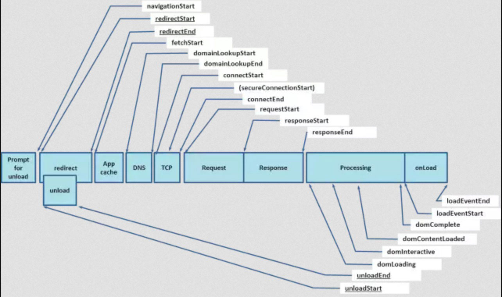

# 网络篇

这是navigation timing监测指标图，从图中我们可以看出，浏览器在得到用户请求之后，经历了下面这些阶段：重定向→拉取缓存→DNS查询→建立TCP链接→发起请求→接收响应→处理HTML元素→元素加载完成。不着急，我们对其中的细节一步步展开讨论：

## 通过rel="preload"进行内容预加载

 <link> 元素的 rel 属性的属性值preload能够让你在你的HTML页面中 <head>元素内部书写一些声明式的资源获取请求，可以指明哪些资源是在页面加载完成后即刻需要的。对于这种即刻需要的资源，你可能希望在页面加载的生命周期的早期阶段就开始获取，在浏览器的主渲染机制介入前就进行预加载。这一机制使得资源可以更早的得到加载并可用，且更不易阻塞页面的初步渲染，进而提升性能。本文提供了一个如何有效使用preload机制的基本说明。
 
 
### 参考
[https://developer.mozilla.org/zh-CN/docs/Web/HTML/Preloading_content](https://developer.mozilla.org/zh-CN/docs/Web/HTML/Preloading_content)

## 通过rel="prefetch"进行链接预取

链接预取是一种浏览器机制，其利用浏览器空闲时间来下载或预取用户在不久的将来可能访问的文档。网页向浏览器提供一组预取提示，并在浏览器完成当前页面的加载后开始静默地拉取指定的文档并将其存储在缓存中。当用户访问其中一个预取文档时，便可以快速的从浏览器缓存中得到。

### 参考
[https://developer.mozilla.org/zh-CN/docs/Web/HTTP/Link_prefetching_FAQ](https://developer.mozilla.org/zh-CN/docs/Web/HTTP/Link_prefetching_FAQ)

## 减少页面资源请求：

### html
 
webpack打包时压缩html

### js

合并，压缩 js，并不是把所有的都合并成一个js，应该把业务逻辑和库文件分开。项目迭代更新的时候只需要更新业务逻辑代码即可。让库文件走缓存。另外游戏渲染库比较大，学习中心运行在app上，app如果能把这些库文件打包到app里面 app监测网络请求如果监测到是特定的渲染库，直接走app本地库文件效果更好，几乎就是秒加载。

**实战应用：**js库文件和业务逻辑分开。对库文件进行缓存，只需要更新业务逻辑代码。

### css

合并，压缩 css，并不是把所有的都合并成一个css，框架css和 单个页面样式分开打包。

### 图片

* jpg 压缩
* png 压缩
* webp压缩成都更好，在ios webview有兼容问题--**安卓**
* svg矢量图，代码内嵌，相对较小，图片样式相对简单的场景--**iconfont** 。高清显示

**方法：**

* 雪碧图--图标合并，代码不便于更新
* 图片转Base64数据--将图片内签到html中，减少http请求，较小的图片
* 矢量图--SVG绘图，iconfont解决icon问题
* 在线网站：**https://tinypng.com (压缩png),zhitu.isux.us (png转成webp),spritecow.com (生产雪碧图)  
* http://iconfont.cn**  加入购物车，下载，可以生产代码html/css/js在项目中统一引入使用(unicode兼容性最好，svg浏览器渲染比较差，fontclass ie8+)  

压缩图片到一个合适的质量，没必须所有的图片都用2倍高清图片可以和设计沟通把部分图片质量稍微调底一些。另外是合并成雪碧图，也可以减少资源请求量。这种方式效果比较可观。

另外太小的图片，比如只有1kb这类图片资源 我们可以直接把图片资源转成base64数据，然后打包到文件中这个图片资源请求就没有了。

### 音频：
点击 升级 这种短的多个音频合并成一个音频，需要播放的时候播放这个一个音频中的某一个段就好了。减少资源加载数量。

资源该减少的已经减少了，然后是怎么优化单个网络请求：

## 服务器上开启Gzip传输压缩:
我们还应该在服务器上开启Gzip传输压缩，它能将我们的文本类文件体积压缩至原先的四分之一左右，效果立竿见影。
Content-Encoding: gzip

## 对资源做缓存：

**Cache-Control：**

- max-age:缓存的时间，该时间之内不再发出请求（200 from memory cache);优先级高于expires(过期时间)、last-modified  
- s-maxage:(304),针对public（CDN）的缓存有效;优先级高于max-age  
- no-cache:搭配max-age=0;发请求到服务端去询问浏览器是否过期；  
- no-store:不使用缓存  
- expires: 缓存过期时间，是服务端的具体的时间点；告诉浏览器在过期时间前可以直接从浏览器缓存读取数据，无需再次请求  
- last-modified: response header (最后修改时间)  
- if-modified-since: request header（客户端知道的最后修改的时间），需要配合cache-contorl使用，优先级低于max-age  
- Etag:response header(文件内容hash值)，优先级高于last-modified  
- if-None-Match:request header,需要配合cache-contorl使用  

**分级缓存策略：**

- 200(from cache):由expires/cache-contorl控制，后者优先级高；只要没有失效，浏览器就只访问自己的缓存  
- 304:由last-modified/etag控制，当上一层时间点失效或者用户点击refresh,F5时，浏览器会发送请求给服务器，如果服务端没有变化，则返回304给浏览器  
- 200:当浏览器本地没有缓存或者上一层失效，或者用户点击了ctr+f5时，浏览器直接去服务器下载最新数据  

## 使用CDN：

### http 2.0
浏览器对同时请求同一个域名的http请求做了限制不同浏览器不同chorme最多6个，那么想还要更快可以用http 2.0

使用http 1.1协议，chorme浏览器最多并发请求6个。使用http 2.0协议，请求数量不受限。加快页面加载速。

### 总结
减少请求数、减小请求资源体积、提升网络传输速率

### 参考:

[再谈前端优化——从实际项目优化说起](https://github.com/creeperyang/blog/issues/14)  
[前端性能 优化](https://github.com/GerryIsWarrior/optimization)  
[慕课网，前端性能优化](https://github.com/Heyff12/web-high)  
[慕课网，前端性能优化](https://mp.weixin.qq.com/s/sU4Y2pBU659O1vNyZSSX5Q)