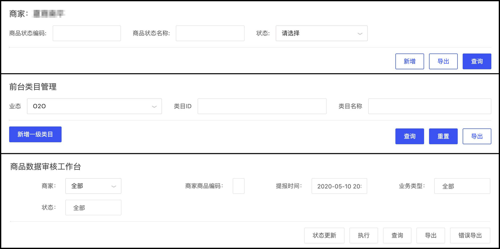

# 前端优化（高级版）

## 网络优化

网络 combo

APP上通过网络推包，html、js、css资源加载本地化。

## 页面渲染优化

flutter渲染、北海渲染引擎

## 用户体验优化

### 制定一套适合自己公司业务发展的开发规范

#### 背景和理念

图形用户界面（Graphics User Interfae）简称GUI。使用图形方式，借助菜单、按钮等标准界面元素和鼠标操作，帮助用户方便地向计算机系统发出指令，启动操作，并将系统运行的结果同样以图形方式显示给用户。GUI中的三个基本元素：容器、组件和布局管理器。开发者通过这些基本元素和布局可开发出各种花里胡哨的界面和交互效果。

如下图所示都是搜索功能模块不同的团队开发有不同的展现形式和交互。

对于面向商家、企业级、业务部门提供的服务产品来说带来不少麻烦，不同的团队开发出来产品视觉交互体验不一致，缺少框架规范，产品、UI、研发没有标准，重复造轮子。

为了解决上述的痛点，团队应该结合自身的业务制定Web GUI编程规范和标准，从而达到视觉交互一致性。

#### 规范

##### UI规范

* Page
* Form
* FormItem
* Button

##### 交互规范

* 封闭交互（一个体系有且仅有一种交互）
* 编码封闭（DML,描述“本质”,代码和页面一一映射,没有第二种写法）

保持开放原则80%系统组件（XComponent），20%业务中复杂组件单独实现（SysComponent）

#### 实现

	

	

	

 