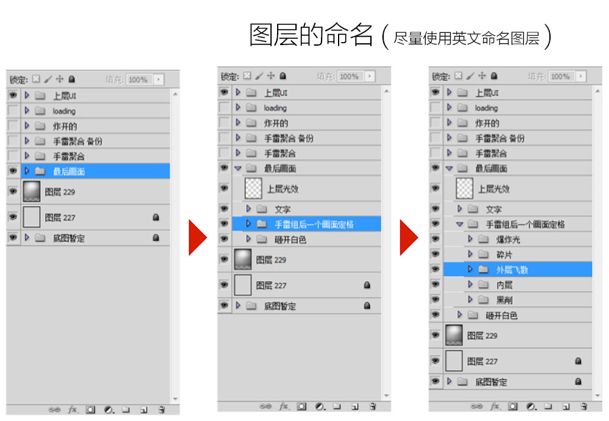
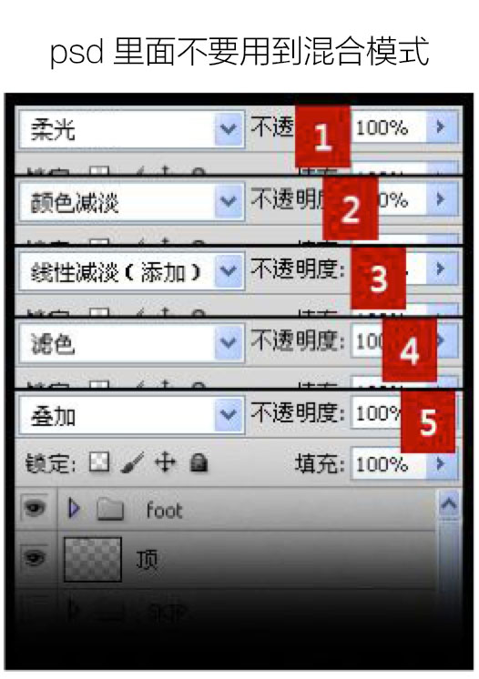

# UI设计规范

> 时间：2021.06.29  
> 作者：阿彬

## 移动端设计图

> 有一种说法：认为肉眼可识别的最高密度为300ppi。而iPhone X的458ppi在手机屏幕历史可能仅次于HTC one的468ppi(2013年)， 所以完全可以认为X 是今天市面上最清晰的手机^_^ 无论我这个凡人的肉眼能不能看得出区别来，都不能影响它的傲娇。

### 总结：

1. 当手机的屏幕密度是326ppi，倍图是2的时候就足以满足人肉眼识别的能力。所以在h5上面3倍图就不用考虑了。
2. 单屏显示的界面 如H5活动页面适配方案会等比例缩放图片所以设计图制作成640 x 1386px的就够了。安全区域是640 x 960px，（如果是微信还要除去状态栏和导航栏的高度128px，也就是640*1258px)。
3. 对于大多数采用瀑布流的页面来说，仅仅是屏幕高度上的变化，可以无视。然而制作webapp字体大小无法等比例缩小，所以使用rem的适配方案，设计图出宽度750的，小手机更改html的font-size，页面字体等比例缩小，图片宽度使用百分比)。

### 单页面设计稿尺寸

|设备|设计稿|说明|
|---|---| ---|
|iPhone 4/s| 640 x 960 |  |
|iPhone 5/s/se|640 × 1136| |
|iPhone 6/7/8|750 × 1334| |
|iPhone 6/7/8 Plus|750 x 1333 | |
|iPhone X|750 × 1624| 设计稿高度 - 128px (状态栏 + 导航栏高度) = 视图高度 |

### 注意⚠️
iPhone设计稿 视图高度 安全区域为：(1125 - 128) = 997px，非安全区域的视图可能会被裁切

## .psd文件提供

所以为了避免一些沟通问题，低调的PSD有必要这样做<移动端按@2x设计>：
1. 文字(单位px，移动端设计最小字号20)

2. html不支持各种图层混合模式,如果使用混合模式请保证在合并图层后不会影响视觉效果。如果会有影响用其他方法代替。

3. 图层命名合理，如果量太大，至少编组命名(尽量使用英文命名)；

4. 图层需分离的尽量少用图层混合模式；

5. 删除不需要的图，减小文件体积；

6. 常更新文字尽量使用雅黑、宋体、思源黑、苹方等系统默认字体；如果使用其他非系统默认字体，请打包发给前端；

7. 常更新文字字号取整且别变形拉伸；

8. 常更新文字颜色别用颜色叠加，慎用图层混合模式；

9. 常更新文字尽量不用描边、渐变色；

10. 有状态的元素把状态做全，把其他状态的图层标色区分可隐藏；

11. 需要做动画的元素有动画序列或者动画说明(动画元素单个分层，补全动画元素)；

12. 网页开发加载是自上而下的，所以PSD的图层也尽量从上而下分层；

13. 用色统一有阶次，如黑(#333)、深灰(#666)、灰(#999)

14. PSD文件分辨率72像素/英寸，颜色模式RGB