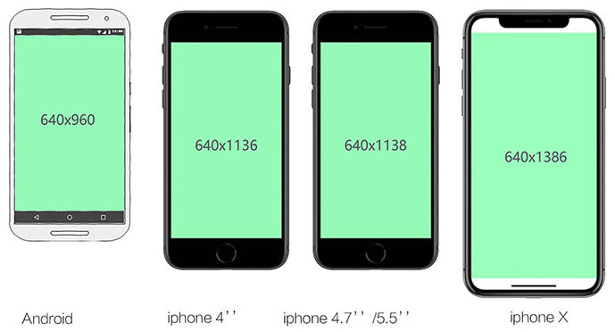

# 视频/音频 开发规范

## 移动端视频

1. 全屏单页面活动页：输出640*1386/格式.mp4（安全区域是640 x 960px,不同型号手机超出安全区域的可能会被裁掉)。
2. 微信端：输出640*1258/格式.mp4(ios微信可以不全屏播放所以是1386-128(状态栏+导航栏高度)=1258，android没有1386的屏幕所以不管)

## 音频

1. 大小压缩至80kb以下
2. 文件格式 .mp3
3. 开头和结尾音轨建议做淡入淡出处理

