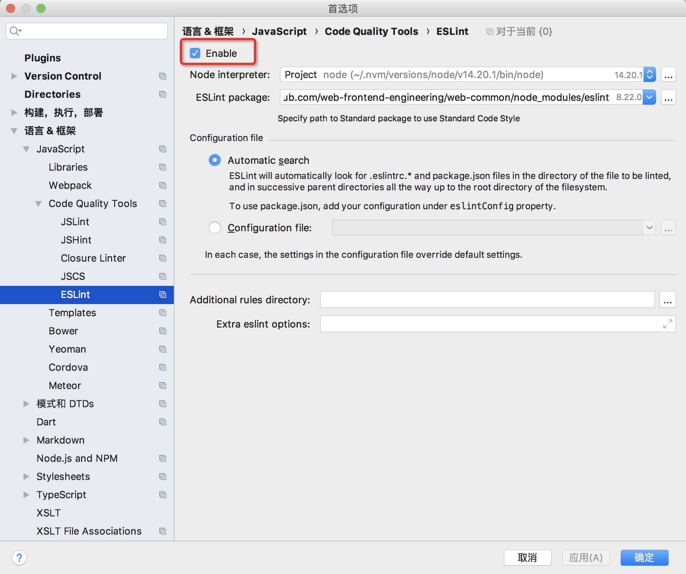
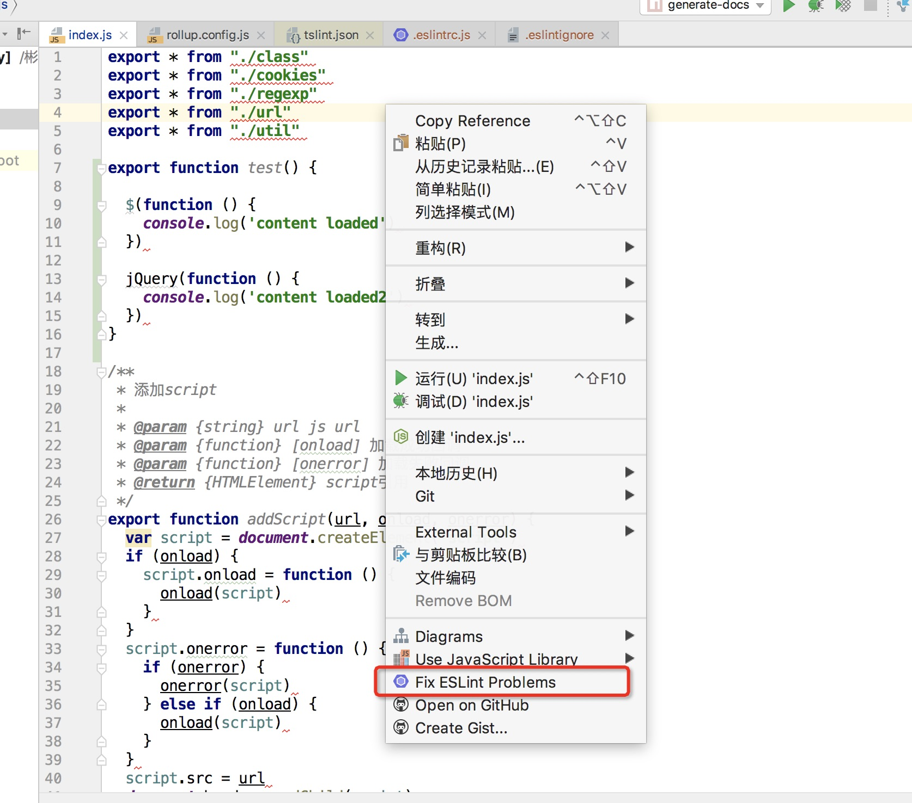
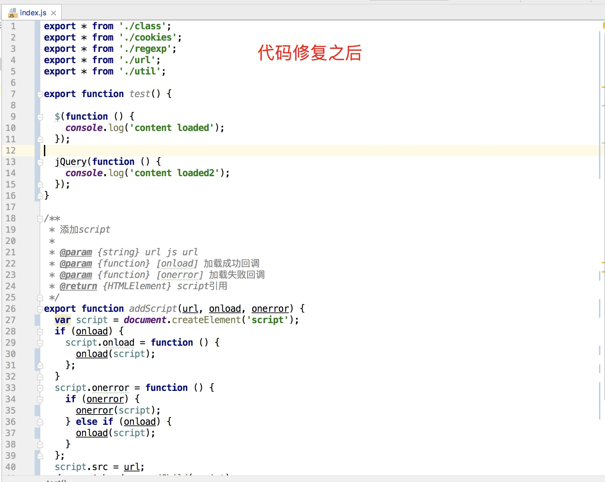

# ESLint 实践

## 简介

ESLint 是一个检查代码质量与风格的工具，配置一套规则，就能检查出你代码中不符合规则的地方，部分问题支持自动修复；

总结起来就两个功能：
* 代码质量检查
可以发现代码中存在的可能错误，如使用未声明变量、声明而未使用的变量、修改 const 变量、代码中使用debugger等等

* 代码格式化
可以用来统一团队的代码风格，比如加不加分号、使用 tab 还是空格、字符串使用单引号 等等

ESLint是一个插件化的代码检测工具，正如它官网描述的slogan：

> 可组装的JavaScript和JSX检查工具

ESLint不仅可以检测JS，还支持JSX和Vue，它的高可扩展性让它能够支持更多的项目。

刚开始ESlint的推出并没有撼动JSHint的霸主地位，由于ESlint需要将源码转为AST，而JSHint直接检测源文件字符串，因此执行速度比JSHint慢很多；真正让ESLint实现弯道超车的是ES6的出现。

2015年，ES6规范发布后，由于大部分浏览器支持程度不高，因此需要Babel将代码转换编译成ES5或者更低版本；同时由于ES6变化很大，短期内JSHint无法完全支持，这时ESLint的高扩展性的优点显现出来了，不仅可以扩展规则，连默认的解析器也能替换；Babel团队就为ESLint开发了babel-eslint替换默认的解析器esprima，让ESLint率先支持ES6。

ESLint扩展性好；ESLint的核心是检测AST是否符合规则；
1. 第一步：解析器把源码转成AST；ESLint的解析器可自定义，源码用了啥高级语法或者换成TS，可直接换解析器得到最终的AST，eslint就可做规则匹配了；
2. 第二步：执行规则；ESLint的检测规则可自定义；

## 安装

npm i eslint --save-dev

npx eslint --init // 生成 .eslintrc*  配置文件

一般我们会把eslint命令行配置到packages.json中：

"scripts": {
  "lint": "npx eslint src”,
  "lint:fix": "npx eslint src --fix",
  "lint:create": "npx eslint --init"
}

## 配置

包括全局变量、插件配置、规则配置、内嵌注释代码禁用规则，扩展配置、忽略文件和目录

root 配置

root: true 这个配置，这个配置是让eslint不要往父级去继续查找配置

globals和env 配置（对环境定义的一组全局变量的预设 详细看：https://zh-hans.eslint.org/docs/latest/use/configure/language-options ）

通常我们在项目里面会使用很多全局变量，比如浏览器环境下的windows，node环境下的global等，通常一些规则集像eslint:recommended等，是会校验不过的，因为在它看来你是使用了未定义的变量，这个时候globals就派上用场了

'globals': {
// false、readable、readonly 这 3 个是等价的，表示变量只可读不可写；
// true、writeable、writable 这 3 个是等价的，表示变量可读可写；
'$': true,
'jQuery': true,
'encode': false,
},

但是像浏览器环境或者node环境全局变量有很多，一个个指定又太麻烦了，此时就可以使用env去指定环境，这样我们就无需一个个指定这个环境下的全局变量了

{
// 浏览器全局变量
browser: true,
// Node.js 全局变量和作用域
node: true,
// CommonJS全局变量和CommonJS作用域
commonjs: true,
// 启用除模块之外的所有ECMAScript 6功能
es6: true
}

extends 配置

继承另一个配置文件的所有特性

通常来讲extends可以分为以下几种：
* eslint开头的，就是eslint官方的扩展，如eslint:recommended(推荐规范)和eslint:all(所有规范)

* eslint-config开头的，比如第三方发布到npm上的，如eslint-config-airbnb（airbnb的规范），eslint-config-alloy（腾讯Alloy team的规范）等

* plugin开头的，就是通过插件共享的规则，如eslint-plugin-vue，我们使用其中的plugin:vue/vue3-recommended的规则集

* @开头的，跟eslint-config开头的类似，只不过是加了作用域，例如@vue/eslint-config-prettier就是加了个作用域

{
  // extends可以是字符串，可以是数组，数组的时候就可以配置多个
  extends: [
      // eslint官方扩展，无需再安装npm包就可使用
      'eslint:recommended',
      // airbnb的扩展，需要先安装eslint-config-airbnb及其依赖才能使用，这种eslint-config-开头的可以省略前面的
      // 比如直接传'airbnb'即可
      'eslint-config-airbnb',
      // @开头的，就是加了作用域，跟上面的类似，使用前也需要先安装，也可以省略调eslin-config
      // 比如直接传'@vue/prettier'即可
      '@vue/eslint-config-prettier',
      // plugin开头的，使用前需先安装，通常一个插件会提供多套规则，而我们则通过plugin:pluginName/configName这样的形式在extends中引入插件提供的规则，如下面使用的eslint-plugin-vue就有recommended|vue3-recommended等多套规则
      'plugin:vue/vue3-recommended'
  ],
}

parser和parserOptions

eslint默认的解析器是espree，只支持转换js，默认支持到ES5的语法，假如需要支持更高版本的语法，则可以通过parserOptions来指定版本号

{
  parserOptions: {
      // 指定支持es6的语法
      ecmaVersion: 6,
      // 默认是script，但我们现在都是模块，所以将它指定为module
      sourceType: 'module',
      ecmaFeatures: {
          // 启用jsx语法，如果不打开，当我们写jsx语法的时候，eslint就会校验不通过，因为它会认为<不是一个合法的token
          jsx: true,
      }
  }
}

默认的espree解释器和规则只支持最新的ECMAScript标准，对于一些还没成为标准的实验性语法是不支持的，此时就需要@babel/eslint-parser这个解释器了。当然，使用这个解释器的前提是你的项目使用了babel。当你使用了babel和这个解释器，babel首先会将源码转换成AST,然后这个解释器再将这个AST转换成eslint能动的ESTree

假设你项目使用了babel的情况下，parser的配置如下

{
  // 使用前需先安装
  parser: '@babel/eslint-parser',
  parserOptions: {
      // @babel/eslint-parser相关的选项
  }
}

plugins 配置

上面对parser和extends做了详尽的介绍，而这里介绍一下上面提到的plugins。插件其中一个作用是可以共享配置，如上面介绍的配合extends来继承插件里面的规则，还有另一个最重要的作用是扩展eslint的规则，因为本身官方的规则只能检测js语法，如果是像vue这样的文件就无能为力了，此时就需要通过插件去完成了，比如上面也提到的eslint-plugin-vue，就是用来校验eslint本来不支持的vue模板文件的。

而通常我们使用插件，有两种用法，一种是像上面介绍的，通过extends去继承插件提供出来的规则集合。当然，前提是这个插件本身有提供出来相应的config。

rule 规则配置
1. "off" 或 0： 关闭规则；
2. "warn" 或 1： 开启规则，使用警告级别的错误：warn (不会导致程序退出)；
3. "error" 或 2： 开启规则，使用错误级别的错误：error (当被触发的时候，程序会退出)；

内置规则：https://zh-hans.eslint.org/

Webstrom 配置 ESLint的autofix功能

1、项目绑定Eslint，并提示错误。


2、之后在编辑器中就会出现检测错误提示。

3、文件 -> 右键 -> Fix ESLint Problems 会自动根据 Eslint 规则修复代码。

### 参考：

ESLint 命令行使用
https://www.jianshu.com/p/4133063d1785

看完这篇文章，我不信你还对eslint一知半解
https://juejin.cn/post/7129771851638636575?searchId=202310111031309F0D69AD1F3EDF63BE94

深入浅出之ESLint
https://juejin.cn/post/7028754877312401444?searchId=202310111031309F0D69AD1F3EDF63BE94
