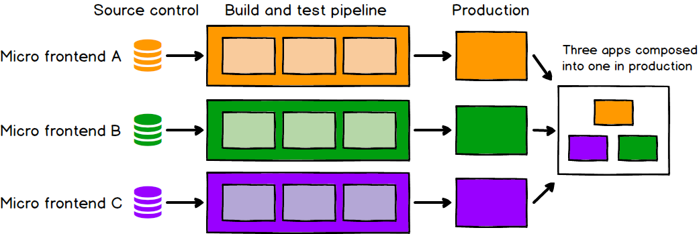

# 微前端

#### 目录

1. 前言
2. 什么是微前端
3. 微前端的好处
4. 微前端的实现方式
5. 微前端的落地实现

## 1、前言

分享内容的均是基于我自己的理解和认识，如果有什么不对的地方大家随时给我我纠正。

## 2、什么是微前端

首先我们聊一下就是什么是微前端。为什么出现微前端？

近些年来，后端微服务爆炸式地流行起来，许多组织使用这种体系结构风格来避免大型、单片的后端限制。用这种风格来开发后端项目。虽然关于这种构建服务器端软件的风格已经比较成熟，但是前端却没有太多。

有时我们想构建一个渐进的或响应性的web应用程序，但是找不到一个容易的地方开始将这些新特性集成到现有代码中。也许我们想开始使用新的JavaScript语言特性(或者可以编译成JavaScript的多种语言中的一种)，但是我们还是无法将必要的构建工具融入现有的构建过程。或者有时只是想要扩展您的开发，以便多个团队可以同时处理单个产品，但是现有整体中的耦合性和复杂性意味着每个人都在踩着彼此的脚。这些都是真正的问题，会对有效地提供高质量项目产生负面影响。

带着这些问题，越来越多的人开始关注复杂的现代web开发所必需的整体架构和组织结构。我们也看到了一些模式出现，它们将前端巨石项目分解成更小、更简单的块，这些块可以独立开发、测试和部署，同时在客户看来仍然是一个单一的内聚产品。我们称之为微前沿技术。

我们将其定义为:

> “将独立可交付的前端应用程序组成一个更大的整体的架构风格”
> 与技术无关，做到技术隔离。

## 3、微前端的好处

#### 独立部署

与微服务一样，微前端的独立可部署性是关键。这减少了给定部署的范围，从而减少了相关的风险。不管前端代码在哪里托管的，每个微前端都应该有自己的连续交付管道，在生产过程中构建、测试和部署它。我们应该能够在部署每个微前端项目时，很少考虑到其他代码库当前状态。不管旧的，还是隔壁老王的团队将一个半成品或过时的特性推到他们的主分支中，这都不重要。因为各自的项目可以独立部署，这个该由构建和维护它的团队来决定。而不是别的开发人员或开发团队。

就像下面这张图，每个团队项目拥有自己的项目仓库，可以对项目构建，测试，部署，并且最终发布组成一个大的应用程序。



#### 增量升级

在我们的项目中正在使用那些旧的过时的技术，或者是在交付压力下编写的代码所拖累，而现在已经到了完全要重写的时候了。为了避免完全重写的危险，我们更愿意一点一点地扼杀旧的应用程序，同时可以继续交付高质量的项目并使用新特性，而不被这个庞然大物的项目压垮。

#### 简单并且解耦的代码库

每个单独的微前端的源代码都比单个整体前端的源代码小得多。对于我们开发人员来说，这些较小的代码库往往更简单、更容易使用。特别是，我们避免了组件之间不应该相互了解的非故意和不适当耦合所带来的复杂性。

就比如说A团队有一块和B团队有一块的需求差不多，但是B团队要对A团队的代码上做一些处理才能满足B团队的需求。要嘛高度抽象出公共业务组件，要嘛就在项目内开发。避免像蜘蛛网一样的项目之间引用。

#### 自治团队

作为将我们的代码库和发布周期解耦的好处，就是我们可以拥有完全独立的团队开发，他们可以拥有产品的一部分，从构思到生产，甚至更远。这使得团队能够快速有效地行动。为了实现这一点，我们的团队只需要围绕业务功能的垂直部分去开发，而不是围绕技术能力。一种简单的方法是根据最终用户将看到的内容划分产品，因此每个微前端封装应用程序的单个页面，并由单个团队端到端拥有。

## 4、微前端的实现方式

#### 通过构建时集成

```
{
  "name": "@feed-me/container",
  "version": "1.0.0",
  "description": "A food delivery web app",
  "dependencies": {
    "@feed-me/browse-restaurants": "^1.2.3",
    "@feed-me/order-food": "^4.5.6",
    "@feed-me/user-profile": "^7.8.9"
  }
}
```

从上面可以看到browse项目由一个团队开发，order项目由一个团队开发，user项目又由另一个团队开发，最终会在一个统一的项目中去打包发布项目。

这种方法意味着我们必须重新编译和发布每一个微前端，以便更新对产品任何单独部分的更改。就像微服务一样，我们已经看到了这种同步发布过程所带来的痛苦，因此我们强烈建议不要在微前端中沿使用这种方法。

在将应用程序划分为可独立开发和测试的离散代码库时遇到的所有麻烦之后，我们不要在发布阶段重新引入所有耦合。我们应该找到一种方法在运行时集成我们的微前端，而不是在构建时集成。

#### 通过iframe进行运行时集成

在浏览器中组合应用程序的最简单方法之一是iframe。从本质上讲，iframe使的独立的子页面构建变得很容易。它们还在样式化和全局变量之间提供了良好的隔离，不会相互干扰。只要我们谨慎地划分应用程序和组建团队，iframes就很适合。

但是也有一些不好的地方，比如全局loading，跨应用之间通信，子应用路由管理，历史记录等等问题。

```
<html>
  <head>
    <title>Feed me!</title>
  </head>
  <body>
    <h1>Welcome to Feed me!</h1>

    <iframe id="micro-frontend-container"></iframe>

    <script type="text/javascript">
      const microFrontendsByRoute = {
        '/': 'https://browse.example.com/index.html',
        '/order-food': 'https://order.example.com/index.html',
        '/user-profile': 'https://profile.example.com/index.html',
      };

      const iframe = document.getElementById('micro-frontend-container');
      iframe.src = microFrontendsByRoute[window.location.pathname];
    </script>
  </body>
</html>
```

#### 通过JavaScript运行时集成

下面是一个简单的例子：

```
<html>
  <head>
    <title>Feed me!</title>
  </head>
  <body>
    <h1>Welcome to Feed me!</h1>

    <!-- 这些脚本不会立即渲染任何东西 -->
    <!-- 相反，它们将入口点函数附加到窗口上 -->
    <script src="https://browse.example.com/bundle.js"></script>
    <script src="https://order.example.com/bundle.js"></script>
    <script src="https://profile.example.com/bundle.js"></script>

    <div id="micro-frontend-root"></div>

    <script type="text/javascript">
      // 这些全局函数通过上面的脚本附加到window上
      const microFrontendsByRoute = {
        '/': window.renderBrowseRestaurants,
        '/order-food': window.renderOrderFood,
        '/user-profile': window.renderUserProfile,
      };
      const renderFunction = microFrontendsByRoute[window.location.pathname];

      // 确定了入口函数后，我们现在称它为，
      // 给它应该呈现自身的元素ID
      renderFunction('micro-frontend-root');
    </script>
  </body>
</html>
```

假设每个微前端应用都使用`<script>`包含在页面上，加载时公开一个全局函数作为它的入口点。主应用程序然后决定应该安装哪个微前端，并调用相关的函数来告诉微前端何时何地渲染自己。

那这种形式就更升级一点，但是这种形式就牵扯出一些问题：比如样式污染和全局变量污染，等等问题。但是这些都可以解决。

上面这块儿不应该是上来就把所有的`script`都加载进来，本来浏览器的优势就在说可以实现增量下载。所以真正实现的时候应该是做到增量下载。

#### 通过Web组件进行运行时集成

与上一种方法不同的是，每个微前端项目都为主应用容器 实例化自定义的HTML元素，而不是为主应用容器定义要调用的全局函数。

```
<html>
  <head>
    <title>Feed me!</title>
  </head>
  <body>
    <h1>Welcome to Feed me!</h1>

    <script src="https://browse.example.com/bundle.js"></script>
    <script src="https://order.example.com/bundle.js"></script>
    <script src="https://profile.example.com/bundle.js"></script>

    <div id="micro-frontend-root"></div>

    <script type="text/javascript">
      const webComponentsByRoute = {
        '/': 'micro-frontend-browse-restaurants',
        '/order-food': 'micro-frontend-order-food',
        '/user-profile': 'micro-frontend-user-profile',
      };
      
      // 通过路由获取应该挂载的组件
      const webComponentType = webComponentsByRoute[window.location.pathname];

      const root = document.getElementById('micro-frontend-root');
      const webComponent = document.createElement(webComponentType);
      root.appendChild(webComponent);
    </script>
  </body>
</html>
```

## 5、微前端的落地实现

通过JavaScript运行时集成的实现原理：拦截路由，根据不同路由规则渲染对应的子应用。

核心要做的事情：  

1. 路由管理
2. 增量加载子应用
3. 应用间运行时隔离
4. 应用间通信

### 路由管理

前端路由管理实现方法主要有两种方法：location.hash和window.history

#### Hash

hash（“#”）符号的本来作用是加在URL中指示网页中的位置(http://www.example.com/index.html#print)。`#`符号本身以及它后面的字符称之为hash，它具有如下特点：

hash虽然出现在URL中，但不会被包括在HTTP请求中。它是用来指导浏览器动作的，对服务器端完全无用，因此，改变hash不会重新加载页面,可以为hash的改变添加监听事件：

> window.addEventListener("hashchange", funcRef, false)

每一次改变hash（window.location.hash），都会在浏览器的访问历史中增加一个记录，利用hash的以上特点，就可以来实现前端路由“更新视图但不重新请求页面”的功能了。

#### History

History接口 是浏览器历史记录栈提供的接口，通过back(), forward(), go()等方法，我们可以读取浏览器历史记录栈的信息，进行各种跳转操作。

从HTML5开始，History interface提供了两个新的方法：pushState(), replaceState()使得我们可以对浏览器历史记录栈进行修改：

> window.history.pushState(stateObject, title, URL)  
> window.history.replaceState(stateObject, title, URL)

> window.addEventListener('popstate', funcRef, false)

stateObject: 当浏览器跳转到新的状态时，将触发popState事件

这两个方法有个共同的特点：当调用他们修改浏览器历史记录栈后，虽然当前URL改变了，但浏览器不会刷新页面，这就为单页应用前端路由“更新视图但不重新请求页面”提供了基础。

### 增量加载子应用

sea.js提供了异步加载模块的方式`require.async(id, callback?)`去实现增量下载子应用。

### 应用间运行时隔离

### 应用间通信

#### 参考

1. [微前端](https://martinfowler.com/articles/micro-frontends.html)
2. [解密微前端：从qiankun看沙箱隔离](https://juejin.cn/post/6896643767353212935 )
