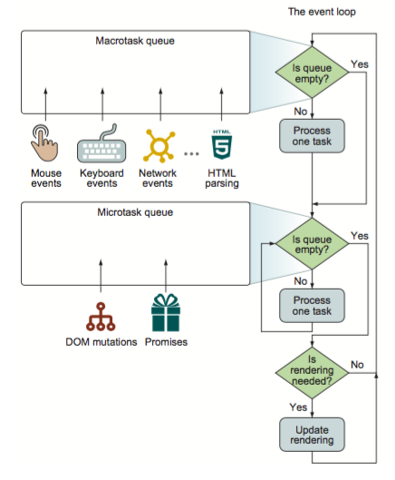

# 浏览器中的js事件循环机制


		
* 这里提及了 macrotask 和 microtask 两个概念，这表示异步任务的两种分类。在挂起任务时，JS 引擎会将所有任务按照类别分到这两个队列中，首先在 macrotask 的队列（这个队列也被叫做 task queue）中取出第一个任务，执行完毕后取出 microtask 队列中的所有任务顺序执行；之后再取 macrotask 任务，周而复始，直至两个队列的任务都取完。

	两个类别的具体分类如下：

	* macro-task: script（整体代码）, <label style='color:red;'>setTimeout, setInterval, setImmediate,</label> I/O, UI rendering
	* micro-task:  <label style='color:red;'>process.nextTick, Promises</label>（这里指浏览器实现的原生 Promise）,  <label style='color:red;'>Object.observe, MutationObserver</label>


白话解释上面 事件循环过程

* 第一步： 检查宏任务队列是否为空
	* 否 -> 从宏任务队列中拿出一个任务 -> 这个任务压栈执行
	* 是 -> 跳第二步
* 第二步： 检查微任务队列是否为空
	* 否 -> 从微任务队列中拿出一个任务 -> 这个任务压栈执行 -> 回到第二步(循环执行微任务队列，一次取一个微任务压栈执行，直到这次事件循环中微任务队列为空)
	* 是 -> 跳第三步
* 第三步：是否需要渲染
	* 否 -> 下一次事件循环
	* 是 -> 更新渲染 -> 完成后进入下一次事件循环 
	
### 参考链接

* [https://github.com/ProtoTeam/blog/blob/master/201801/2.md](https://github.com/ProtoTeam/blog/blob/master/201801/2.md)
* [这一次，彻底弄懂 JavaScript 执行机制](https://juejin.im/post/59e85eebf265da430d571f89)
* [https://www.ituring.com.cn/article/66566](https://www.ituring.com.cn/article/66566)	

### 翻译
* event loop (事件循环）
* 
* Macrotask queue (宏任务队列)
* Mouse events (鼠标事件)
* Keyboard events (键盘事件)
* Network events (网络事件)
* HTML parsing (HTML解析)
* 
* Microtask queue (微任务队列)
* DOM mutations (DOM突变？不明白！！！)
* Promises (Promise.then().then())
	
---
	
### 一些问题

> 以下代码不会导致js线程挂起，因为一次事件循环只会执行一个宏任务。如果浏览器的刷新率是60fps，那么setTimeout的最小间隔时间也是16.666。即使设置了0，也不会按照间隔0ms执行，而是16.66ms毫秒之后执行。

```
let i = 0
function a() {
	console.log(i++)
	setTimeout(a, 0)
}
a()
```

> 以下代码会导致js线程挂起，因为一次事件循环会把所有的微任务执行完毕。当调用then()函数被调用后往微任务队列中又插入了一个任务，循环往复，导致微任务队列永远无法为空。所以js线程挂起。

```
let i = 0
function a() {
	console.log(i++)
	new Promise((resolve, reject) => {
	  resolve()
	}).then(value => {
	  a()
	})
}
a()
```

