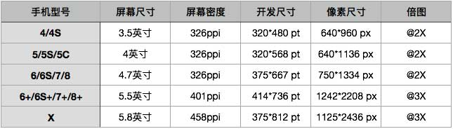
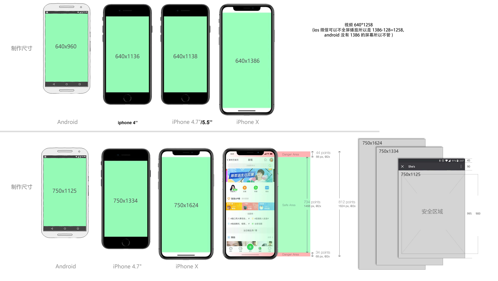
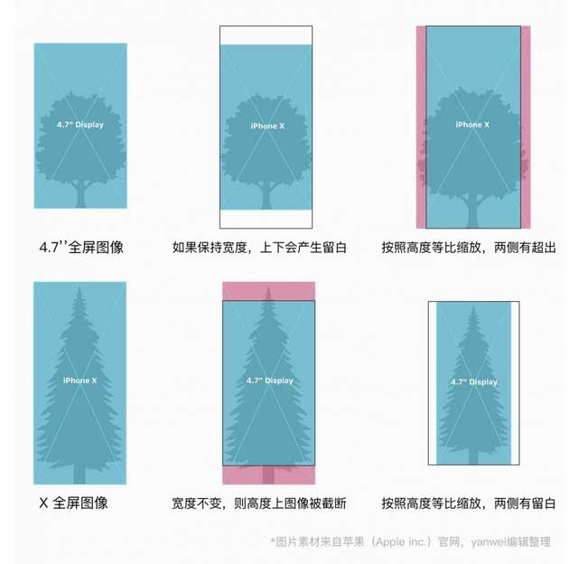

# Android IOS设备屏幕详细信息

手机屏幕的物理长度，使用英寸作为单位。比如iPhone 4屏幕是3.5英寸，iPhone 5 是4英寸，iphone 6是4.7英寸，这里的数字是指手机屏幕对角线的物理长度。

iPhone4 屏幕尺寸继续保持320 x 480，不过单位并非是像素，而是点。

### 屏幕像素:
上面这些有限的点就叫做像素，每一个长度方向上的像素个数乖每一个宽度方向上的像素个数的形式表示，就叫做图片的分辨率。
如一张640X480的图片，表示这张图片在每一个长度的方向上都有640个像素点，而每一个宽度方向上都480个像素点，总数就是640X480=307200（个像素），简称30万像素。
显然单位面积上像素点越多即像素点越小，这图片就越清晰细腻。
那这个像素点究竟有多大小呢？单纯从图片来说是不能确定这个点有多大的。这个大小和显示屏的分辨率息息相关。

### 屏幕密度：
每英寸有多少个像素，称为ppi(pixel per inch)。我们可以简单算算，iPhone 4是640 x 960像素，对角线就是1154像素，除以3.5英寸，应该是330ppi。而官方给出的数字是326ppi。当像素太密，超过300ppi的时候，人眼也就不能区分出每个像素。因此iPhone 4的屏幕叫作Retina显示屏。Retina在英文中，是视网膜的意思。

### 设备像素比(device pixel ratio) 
设备像素比(简称dpr)定义了物理像素和设备独立像素的对应关系，它的值可以按如下的公式的得到：
设备像素比 = 物理像素 / 设备独立像素   
// 在某一方向上，x方向或者y方向在javascript中，可以通过window.devicePixelRatio获取到当前设备的dpr。

### 转化成我们熟知的像素尺寸：

<label style='color:red;'>有一种说法：认为肉眼可识别的最高密度为300ppi。</label>而iPhone X的458ppi在手机屏幕历史可能仅次于HTC one的468ppi(2013年)， 所以完全可以认为X 是今天市面上最清晰的手机^_^ 无论我这个凡人的肉眼能不能看得出区别来，都不能影响它的傲娇。

### 总结：
1. <label style='color:red;'>当手机的屏幕密度是326ppi，倍图是2的时候就足以满足人肉眼识别的能力。所以在h5上面3倍图就不用考虑了。</label>
2. 单屏显示的界面,如:<label style='color:red;'>H5活动页面适配方案会等比例缩放图片所以设计图制作成640 * 1386px的就够了。安全区域是640 * 960px，（如果是微信还要除去状态栏和导航栏的高度128px，也就是640*1258px)。</label>
3. 对于大多数采用瀑布流的页面来说，仅仅是屏幕高度上的变化，可以无视。<label style='color:red;'>然而制作webapp字体大小无法等比例缩小，所以使用rem的适配方案，设计图出宽度750的，小手机更改html的font-size，页面字体等比例缩小，图片宽度使用百分比)。</label>

### 参考链接：

深入了解viewport和px：
http://tgideas.qq.com/webplat/info/news_version3/804/7104/7106/m5723/201509/376281.shtml

理解Android中dpi和分辨率的关系，谈谈Android做成适应全部手机的UI方式
http://blog.csdn.net/ueryueryuery/article/details/20048401

UI设计师不可不知的安卓屏幕知识
http://www.zcool.com.cn/article/ZNjI3NDQ=.html

Android屏幕适配全攻略(最权威的官方适配指导)
http://blog.csdn.net/jdsjlzx/article/details/45891551

移动前端开发之viewport的深入理解
http://www.cnblogs.com/2050/p/3877280.html

iPhone 6 Screens Demystified
http://www.paintcodeapp.com/news/iphone-6-screens-demystified

如何做跨DPI设计
http://www.ui.cn/detail/23624.html

使用Flexible实现手淘H5页面的终端适配
https://www.w3cplus.com/mobile/lib-flexible-for-html5-layout.html


