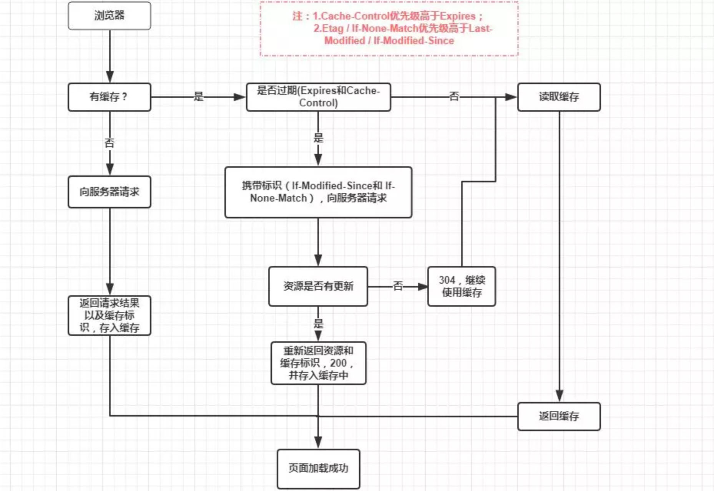

# HTTP 缓存

通过复用以前获取的资源，可以显著提高网站和应用程序的性能。Web 缓存减少了等待时间和网络流量，因此减少了显示资源表示形式所需的时间。通过使用 HTTP缓存，变得更加响应性。

缓存是一种保存资源副本并在下次请求时直接使用该副本的技术。当 web 缓存发现请求的资源已经被存储，它会拦截请求，返回该资源的拷贝，而不会去源服务器重新下载。这样带来的好处有：缓解服务器端压力，提升性能(获取资源的耗时更短了)。

## 缓存控制

### 强制缓存

强制缓存的字段分别是Expires和Cache-Control，其中Cache-Control优先级比Expires高。

#### Expires

Expires是HTTP/1.0控制网页缓存的字段，其值为服务器返回该请求结果缓存的到期时间，即再次发起该请求时，如果客户端的时间小于Expires的值时，直接使用缓存结果。

>到了HTTP/1.1，Expire已经被Cache-Control替代，原因在于Expires控制缓存的原理是使用客户端的时间与服务端返回的时间做对比，那么如果客户端与服务端的时间因为某些原因（例如时区不同；客户端和服务端有一方的时间不准确）发生误差，那么强制缓存则会直接失效，这样的话强制缓存的存在则毫无意义，那么Cache-Control又是如何控制的呢？

#### Cache-Control

在HTTP/1.1中，Cache-Control是最重要的规则，主要用于控制网页缓存，主要取值为：  

* public：所有内容都将被缓存（客户端和代理服务器都可缓存）
* private：所有内容只有客户端可以缓存，Cache-Control的默认取值
* no-cache：客户端缓存内容，但是是否使用缓存则需要经过协商缓存来验证决定
* no-store：所有内容都不会被缓存，即不使用强制缓存，也不使用协商缓存
* max-age=xxx (xxx is numeric)：缓存内容将在xxx秒后失效

### 协商缓存

协商缓存就是强制缓存失效后，浏览器携带缓存标识向服务器发起请求，由服务器根据缓存标识决定是否使用缓存的过程。

协商缓存的标识也是在响应报文的HTTP头中和请求结果一起返回给浏览器的，控制协商缓存的字段分别有：Last-Modified / If-Modified-Since和Etag / If-None-Match，其中Etag / If-None-Match的优先级比Last-Modified / If-Modified-Since高。

#### Last-Modified / If-Modified-Since

Last-Modified是服务器响应请求时，返回该资源文件在服务器最后被修改的时间，如下。

If-Modified-Since则是客户端再次发起该请求时，携带上次请求返回的Last-Modified值，通过此字段值告诉服务器该资源上次请求返回的最后被修改时间。服务器收到该请求，发现请求头含有If-Modified-Since字段，则会根据If-Modified-Since的字段值与该资源在服务器的最后被修改时间做对比，若服务器的资源最后被修改时间大于If-Modified-Since的字段值，则重新返回资源，状态码为200；否则则返回304，代表资源无更新，可继续使用缓存文件，如下。

#### Etag / If-None-Match

Etag是服务器响应请求时，返回当前资源文件的一个唯一标识(由服务器生成)，如下。

If-None-Match是客户端再次发起该请求时，携带上次请求返回的唯一标识Etag值，通过此字段值告诉服务器该资源上次请求返回的唯一标识值。服务器收到该请求后，发现该请求头中含有If-None-Match，则会根据If-None-Match的字段值与该资源在服务器的Etag值做对比，一致则返回304，代表资源无更新，继续使用缓存文件；不一致则重新返回资源文件，状态码为200，如下。

注：Etag / If-None-Match优先级高于Last-Modified / If-Modified-Since，同时存在则只有Etag / If-None-Match生效。

### 启发式缓存

如果一个可以缓存的请求没有设置Expires和Cache-Control，但是响应头有设置Last-Modified信息，这种情况下浏览器会有一个默认的缓存策略push cache，自动设置过期时间：(Date - Last-Modified)*0.1，也就是当前时间减去最后更新时间后再乘10%，这就是启发式缓存。

注：**只有在服务端没有返回明确的缓存策略时才会激活浏览器的启发式缓存策略**。

启发式缓存会引起什么问题吗？？

> 考虑一个情况，假设你有一个文件没有设置缓存时间，在一个月前你更新了上个版本。这次发版后，你可能得等到3天后用户才看到新的内容了。如果这个资源还在CDN也缓存了，则问题会更严重。

1. (20210208 - 20210108) = 30天 
2. 30天 * 0.1 = 3天
3. 文件的过期时间就是：20210208+3天 = 20210211

### 总结

强制缓存优先于协商缓存进行，若强制缓存(Expires和Cache-Control)生效则直接使用缓存，若不生效则进行协商缓存(Last-Modified / If-Modified-Since和Etag / If-None-Match)，协商缓存由服务器决定是否使用缓存，若协商缓存失效，那么代表该请求的缓存失效，重新获取请求结果，再存入浏览器缓存中；生效则返回304，继续使用缓存，主要过程如下：

### 参考

* [https://mp.weixin.qq.com/s/d2zeGhUptGUGJpB5xHQbOA  
](https://mp.weixin.qq.com/s/d2zeGhUptGUGJpB5xHQbOA  
)
* [https://developer.mozilla.org/zh-CN/docs/Web/HTTP/Headers/Cache-Control](https://developer.mozilla.org/zh-CN/docs/Web/HTTP/Headers/Cache-Control)
