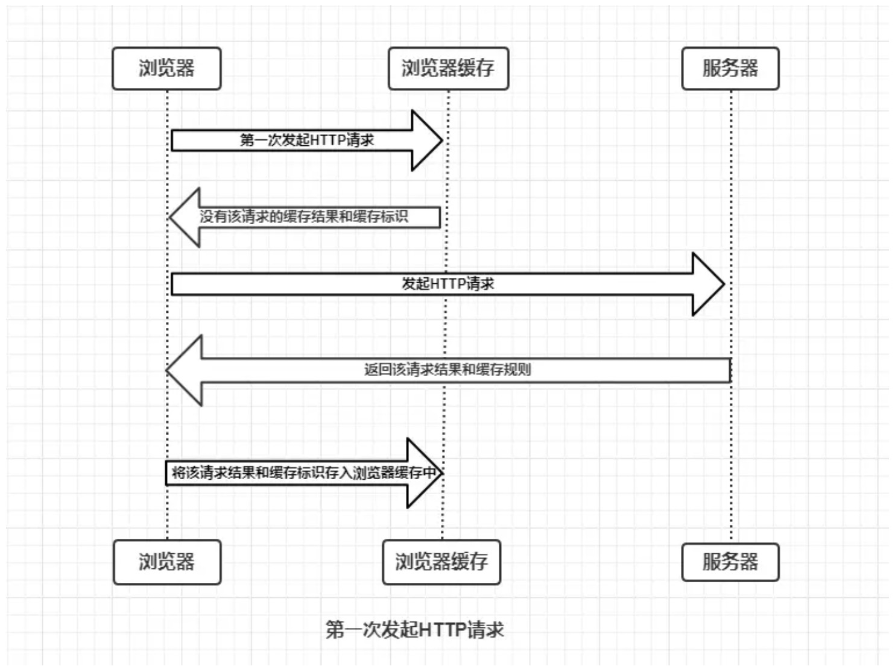
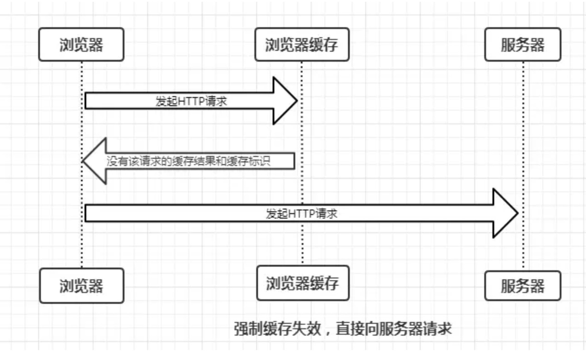
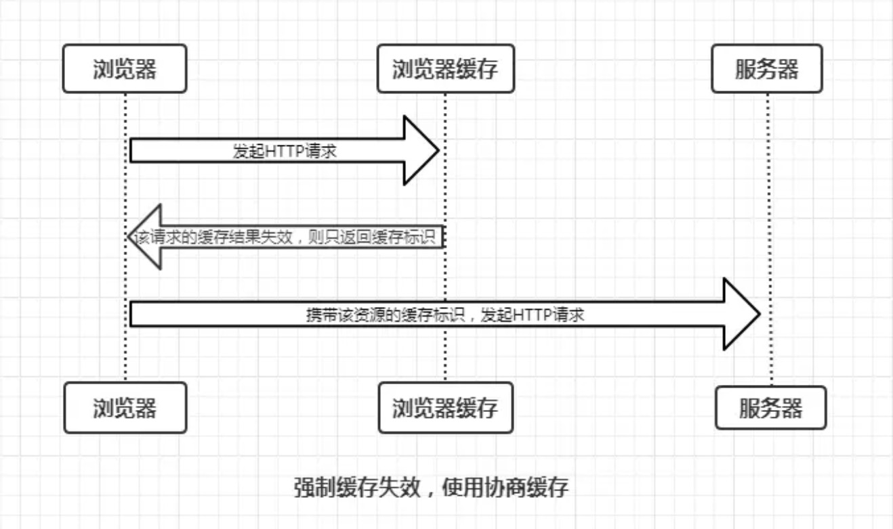
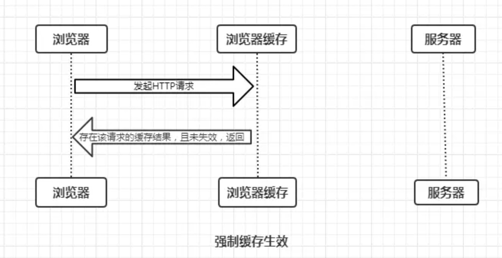
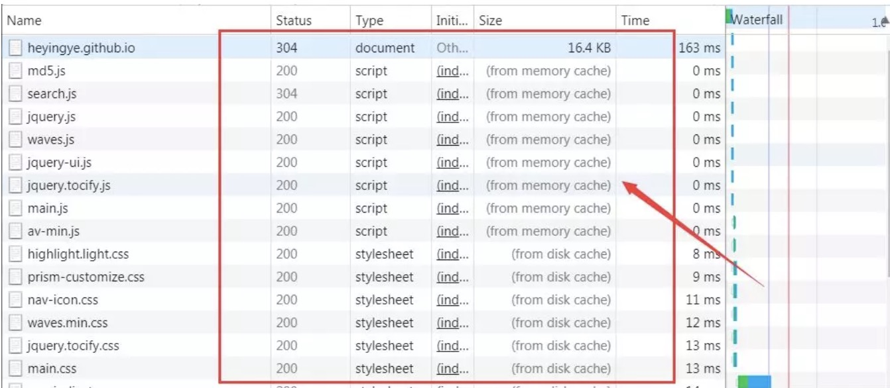
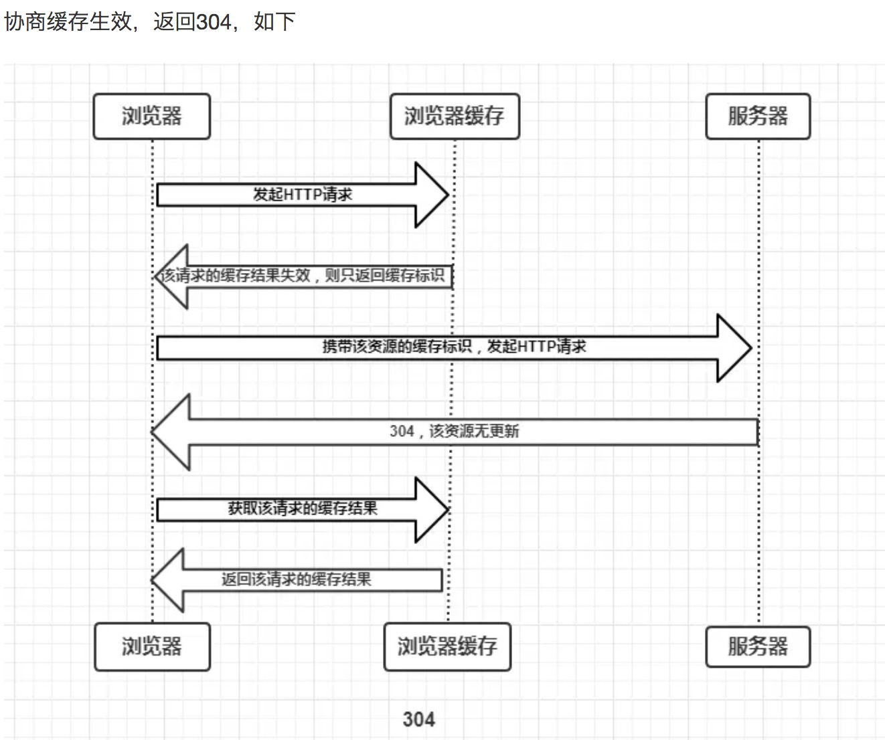
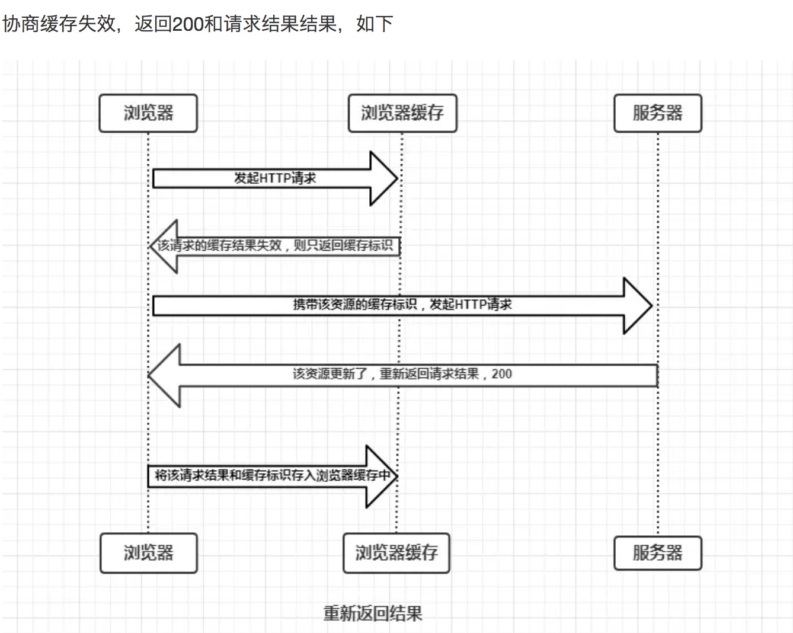

# HTTP缓存机制
## 概述
>浏览器的缓存机制也就是我们说的HTTP缓存机制，其机制是根据HTTP报文的缓存标识进行的。

## 缓存过程分析
>浏览器与服务器通信的方式为应答模式，即是：浏览器发起HTTP请求 - 服务器响应该请求。
那么浏览器第一次向服务器发起该请求后拿到请求结果，会根据响应报文中HTTP头的缓存标识，
决定是否缓存结果，是则将请求结果和缓存标识存入浏览器的缓存中，简单的过程如下图:  

  

由上图我们可以知道：
* 浏览器每次发起请求，都会先在浏览器缓存中查找该请求的结果以及缓存标识
* 浏览器每次拿到返回的请求结果都会将该结果和缓存标识存入浏览器缓存中  

以上两点结论就是浏览器缓存机制的关键，他确保了每次请求的缓存存入与读取。  
这里我们将根据是否需要向服务器重新发起HTTP请求将缓存过程分为两个部分，分别是强制缓存和协商缓存。  

## 强制缓存

强制缓存就是向浏览器缓存查找该请求结果，并根据该结果的缓存规则来决定是否使用该缓存结果的过程，  
强制缓存的情况主要有三种(暂不分析协商缓存过程)，如下：
  

>那么强制缓存的缓存规则是什么？  

当浏览器向服务器发起请求时，服务器会将缓存规则放入HTTP响应报文的HTTP头中和请求结果一起返回给浏览器，
控制强制缓存的字段分别是Expires和Cache-Control，其中Cache-Control优先级比Expires高。  

### Expires
### Cache-Control
在HTTP/1.1中，Cache-Control是最重要的规则，主要用于控制网页缓存，主要取值为：  

* public：所有内容都将被缓存（客户端和代理服务器都可缓存）
* private：所有内容只有客户端可以缓存，Cache-Control的默认取值
* no-cache：客户端缓存内容，但是是否使用缓存则需要经过协商缓存来验证决定
* no-store：所有内容都不会被缓存，即不使用强制缓存，也不使用协商缓存
* max-age=xxx (xxx is numeric)：缓存内容将在xxx秒后失效

>浏览器的缓存存放在哪里，如何在浏览器中判断强制缓存是否生效？  

状态码为灰色的请求则代表使用了强制缓存，请求对应的Size值则代表该缓存存放的位置，分别为from memory cache 和 from disk cache。

>那么from memory cache 和 from disk cache又分别代表的是什么呢？什么时候会使用from disk cache，什么时候会使用from memory cache呢？

from memory cache代表使用内存中的缓存，from disk cache则代表使用的是硬盘中的缓存，浏览器读取缓存的顺序为memory –> disk。

>看到这里可能有人小伙伴问了，最后一个步骤刷新的时候，不是同时存在着from disk cache和from memory cache吗？

对于这个问题，我们需要了解内存缓存(from memory cache)和硬盘缓存(from disk cache)，如下:

* 内存缓存(from memory cache)：内存缓存具有两个特点，分别是快速读取和时效性：
* 快速读取：内存缓存会将编译解析后的文件，直接存入该进程的内存中，占据该进程一定的内存资源，以方便下次运行使用时的快速读取。
* 时效性：一旦该进程关闭，则该进程的内存则会清空。
* 硬盘缓存(from disk cache)：硬盘缓存则是直接将缓存写入硬盘文件中，读取缓存需要对该缓存存放的硬盘文件进行I/O操作，然后重新解析该缓存内容，读取复杂，速度比内存缓存慢。

在浏览器中，浏览器会在js和图片等文件解析执行后直接存入内存缓存中，那么当刷新页面时只需直接从内存缓存中读取(from memory cache)；而css文件则会存入硬盘文件中，所以每次渲染页面都需要从硬盘读取缓存(from disk cache)。

## 协商缓存  

协商缓存就是强制缓存失效后，浏览器携带缓存标识向服务器发起请求，由服务器根据缓存标识决定是否使用缓存的过程，  
主要有以下两种情况：

同样，协商缓存的标识也是在响应报文的HTTP头中和请求结果一起返回给浏览器的，控制协商缓存的字段分别有：  
Last-Modified / If-Modified-Since和Etag / If-None-Match，其中Etag / If-None-Match的优先级比Last-Modified / If-Modified-Since高。

### Last-Modified / If-Modified-Since
### Etag / If-None-Match

## 总结

强制缓存优先于协商缓存进行，若强制缓存(Expires和Cache-Control)生效则直接使用缓存，若不生效则进行协商缓存(Last-Modified / If-Modified-Since和Etag / If-None-Match)，协商缓存由服务器决定是否使用缓存，若协商缓存失效，那么代表该请求的缓存失效，重新获取请求结果，再存入浏览器缓存中；生效则返回304，继续使用缓存，主要过程如下：

### 参考

>原文地址：https://mp.weixin.qq.com/s/d2zeGhUptGUGJpB5xHQbOA  
