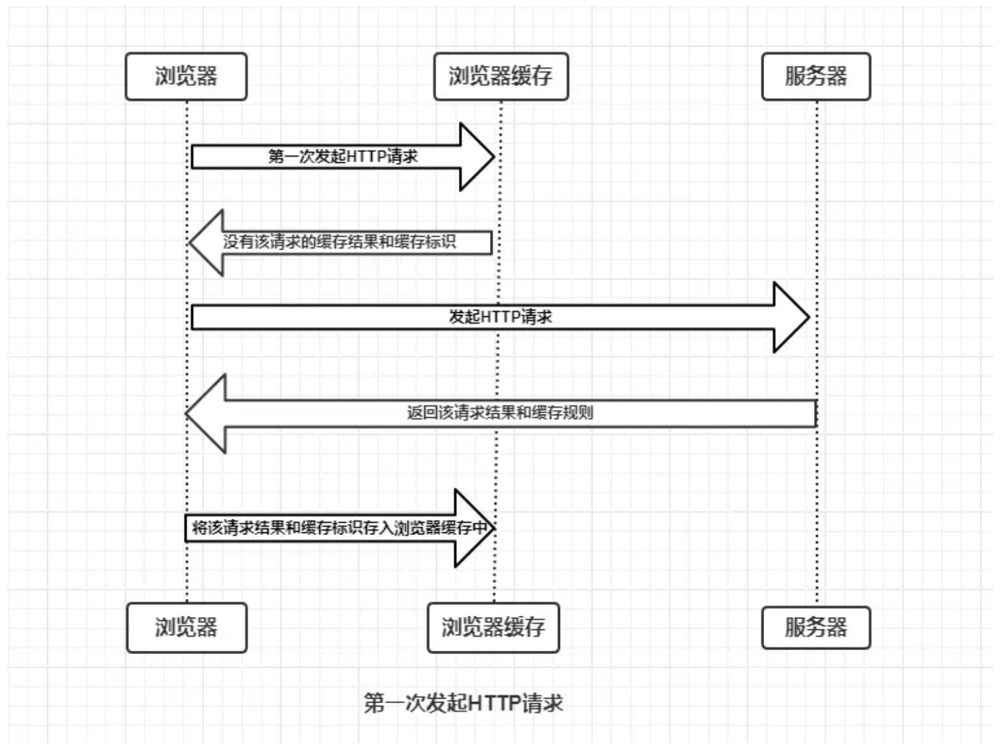

  

浏览器是否需要向服务器重新发起HTTP请求将缓存过程分为两个部分，分别是强制缓存和协商缓存。

1. 强制缓存

当浏览器向服务器发起请求时，服务器会将缓存规则放入HTTP响应报文的HTTP头中和请求结果一起返回给浏览器，
控制强制缓存的字段分别是Expires和Cache-Control，其中Cache-Control优先级比Expires高。 

2. 协商缓存

> 协商缓存就是强制缓存失效后，浏览器携带缓存标识向服务器发起请求，由服务器根据缓存标识决定是否使用缓存的过程。

主要有以下两种情况： 

* 协商缓存生效，返回304，资源无更新，获取该请求的缓存结果。
* 协商缓存失效，返回300和请求结果。将该请求结果和缓存标识存入浏览器缓存中。

协商缓存的标识也是在响应报文的HTTP头中和请求结果一起返回给浏览器的，控制协商缓存的字段分别有：
Last-Modified / If-Modified-Since和Etag / If-None-Match，其中Etag / If-None-Match的优先级比Last-Modified / If-Modified-Since高。