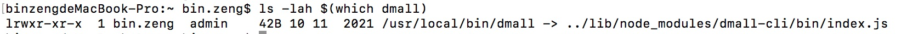

# 使用NodeJS开发命令行工具

> 本着“懒惰是程序员的第一美德”的宗旨，有能力编写出一些能提高研发效率的工具是一件很有成就感的事儿。

## 1. 命令行工具与环境变量 PATH

简而言之: 「在环境变量的 PATH 中路径的命令可在其它任意地方执行」。

「开发命令行的原理也是如此，将你开发的命令行工具脚本置于环境变量 PATH 下的路径之中」，而本篇文章的目标就是:

使用 Javascript 这门前端开发者熟悉的语言，借助 Node 环境，开发一个命令行工具。

## 2. 原理

先看两个 Node 的命令行工具:

通过命令解析出他们指向的符号链接



从中可以看出关于 Node 全局命令行的原理:

* npm 全局下载某个 package 到路径 /usr/local/lib/node_modules 下 (yarn 同理，对应路径 ~/.config/yarn/global/node_modules)
* 根据该库的 package.json 中 bin 字段的指示，把对应的命令行路径通过符号索引挂载到 PATH 路径
* 对应的二进制脚本添加 x 权限 (可执行文件权限)

简而言之，Node 环境下的命令行工具，借助的原理无非是「环境变量 Path」与一个「符号链接」

3. 从 package.json 说起

在 「package.json 中的 bin 字段」，用以指定最终的命令行工具的名字

```
{
    "bin": {
        "dmall": "./bin/index.js"
    }
}
```

如上所示，dmall 是最终在终端执行的命令，而 ./bin/index.js 是该命令实际执行的脚本文件。

对于最终可执行的命令行工具，Node 项目一般倾向置文件于 bin 目录下

4. 一个执行环境

对于可直接执行的文件，需要指明执行环境，首行添加一行说明:

```
#!/usr/bin/env node

// code 往下写
```

这一句话是啥子意思了？

* #! 加解释器，标明该文件使用 /usr/bin/env node 来执行
* /usr/bin/env 为 env 的绝对路径，用以在 PATH 路径中执行命令 (在各种不同的系统中，node 命令行的位置不同，因此使用 env node 找到路径并执行)
* env node 在人为层面可理解为执行 node 命令

所以这句话的意思是: 「使用 node 解释器来执行这个脚本，而通过 env node 能够正确定位到 node 解释器的位置」

```
// 如果不写 #!/usr/bin/env node，需要这么执行
$ node serve .

// 如果写上 #!/usr/bin/env node，可以直接执行
$ serve .
```

5. 解析命令输入

而在命令行工具中，可通过 progress.argv 可获取用户输入。请看以下示例：

```
$ node cmd.js 1 2 3
```

```
// Output: [
//   '/usr/local/bin/node',
//   '/Users/shanyue/cmd.js',
//   '1',
//   '2',
//   '3',
// ]
process.argv
```

根据解析 process.argv 可以定制格式来获取各式各样的参数作为命令行的输入。

当然解析参数也要参照 POSIX 兼容的基本规律: 格式、可选、必选、简写、说明、帮助等等。命令行工具命名协议 文章中已说的足够详细。

7. 可交互性

在 Web 中，可使用 Input 来展现丰富多彩的表单，如开关、多选、单选、输入框等。

而在命令行工具中，也可借用多种库来实现强交互性。

enquire

ora

ink

8. 发布与安装

在辛苦努力写完一个 cli 工具后，就是检验成果的时候。发布到 npm 仓库，可使所有人使用你的命令行工具，这也是最重要的一步

```
# 发布之前需要 npm login，登录到 npm registory
$ npm publish
```

发版成功后全局下载命令行工具，开始使用

```
$ npm i -g dmall-cli
```

如果不想发布到npm仓库，可以通过`npm link`为开发的模块(待发布的npm包)创造一个全局链接，进行测试。


参考：

[使用 Node，如何制作一个专业的命令行工具？](
https://mp.weixin.qq.com/s/TAj-dvEU8FeM6ifq34zanA)
