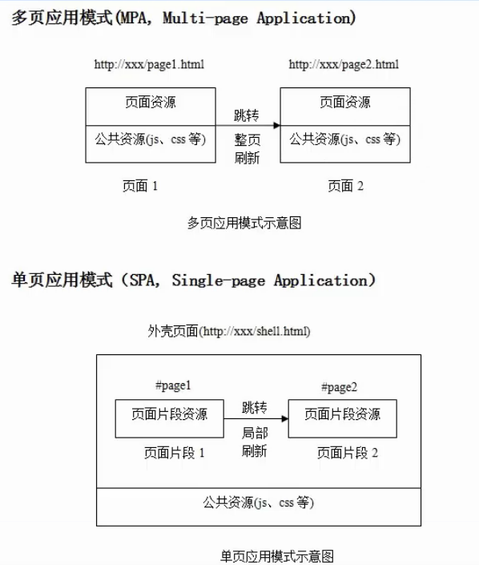

# SPA(单页面应用)和MPA(多页面应用)

#### 目录

* 单页面应用
* 多页面应用
* 总结

## 单页面应用

> 第一次进入页面时会请求一个html文件，刷新清除一下，切换到其他组件，此时路径也相应变化，但是并没有新的html文件请求，页面内容却变化了。

原理： js会感知到url的变化，通过这一点可以用js动态地将当前页面的内容清除，然后将下一个页面的内容挂载到当前页面上。这个时候的路由不再是后端来做了，而是前端来做，判断页面显示相应的组件，清除不需要的。

页面跳转： js渲染  
优点： 页面切换快  
缺点： 首屏时间稍慢，SEO差  

## 多页面应用

> 每一次页面跳转的时候，后台服务器都会返回一个新的html文档，这种类型的网站也就是多页网站，也叫多页应用。

页面跳转： 返回HTML  
优点： 首屏时间快，SEO效果好  
缺点： 页面切换慢  

## 参考链接
* [https://www.jianshu.com/p/a02eb15d2d70](https://www.jianshu.com/p/a02eb15d2d70)