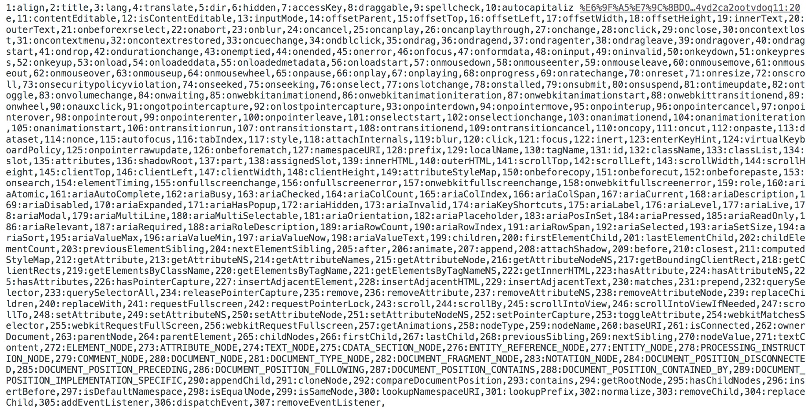

```
<script>
  var div = document.createElement("div")
  var str = ""
  var i = 1
  for (var key in div) {
    str += (`${i++}:${key},`)
  }
  console.log(str)
</script>
```



VNode是对真实的DOM节点的一种抽象描述，它的核心定义无非就几个关键属性，标签名、数据、子节点、键值等。由于VNode只是用来映射到真实DOM的渲染，不需要包含操作DOM的方法，因此它是非常轻量和简单的。