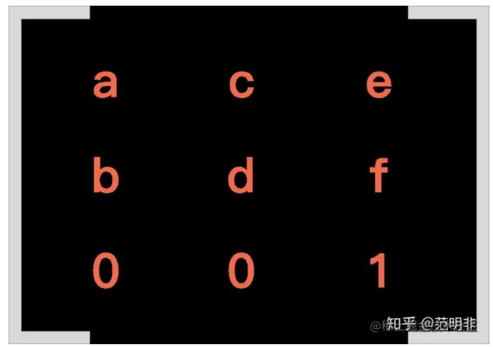

# CSS transform: matrix();

一个元素渲染后就可以得到一张位图，然后对这个位图上每一点进行变换，就可以得到新的一张位图，从而产生了视觉上的平移translate、旋转rotate、缩放scale、拉伸skew 等效果。这一切都是变换矩阵的功劳。

selector {
    transform: matrix(a, b, c, d, e, f);
}

2D 的转换是由一个 3*3 的矩阵表示的，前两行代表转换的值，分别是 a b c d e f，要注意是竖着排的，第一行代表 x 轴发生的变化，第二行代表 y 轴发生的变化，第三行代表 z 轴发生的变化，因为这里是 2D 不涉及 z 轴，所以这里是 0 0 1。

### 缩放
缩放对应的是矩阵中的 a 和 d，x 轴的缩放比例对应 a，y 轴的缩放比例对应 d。

transform: scale(1.5, 1.2);

a=1.5 
d=1.2

transform: matrix(1.5, 0, 0, 2, 0, 0);

### 平移
平移对应的是矩阵中的 e 和 f，平移的 x 和 y 分别对应 e 和 f。

transform: translate(10, 20)

e=10
f=20

transform: matrix(a, b, c, d, 10, 20);

### 旋转
旋转影响的是a/b/c/d四个值，分别是什么呢？

a=cosθ
b=sinθ
c=-sinθ
d=cosθ

如果要计算 30° 的sin值：

// 弧度和角度的转换公式：弧度=π/180×角度 

const radian = Math.PI / 180 * 30 // 算出弧度 

const sin = Math.sin(radian) // 计算 sinθ 
const cos = Math.cos(radian) // 计算 cosθ 

console.log(sin, cos) // 输出 ≈ 0.5, 0.866

如果我们不考虑缩放和偏移，只旋转30°，矩阵应该表示为

transform: rotate(30deg)

a=0.866
b=0.5
c=-0.5
d=0.866

transform: matrix(0.866, 0.5, -0.5, 0.866, 0, 0);

### 拉伸
拉伸也是由两个参数组成，x 轴和 y 轴，分别对应矩阵中的 c 和 b。
是 x 对应 c，y 对应 b， 这个对应并不是相等，需要对 skew 的 x 值 和 y 值进行 tan 运算。

transform: skew(20deg, 30deg);

b=tan30°
c=tan20°

// 先创建一个方法，直接返回角度的tan值 
function tan (deg) { const radian = Math.PI / 180 * deg return Math.tan(radian) } 

const b = tan(30) 
const c = tan(20) 
console.log(b, c) // 输出 ≈ 0.577, 0.364

b=0.577 c=0.364

transform: matrix(1, 0.577, 0.364, 1, 0, 0)

矩阵可以对向量进行转换?

### 参考链接

* [https://developer.mozilla.org/zh-CN/docs/Web/CSS/transform-function](https://developer.mozilla.org/zh-CN/docs/Web/CSS/transform-function)

* [理解 CSS3 transform 中的 matrix](https://juejin.cn/post/6844903616629719054 )