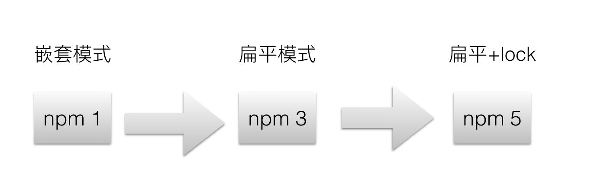

## NPM

Node Package Manager，即“node包管理器”。npm 发展到今天，可以说经历过三个重大的版本变化。

### npm v1-v2

最早的 npm 版本在管理依赖时使用了一种很简单的方式。我们称之为嵌套模式。比如，在你的项目中有如下的依赖。

```
"dependencies": {
    A: "1.0.0",
    C: "1.0.0",
    D: "1.0.0"
}
```

这些模块都依赖 B 模块，而且依赖的 B模块的版本还不同。

```
A@1.0.0 -> B@1.0.0
C@1.0.1 -> B@2.0.0
D@1.0.0 -> B@1.0.0 
```

通过执行 npm install 命令，npm v1 生成的 node_modules目录如下：

```
node_modules
├── A@1.0.0
│   └── node_modules
│       └── B@1.0.0
├── C@1.0.0
│   └── node_modules
│       └── B@2.0.0
└── D@1.0.0
└── node_modules
└── B@1.0.0
```

很明显，每个模块下面都会有一个 node_modules 目录存放该模块的直接依赖。模块的依赖下面还会存在一个 node_modules 目录来存放模块的依赖的依赖。很明显这种依赖管理简单明了，但存在很大的问题，除了 node_modules 目录长度的嵌套过深之外，还会造成相同的依赖存储多份的问题，比如上面的 B@1.0.0 就存放了两份，这明显也是一种浪费。于是在 npm v3 发布后，npm 的依赖管理做出了重大的改变。

### npm v3

对于同样的上述依赖，使用 npm v3 执行 npm install 命令后生成的 node_modules 目录如下：

```
node_modules
├── A@1.0.0
├── B@1.0.0
└── C@1.0.0
    └── node_modules
        └── B@2.0.0 
├── D@1.0.0
```

显而易见，npm v3 使用了一种扁平的模式，把项目中使用的所有的模块和模块的依赖都放在了 node_modules 目录下的顶层，（多个版本的包只有一个(最先安装的一个) 被提升上来，其余版本的包还是会嵌套安装到各自的依赖当中，上面提到的路径过长和重复安装的问题没有彻底解决。）遇到版本冲突的时候才会在模块下的 node_modules 目录下存放该模块需要用到的依赖。之所以能这么实现是基于包搜索机制的。包搜索机制是指当你在项目中直接 require('A') 时，首先会在当前路径下搜索 node_modules 目录中是否存在该依赖，如果不存在则往上查找也就是继续查找该路径的上一层目录下的 node_modules。正因为此，npm v3 才能把之前的嵌套结构拍平，把所有的依赖都放在项目根目录的 node_modules，这样就避免了 node_modules 目录嵌套过深的问题。此外，npm v3 还会解析模块的依赖的多个版本为一个版本，比如 A依赖 B@^1.0.1，D 依赖 B@^1.0.2，则只会有一个 B@1.0.2 的版本存在。虽然 npm v3 解决了这两个问题，但是此时的 npm 仍然存在诸多问题，被人诟病最多的应该就是它的不确定性了。


### npm v5

什么是确定性。在 JavaScript 包管理的背景下，确定性是指在给定的 package.json 和 lock 文件下始终能得到一致的 node_modules 目录结构。简单点说就是无论在何种环境下执行 npm install 都能得到相同的 node_modules 目录结构。npm v5 正是为解决这个问题而产生的，npm v5 生成的 node_modules 目录和 v3 是一致的，区别是 v5 会默认生成一个 package-lock.json 文件，来保证安装的依赖的确定性。比如，对于如下的一个 package.json 文件

```
"dependencies": {
    "redux": "^3.7.2"
}
```

对应的 package-lock.json 文件内容如下：

```
{
  "name": "test",
  "version": "1.0.0",
  "lockfileVersion": 1,
  "requires": true,
  "dependencies": {
    "js-tokens": {
      "version": "3.0.2",
      "resolved": "https://registry.npmjs.org/js-tokens/-/js-tokens-3.0.2.tgz",
      "integrity": "sha1-mGbfOVECEw449/mWvOtlRDIJwls="
    },
    "lodash": {
      "version": "4.17.4",
      "resolved": "https://registry.npmjs.org/lodash/-/lodash-4.17.4.tgz",
      "integrity": "sha1-eCA6TRwyiuHYbcpkYONptX9AVa4="
    },
    "lodash-es": {
      "version": "4.17.4",
      "resolved": "https://registry.npmjs.org/lodash-es/-/lodash-es-4.17.4.tgz",
      "integrity": "sha1-3MHXVS4VCgZABzupyzHXDwMpUOc="
    },
    "loose-envify": {
      "version": "1.3.1",
      "resolved": "https://registry.npmjs.org/loose-envify/-/loose-envify-1.3.1.tgz",
      "integrity": "sha1-0aitM/qc4OcT1l/dCsi3SNR4yEg=",
      "requires": {
        "js-tokens": "3.0.2"
      }
    },
    "redux": {
      "version": "3.7.2",
      "resolved": "https://registry.npmjs.org/redux/-/redux-3.7.2.tgz",
      "integrity": "sha512-pNqnf9q1hI5HHZRBkj3bAngGZW/JMCmexDlOxw4XagXY2o1327nHH54LoTjiPJ0gizoqPDRqWyX/00g0hD6w+A==",
      "requires": {
        "lodash": "4.17.4",
        "lodash-es": "4.17.4",
        "loose-envify": "1.3.1",
        "symbol-observable": "1.1.0"
      }
    },
    "symbol-observable": {
      "version": "1.1.0",
      "resolved": "https://registry.npmjs.org/symbol-observable/-/symbol-observable-1.1.0.tgz",
      "integrity": "sha512-dQoid9tqQ+uotGhuTKEY11X4xhyYePVnqGSoSm3OGKh2E8LZ6RPULp1uXTctk33IeERlrRJYoVSBglsL05F5Uw=="
    }
  }
}
```

不难看出，package-lock.json 文件里记录了安装的每一个依赖的确定版本，这样在下次安装时就能通过这个文件来安装一样的依赖了。



## Yarn

yarn 是在 2016.10.11 开源的，yarn 的出现是为了解决 npm v3 中的存在的一些问题，那时 npm v5 还没发布。yarn 被定义为快速、安全、可靠的依赖管理。

* 快速：全局缓存、并行下载、离线模式
* 安全：安装包被执行前校验其完整性
* 可靠：lockfile文件、确定性算法

yarn 生成的 node_modules 目录结构和 npm v5 是相同的，同时默认生成一个 yarn.lock 文件。

## PNMP

Performance NPM，即“高性能的node包管理器”

Pnpm 只是从全局存储中**链接文件**，而 yarn 从其缓存中**复制文件**。软件包版本永远不会在磁盘上多次保存。

pnpm 的算法没有使用扁平化的依赖树，这使得它更容易实现、维护，并且需要更少的计算。

这是 NPM 3 及更早版本中使用的方法，但嵌套存在问题，因此必须为每个**依赖它们**的包**复制多次包**。

与 NPM 相比，PNPM 通过**硬链接**和**符号链接**解决了上述问题。PNPM 按符号链接对所有依赖项进行分组，但保留所有依赖项。

与其他两个包管理器相比，PNPM 还可以**节省大量空间**。

### 参考链接

https://www.atatus.com/blog/npm-vs-yarn-vs-pnpm/


