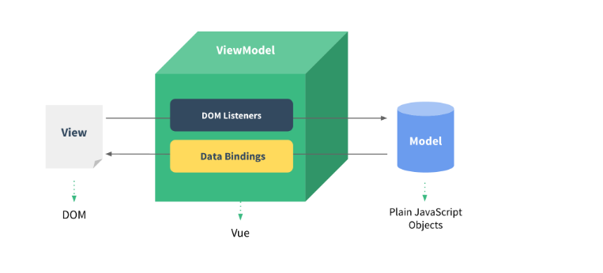

# 数据驱动视图

什么是数据驱动视图？

数据驱动视图就是当数据发生变化的时候，用户界面发生相应的变化，开发者不需要手动的去修改dom。

优点：只关心数据的处理，数据变化后自然的通知页面进行重新渲染，不会导致混乱。

## MVVM框架

Vuejs的数据驱动是通过MVVM这种框架来实现的。MVVM框架主要包含3个部分:model、view和 viewmodel。

Model:指的是数据部分，对应到前端就是javascript对象

View:指的是视图部分，对应前端就是dom

Viewmodel:就是连接视图与数据的中间件

数据(Model)和视图(View)是不能直接通讯的，而是需要通过ViewModel来实现双方的通讯。当数据变化的时候，viewModel能够监听到这种变化，并及时的通知view做出修改。同样的，当页面有事件触发时，viewMOdel也能够监听到事件，并通知model进行响应。Viewmodel就相当于一个观察者，监控着双方的动作，并及时通知对方进行相应的操作。

### 参考

https://www.cnblogs.com/caizhenbo/p/6418284.html