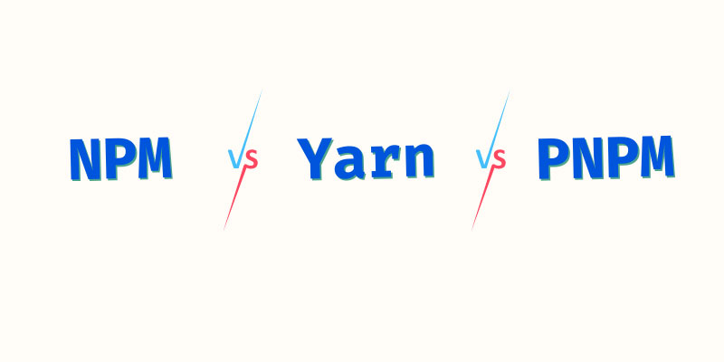

## NPM

Node Package Manager，即“node包管理器”

## Yarn

## PNMP

Performance NPM，即“高性能的node包管理器”

Pnpm 只是从全局存储中**链接文件**，而 yarn 从其缓存中**复制文件**。软件包版本永远不会在磁盘上多次保存。

pnpm 的算法没有使用扁平化的依赖树，这使得它更容易实现、维护，并且需要更少的计算。

这是 NPM 3 及更早版本中使用的方法，但嵌套存在问题，因此必须为每个**依赖它们**的包**复制多次包**。

与 NPM 相比，PNPM 通过**硬链接**和**符号链接**解决了上述问题。PNPM 按符号链接对所有依赖项进行分组，但保留所有依赖项。

与其他两个包管理器相比，PNPM 还可以**节省大量空间**。

### 参考链接

https://www.atatus.com/blog/npm-vs-yarn-vs-pnpm/ 