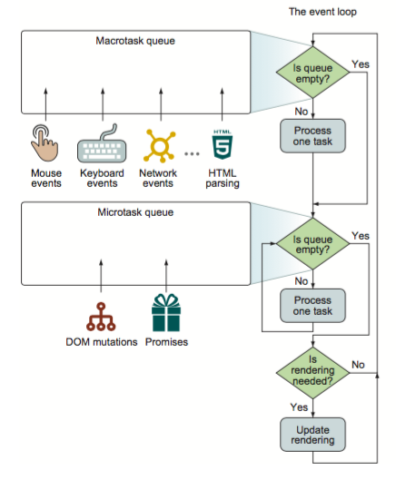

# 浏览器中的事件循环机制

### 简介

* event loop （事件循环）
	1. Macrotask queue (宏任务队列)
		* Mouse events (鼠标事件)
		* Keyboard events (键盘事件)
		* Network events (网络事件)
		* ...(等等)
		* HTML parsing (HTML解析)
	2. Microtask queue (微任务队列)
		* DOM mutations (DOM突变？不明白！！！)
		* Promises (Promise.then().then())

### 事件循环过程 

事件循环开始

* 第一步： 检查宏任务队列是否为空
	* 否 -> 从宏任务队列中拿出一个任务 -> 这个任务压栈执行
	* 是 -> 跳第二步
* 第二步： 检查微任务队列是否为空
	* 否 -> 从微任务队列中拿出一个任务 -> 这个任务压栈执行 -> 回到第二步(循环执行微任务队列，一次取一个微任务压栈执行，直到这次事件循环中微任务队列为空)
	* 是 -> 跳第三步
* 第三步：是否需要渲染
	* 否 -> 下一次事件循环
	* 是 -> 更新渲染 -> 完成后进入下一次事件循环 
	

