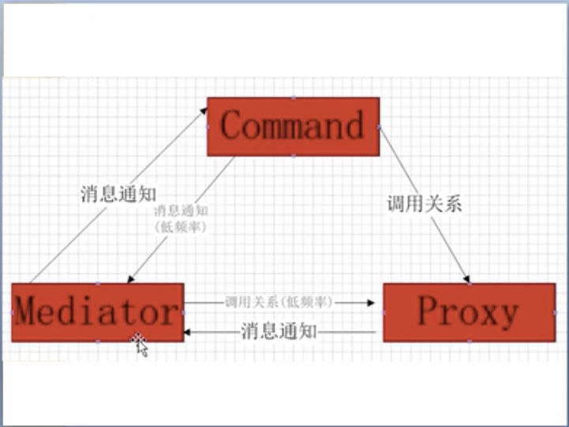

# PureMVC

用 PureMVC 创建健壮、易扩展、易维护的客户端程序
Model->Proxy
View -> Mediator
Controller -> Command

Command 可以获取 Proxy 对象并与之交互，发送 Notification，执行其他 的 Command

在实际的应用中，你只需继承 Façade 类创建一个具体的 Façade 类就 可以实现整个 MVC 模式，并不需要在代码中导入编写 Model，View 和 Controller 类。

Observer 与 Notification 

PureMVC 的通信是使用观察者模式以一种松耦合的方式来实现的

你只需要使用一个非常简单的方法从 Proxy, Mediator, Command 和 Facade 发送 Notification，甚至不需要创建一个 Notification 实例。

## Notification可以被用来触发Command的执行

## Mediator发送、声明、接收Notification 
当用 View 注册 Mediator 时，Mediator 的 listNotifications 方法会被调用， 以数组形式返回该 Mediator 对象所关心的所有 Notification。

之后，当系统其它角色发出同名的 Notification（通知）时，关心这个通知的 Mediator 都会调用 handleNotification 方法并将 Notification 以参数传递到 方法。

## Proxy发送，但不接收Notification 
在很多场合下 Proxy 需要发送 Notification（通知）

如果让 Proxy 也侦听 Notification（通知）会导致它和 View（视图）层、 Controller（控制）层的耦合度太高。 

View 和 Controller 必须监听 Proxy 发送的 Notification，因为它们的职责是 通过可视化的界面使用户能与 Proxy 持有的数据交互。

## Notification
### Event 与 Notification 
Facade 和 Proxy 只能发送 Notification 
Mediators 既可以发送也可以接 收 Notification 
同时 Command 也 可以发送 Notification 

### SimpleCommand和MacroCommand的使用
SimpleCommand 只有一个 execute 方法，execute 方法接受一个 
Inotification 实例做为参数 

MacroCommand 让你可以顺序执行多个 Command。每个执行都会创建 
一个 Command 对象并传参一个对源 Notification 的引用。 

### 降低Command与Mediator, Proxy的耦合度

为了和系统其他部分交互与通信，Command 可能需要: 
1. 注册、删除 Mediator、Proxy 和 Command，或者检查它们是否已经注册。 
2. 发送Notification通知Command或Mediator做出响应。 
3. 获取Proxy和Mediator对象并直接操作它们。 

### 复杂的操作与业务逻辑 

Command 应该做什么? 

程序中的逻辑分为 Business Logic(业务逻辑)和 Domain Logic(域逻 
 辑)，首先需要知道这两者之间的差别。

Proxy 集中程序的 Domain Logic(域逻辑)，并对外公布操作数据对象的 API。 

Mediator 和 Proxy 可以提供一些操作接口让 Command 调用来管理 View Component 和 Data Object，同时对 Command 隐藏具体操作的细节。 

View Component 时就是指像按钮这种用户直接交互的小 东西 。
Data Object 则是指能以任意结构存储数据的对象。 

比较特殊的是 Application 的 Mediator，它是唯一的被允许知道 Application 一切的类，所以我们会在 Application Mediator 的构造函数中 创建其他的 Mediator 对象。 

Command 的业务逻辑应该避免被 Model 或 View 的变化而受到影响。 

Model 应该封装域逻辑(domain logic)，保证数据的完整性。Command 则处理事 务或业务逻辑，协调多个 Proxy 的操作，处理异常等。 

## Mediator 
Mediator 侦􏰁 View Component 来处理用户动作和 Component 的 数据请求。Mediator 通过发送和接收 Notification 来与程序其他部分 通信。 

### Mediator的职责
一个 View Component 应该把尽可能自己的状态和操 作封装起来，对外只提供事件、方法和属性的简单的 API。 

Mediator 保存了一个或多个 View Component 的引用，通过 View Component 自身提供的 API 管理它们。 

Mediator 的主要职责是处理 View Component 派发的事件和系统其他部 分发出来的 Notification(通知)。 

因为 Mediator 也会经常和 Proxy 交互，所以经常在 Mediator 的构造方法中取得 Proxy 实例的引用并保存在 Mediator 的属性中，这样避免频繁的获取 Proxy 实 例。 

PureMVC 的 Mediator 基类在构造方法中提供两个参数:name(名称)和一个Object 类型的对象。 

这个 Mediator 子类会在构造函数中把它的 View Component 传参给父类， 它会在内部赋值给一个 protect 属性:viewComponent，并传化为
Object 类型。 

调用它的 setViewComponent 函数 来动态给它的 View Component 赋值(修改) 

通常一个 Mediator 只对应一个 View Component，但却可能需要管理多
个 UI 控件 ，比如一个 ApplicationToolBar 和它包􏰀的 button 或 control。 我们可以把一组相关的 Control(比如 from)放在一个 View Component 里，把这组相关的控件当作一个 View Component，对 Mediator 来说， 这些控件是这个 View Component 的属性，应尽可能的封装它们的操作与 之交互。 

Mediator 负责处理与 Controller 层、Model 层交互，在收到相关 Notification 时更新 View Component。 

Mediator 按需求对事件做出响应。
一般地，一个 Mediator 的事件响应会有以下几种处理: 

* 检查事件类型或事件的自定义内容。 
* 检查或修改 View Component 的属性(或调用提供的方法)。 
* 检查或修改Proxy对象公布的属性(或调用提供的方法)。 
* 发送一个或多个 Notification，通知别的 Mediatora 或 Command 作出响应(甚至有可能发送给自身)。 

下面是一些有用的经验:

* 如果有多个的 Mediator 对同一个事件做出响应，那么应该发 送一个 Notification，然后相关的 Mediator 做出各自的响应。 
*  如果一个 Mediator需要和其他的 Mediator进行大量的交互， 那么一个好方法是利用 Command 把交互步骤定义在一个地方。 
* 不应该让一个 Mediator 直接去获取调用其他的 Mediator，在Mediator 中定义这样的操作本身就是错误的。
*  Proxy 是有状态的，当状态发生变化时发送 Notification通知Mediator，将数据的变化反映到视图。 

### 在 Mediator 里处理 Notification 
在 Mediator 实例化时，PureMVC 会调用 Mediator 的 listNotificationInterests 方法查询其关心的 Notification，Mediator 则
在 listNotificationInterests 方法中以数据形式返回这些 Notification 名称。 

Notification 名称通常以常量形式定义在 Façade 类中 
下面是个例子: 
override public function listNotificationInterests() : Array { 
	return [
		ApplicationFacade.SEARCH_FAILED, 
		ApplicationFacade.SEARCH_SUCCESS 
	]; 
} 

当这个数组里的一个 Notification 被系统的其他部分(也可能是 Mediator 对象自身)发出时，Mediator 对象的 handleNotification 函数会被调用， 并传进 Notification 参数。 

本质上来讲，在收到一个 Notification 时 Mediator 是所要操作的是很少的。有时 候(偶尔)，我们需要从 Notification 里获取有关 Proxy 的信息，但记住，不应 该让处理 Notification 的方法负责复杂逻辑。业务逻辑应该放在 Command 中而 非在 Mediator 中。 

通常对于每一个事件都需要添加一个监􏰁方法，一般这些方法只是发送 Notification，处理逻辑应该不复杂，也不应该涉及太多的 View Component 细节，因为对视图 View Component 的处理应该尽可能的封装起来。 

Mediator 是被用来负责 View Component 和系统其他部分的通信的。 

### Mediator 和 Proxy 之间、Mediator 和其他 Mediator 之间的耦合 
虽然 Mediator 可以任意访问 Proxy，通过 Proxy 的 API 读取、操作 Data Object， 但是，由 Command 来做这些工作可以实现 View 和 Model 之间的松耦合。 

同样的情况，虽然 Mediator 可以从 View 获取其他的 Mediator，通过 API 访问、操作它们。但这样是很不好的，它会导致 View 下成员的相互依赖， 这违反了“改变一个不影响其他”的目的。 
如果一个 Mediator 要和其他 Mediator 通信，那它应该发送 Notification 来实现， 而不是直接引用这个 Mediator 来操作。 

Mediator 对外不应该公布操作 View Component 的函数。而是自己接收 Notification 做出响应来实现。 

如果一个 Mediator 有太多的对 Proxy 及其数据的操作，那么，应该把这些代码 重构在 Command 内，简化 Mediator，把业务逻辑(Business Logic)移放到 Command 上，这样 Command 可以被 View 的其他部分重用，还会实现 View 和 Model 之间的松耦合提高扩展性。 

### 用户与 View Component 和 Mediator 的交互

Mediator 监听的是 viewComponent 派发的事件

## Proxy 

Proxy Pattern(代理模式)被用来为 控制、访问对象 提供一个代理。 

在 基于 PureMVC 的应用程序，Proxy 类被设计用来管理程序数据模型。 

Proxy 可能会提供访问 Data Object 部分属性或方法的 API，也可能直接提供 Data Object 的引用。如果提供了更 新 Data Object 的方法，那么在数据被修改时可能会发送一个 Notifidation 通知系统 的其它部分。 

### Proxy 的职责

在 PureMVC 中，Proxy 是个被 Model 注册的简单的数据持有者。 

通常 Proxy Pattern 有以下几种类型:

* Remote Proxy, 当 Proxy 管理的数据存放在远程终端，通过 某种服务访问。 
* Proxy and Delegate, 多个 Proxy 共享对一个服务的访问， 由 Delegate 封装对服务的控制访问，确保响应正确的返回给 相应的请求者。 
* Protection Proxy, 用于数据对象的访问有不同的权限时。 
* Virtual Proxy, 对创建开销很大的数据对象进行管理。 
* Smart Proxy, 首次访问时载入数据对象到内存，并计算它被 引用的次数，允许锁定确保其他对象不能修改。 

### 转换数据对象 
Proxy 基类的构造方法接受一个名称(name)和一个 Object 类型的参数

一个很好的惯用做法是在你具体的 Proxy 类中引入一个适当命名的隐式 getter，用来把 Data Object 转化它真正的类型。 

### 避免对 Mediator 的依赖 
Proxy 不监􏰁 Notification，也永远不会被通知，因为 Proxy 并不关心 View 的状态。但是，Proxy 提供方法和属性让其它角色更新数据。 

它应该采取的方式是发送 Notification(这些 Notification 可能被 Command 或 Mediator 响应)。Proxy 不关心这些 Notification 被发出后会影响到系统 的什么。 

### 封装域逻辑 
我们把 Domain Logic(域逻辑)尽可能放在 Proxy 中实现，这样尽可能地 
做到 Model 层与相关联的 View 层、Controller 层的分离。

### 与 Remote Proxy 通信 
