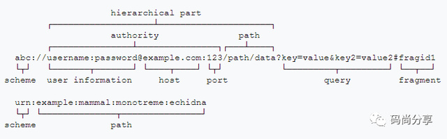
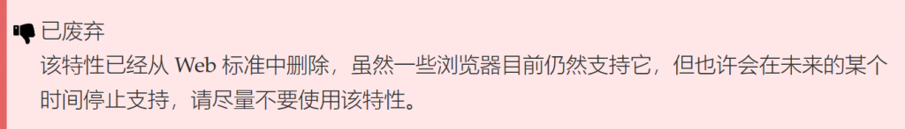

# URL详解与URL编码/解码

## 一、URL简介

>URL：(Uniform/Universal Resource Locator 的缩写，统一资源定位符)。

>URI：(Uniform Resource Identifier 的缩写，统一资源标识符)。


### URL 标准格式

[http://www.aspxfans.com:8080/news/index.asp?boardID=5&ID=24618&page=1#name](http://www.aspxfans.com:8080/news/index.asp?boardID=5&ID=24618&page=1#name)

从上面的URL可以看出，一个完整的URL包括以下几部分：



通常而言，我们所熟悉的 URL 的常见定义格式为：

```
scheme://host[:port#]/path/.../[;url-params][?query-string][#anchor]

scheme //有我们很熟悉的http、https、ftp以及著名的ed2k，迅雷的thunder等。
host   //HTTP服务器的IP地址或者域名
port#  //HTTP服务器的默认端口是80，这种情况下端口号可以省略。如果使用了别的端口，必须指明，例如tomcat的默认端口是8080 http://localhost:8080/
path   //访问资源的路径
url-params  //所带参数
query-string    //发送给http服务器的数据
anchor //锚点定位
```

## 二、编码

在 JavaScript 中，一共有三个方法可以对字符串进行 URI 编码，分别为 escape()、encodeURI() 与 encodeURIComponent()，它们的区别如下。

### escape() 方法


### encodeURI() 方法
类型	包含  
保留字符	; , / ? : @ & = + $  
非转义的字符	字母 数字 - _ . ! ~ * ' ( )  
数字符号	#  

因此，encodeURI 自身无法产生能适用于 HTTP GET 或 POST 请求的 URI，例如对于 XMLHTTPRequests， 因为 “&”, “+”, 和 “=” 不会被编码，然而在 GET 和 POST 请求中它们是特殊字符。

### encodeURIComponent() 方法
encodeURIComponent() 是对统一资源标识符（URI）的组成部分进行编码的方法。它使用一到四个转义序列来表示字符串中的每个字符的 UTF-8 编码。正因为这个方法是对 URI 的组成部分编码的，所以其中不应该含有任何 URI 特殊字符，它会转义除了字母、数字、(、)、.、!、~、*、'、-和_之外的所有字符，原因如 MDN 上所写：

>为了避免服务器收到不可预知的请求，对任何用户输入的作为 URI 部分的内容你都需要用 encodeURIComponent 进行转义。比如，一个用户可能会输入”Thyme &time=again“ 作为 comment 变量的一部分。如果不使用 encodeURIComponent 对此内容进行转义，服务器得到的将是 comment=Thyme%20&time=again。请注意，”&” 符号和”=” 符号产生了一个新的键值对，所以服务器得到两个键值对（一个键值对是 comment=Thyme，另一个则是 time=again），而不是一个键值对。

>—— encodeURIComponent() | MDN

## 三、解码

### decodeURIComponent() 方法

## 参考链接

* [https://www.cnblogs.com/coco1s/p/5038412.html](https://www.cnblogs.com/coco1s/p/5038412.html)