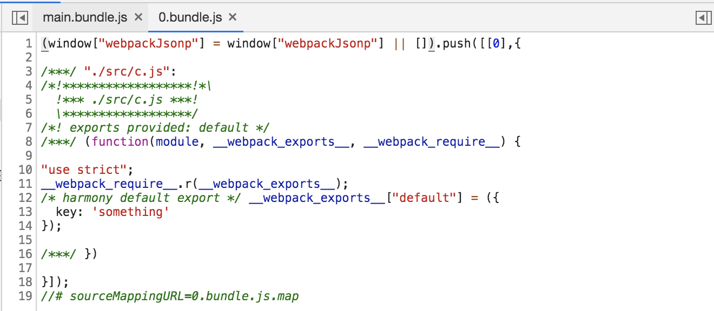
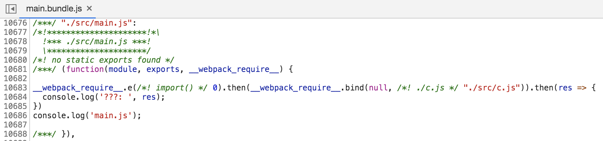

# webpack 代码分离(import方法)

## 动态导入(dynamic imports) 

当涉及到动态代码拆分时，webpack 提供了两个类似的技术。第一种，也是推荐选择的方式是，使用符合 ECMAScript 提案 的 import() 语法 来实现动态导入。第二种，则是 webpack 的遗留功能，使用 webpack 特定的 require.ensure。

> import() 调用会在内部用到 promises。如果在旧版本浏览器中使用 import()，记得使用一个 polyfill 库（例如 es6-promise 或 promise-polyfill），来 shim Promise。

```
// c.js
export default {
  key: 'something'
}
```

```
import('./c.js').then(res => {
  console.log('???: ', res);
})
console.log('main.js');
```

## 分析

以上代码，执行npm run build后，输出的js文件有两个：main.bundle.js和0.bundle.js，其中main.bundle.js首先插入script中执行，0.bunlde.js是动态引入的，其内容如下，主要包裹了c.js：

### 0.bundle.js:



### main.bundle.js

是一个立即执行函数，入参如下图，主要包裹着main.js的内容，其中会动态引入0.bundle.js(包裹着c.js这个module)：



主要就是webpack_require.e这个方法，webpack_require.e会返回promise

## 参考链接

* [webpack 代码分离](https://webpack.docschina.org/guides/code-splitting/#%E5%8A%A8%E6%80%81%E5%AF%BC%E5%85%A5-dynamic-imports-)
* [https://www.jianshu.com/p/65ad66d72e7d](https://www.jianshu.com/p/65ad66d72e7d)
