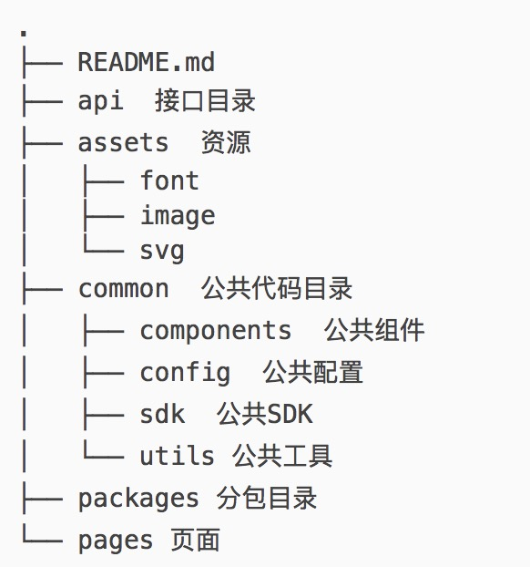

# 项目目录与文件结构规范


## 1、目录结构规范

## 2、文件/文件夹命名规范

1. 文件/文件夹命名

1)最好用一个单词描述

常用项目命名omi、element、master、project、test、vue、iview

二级目录build、static、config、src、examples、base、common、issues、assert

三级目录libs、models、plugins、skins、images、css、js

常用文件命名 index、shopping（购物）、 share（分享）、integral（积分）、advertisement（广告）、pay（支付）、community（社区）、game、docs、bussiness

2)如果一个单词描述不了，用2个词（名词加动词）

color-pick、button-groups、date-picker、option-grounp、jquery-select、jquery-swiper等等反正就是自我想象

3)中间用-或者_连接为了方便归类、一目了然

node_models、async-demo、array-union、array-differ、babel-each

例如：

移动广告(mobile-advertisement)
移动社交(mobile-social)
移动电子商务(mobile-bussiness)
手机游戏(mobile-game)
手机电视(mobile-tv)
移动电子阅读(mobile-reading)
手机搜索(mobile-search)
移动支付(mobile-pay)
手机内容共享(mobile-share)

文件/文件夹都可以用名词+需要的动词命名，达到见词知意

https://zhuanlan.zhihu.com/p/27135630 