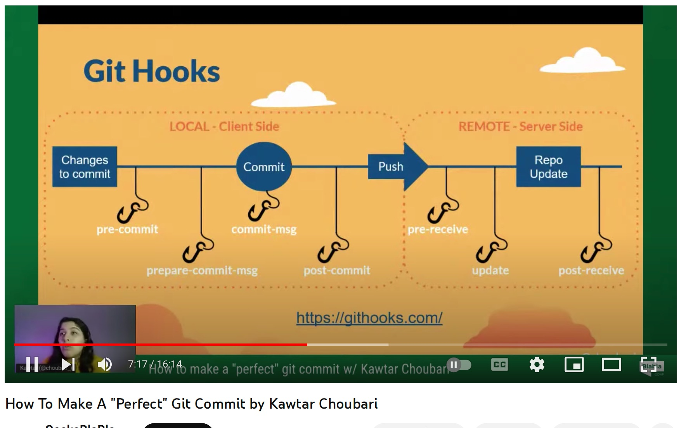

# Husky - Git Hook 工具

## 前沿

在实际的团队协作开发中，你是否曾经遇到过这样的问题：当你在本地执行拉取（pull）操作，获取到团队成员的代码时，却发现他们的代码并未经过格式化，或者存在一些语法错误，甚至遗漏了某个文件的提交。而此时，那位同事却恰好处于休假状态。你只能先着手解决这些报错问题，才能顺利地在本地运行代码。而如果你也修改了那些未经格式化的代码，并在推送（push）之后，同事休假回来，他们对代码进行了格式化处理，并添加了新的功能，当他们提交时，就会产生大量的冲突，而再去解决这些不必要的冲突，又需要消耗你大量的精力。所以规范git提交操作，在git提交时进行eslint静态代码检查，以及格式化代码，这是必要的。

## 安装 husky

`npm install husky --save-dev`

`npx husky-init`

执行成功后，项目中生成一个 .husky 目录

#### 常见钩子

以下是一些常见的 Husky 钩子以及它们的作用：

* pre-commit：在提交代码之前执行的钩子。可以用于运行代码格式化、代码质量检查、单元测试等操作，以确保提交的代码符合规范。

* commit-msg：在提交信息（Commit Message）被创建之后、实际执行提交之前执行的钩子。可以用于对提交信息进行验证、校验和规范，以确保提交信息的格式正确且符合规范。

* pre-push：在推送代码之前执行的钩子。可以用于运行集成测试、端到端测试等操作，以确保即将推送的代码通过了所有的测试。

* prepare-commit-msg：在提交信息被编辑之后、实际执行提交之前执行的钩子。可以用于自动化地修改或添加提交信息，如添加一个统一的前缀或后缀。

* post-merge：在代码合并（merge）之后执行的钩子。可以用于运行安装依赖、构建项目或其他必要的后续操作。

* post-checkout：在切换分支（checkout）之后执行的钩子。可以用于执行特定分支下的必要任务，如安装依赖、清理缓存等。

* post-rewrite：在使用 Git 命令改写提交历史（如使用 git commit --amend）之后执行的钩子。可以用于对改写后的提交进行必要的操作和验证。



当你想新增钩子时可以使用命令：

```
npx husky add .husky/commit-msg 'npm test'
```