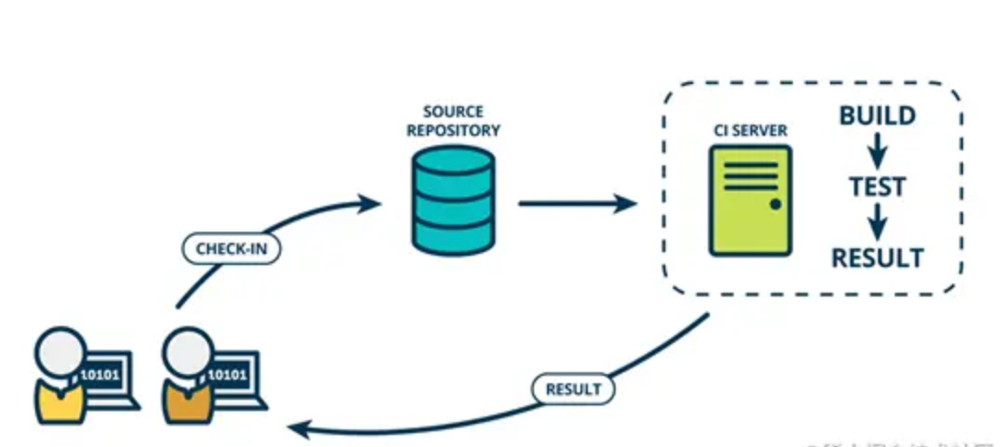
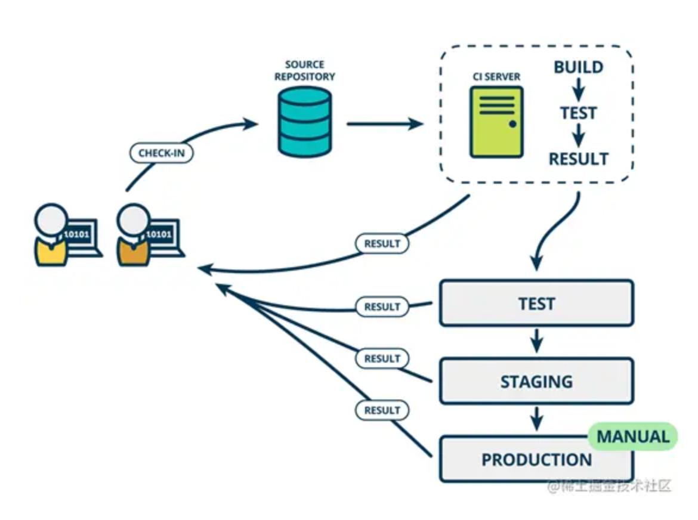
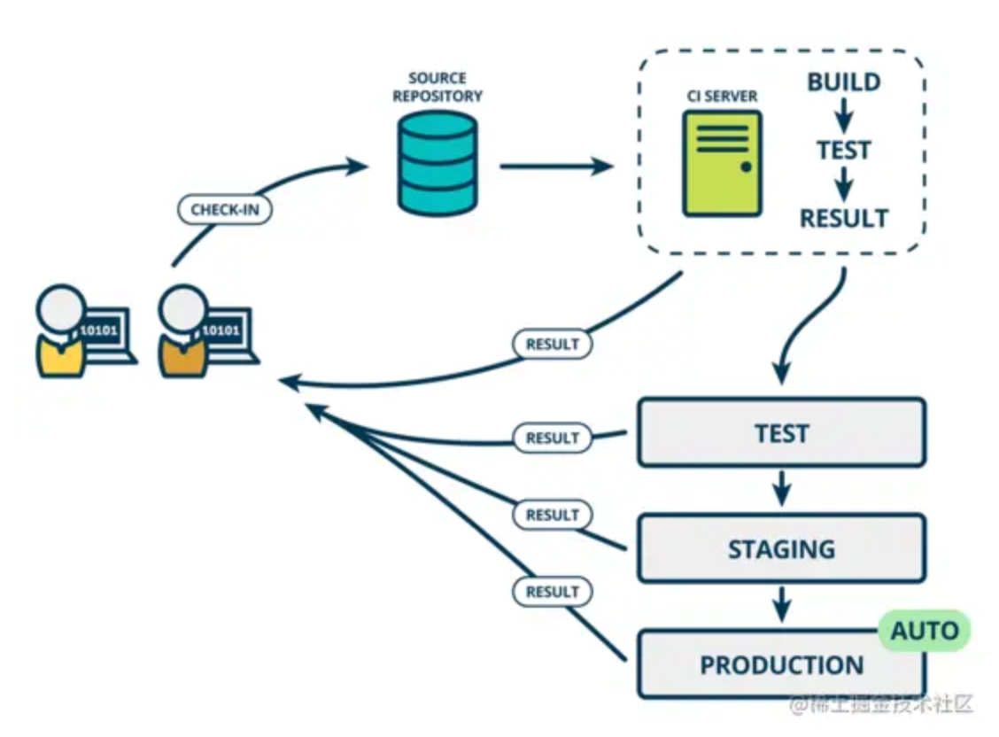
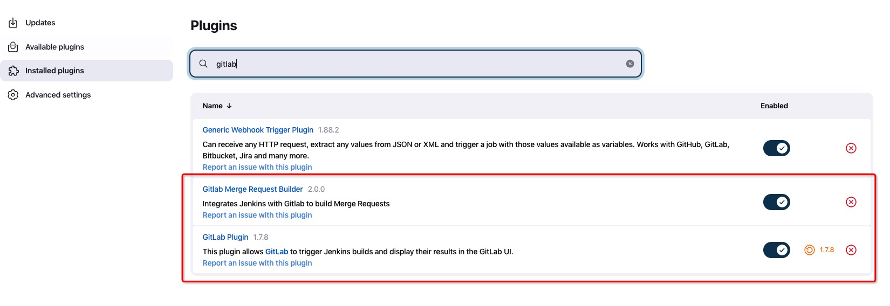
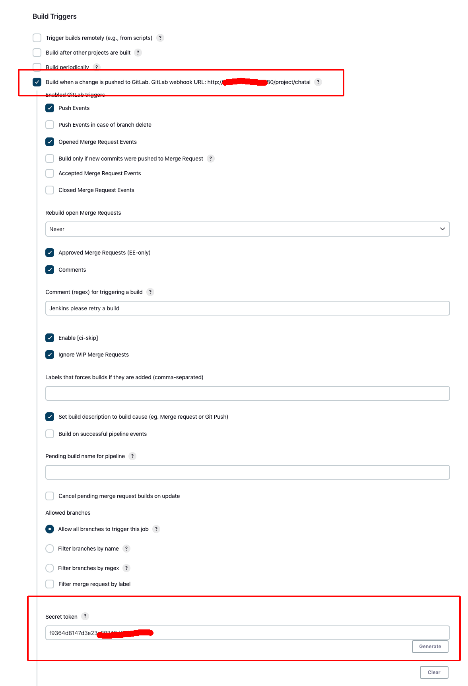
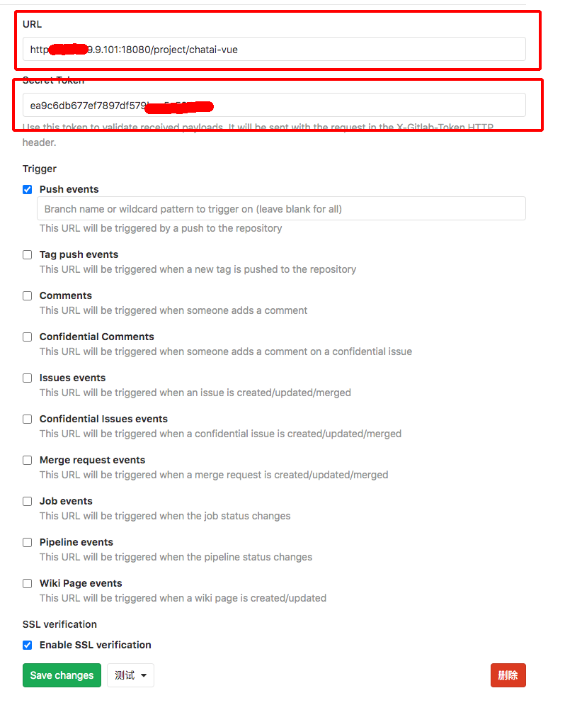
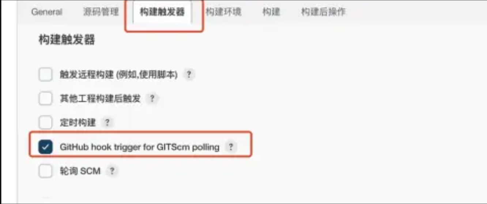
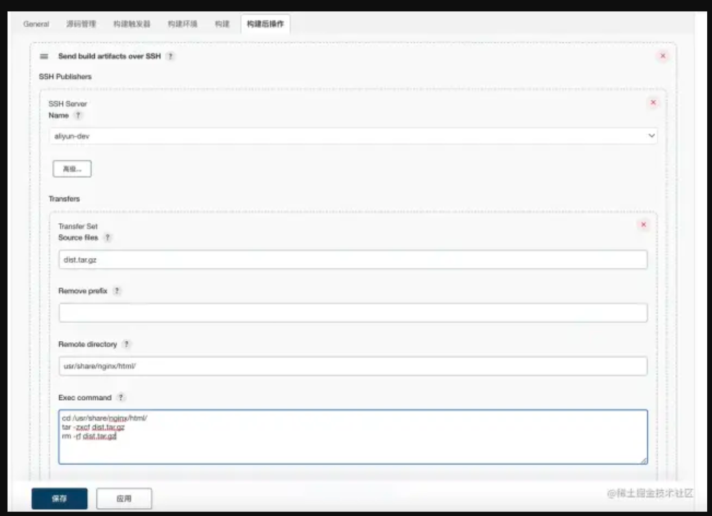

# 部署自动化

## 前言

传统项目部署流程：手动打包、上传代码到git、部署项目。这个过程虽然简单，但往往是重复性强且浪费时间还容易出错，尤其是当项目规模较大时，整个流程会变得非常耗时和繁琐。

为了解决这个问题我们有必要为项目配置 CI/CD 流程。

## 名词解释

### CI

持续集成(Continuous Integration, CI)。

试想软件在开发过程中，需要不断的提交，合并进行单元测试和发布测试版本等等，这一过程是痛苦的。**持续集成CI是在源代码变更后自动检测、拉取、构建的过程。**



### CD

CD 对应两个概念 持续交付Continuous Delivery 持续部署Continuous Deployment

**持续交付**

提交交付顾名思义是要拿出点东西的。在 CI 的自动化流程阶段后，运维团队可以快速、轻松地将应用部署到生产环境中或发布给最终使用的用户。

从前端的角度考虑，在某些情况下肯定是不能直接通过自动化的方式将最终的 build 结果直接扔到生产机的。持续交互就是可持续性交付供生产使用的的最终 build。最后通过运维或者后端小伙伴进行部署。



**持续部署**

作为持续交付的延伸，持续部署可以自动将应用发布到生产环境。



## 思路

手动部署一个前端项目的步骤包括：

1. 写完代码执行`npm run build`打包前端项目。
2. 把代码推送到gitlab仓库。
3. 通过Jenkins执行项目build。
4. 发布最新版本。

## 实现

### 环境安装

1. 代码管理 Gitlab 安装 
2. Jenkins 安装，Jenkins 安装 Gitlab 插件



### Jenkins Freestyle 任务构建

1. New Item 
	1. Freestyle project
2. 进入项目 -> 
	1. 点击 Configure -> 进入General面板
	2. 配置 Source Code Management
	3. 配置 Build Triggers



### 部署到本机

在 构建 中选择 增加构建步骤 -> 执行 shell 输入打包发布相关的命令。

```
# 安装yarn
npm install yarn -g
# 安装项目依赖
yarn install
# 打包项目
yarn build
# 打包 build 后的文件
tar -zcvf dist.tar.gz dist/
# 删除 build 后的文件
rm -rf dist/
# 移动 build 后的压缩包到 nginx 托管目录下。
sudo mv dist.tar.gz /usr/share/nginx/html
# 进入托管目录下
cd /usr/share/nginx/html
# 解压
sudo tar -zxcf dist.tar.gz
# 删除压缩包
sudo rm -rf dist.tar.gz
```

### 侦听 git 提交到指定分支进行构建

##### Gitlab 配置

1. 代码仓库需要 Maintainer 权限
2. 代码仓库
	1. 用户设置 
	2. Webhooks
	3. 输入URL、Secret Token
	4. 点击Add webhook
	5. 点击测试
	6. 点击 Push events
	7. 提示：Hook executed successfully: HTTP 200，表示成功了。



##### Jenkins 配置

1, 修改 Jenkins 任务配置 构建触发器中选择 GitHub hook trigger for GITScm polling



2, 由于在上面的源码管理中已经指定了main分支，此时如果这个分支的代码有改动就会触发自动构建。

### 部署到目标主机

> 在真实的开发场景中，Jenkins 几乎不会和前端资源放到一个服务器。大多数情况下 Jenkins 所处的服务器环境就是一个工具用的服务器，放置了一些公司中常用的工具。因此构建到指定的服务器也至关重要。

1, 先修改原有的构建脚本。因为要发布到远程，所以原有的发布命令要进行去除。

```
# 安装yarn
npm install yarn -g
# 安装项目依赖
yarn install
# 打包项目
yarn build
# 只打包，然后删除文件夹。
tar -zcvf dist.tar.gz dist/
rm -rf dist/
```

2, 选择构建后操作 -> Send build artifacts over SSH



### 钉钉机器人通知

1，系统管理 -> 插件管理 搜索 DingTalk 进行安装。

2，钉钉群创建机器人。钉钉群 -> 只能群助手 -> 添加机器人 -> 自定义

#### 参考

* [前端工程化：保姆级教学 Jenkins 部署前端项目](https://mp.weixin.qq.com/s/HOW-QqbPjhi4AglvQbyifA)
* [自动化部署脚本教程：前端项目的自动打包、上传与部署](https://mp.weixin.qq.com/s/qbLc2WQGhzO3ngE8JogryA)