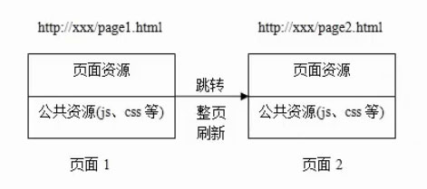

# MPA(多页面应用) 与 SPA(单页面应用)

### 目录

1. 多页面应用
2. 单页面应用
3. 总结

**Web 应用程序主要有两种设计模式：**

* 单页应用程序
* 多页应用程序

## 多页面应用（Multi-page Application, MPA）

多页面应用程序（MPA）是指包含多个页面的应用程序，每个页面都包含静态信息（文本、图像等），并通过链接指向其他页面——每次请求更改时，服务器都会在浏览器中渲染一个新页面并返回响应 。MPA 遵循传统的请求-响应模型，用户通过不同的 URL 导航，服务器在每次请求时都会返回完整的 HTML 页面。

因此，在从一个页面跳转到另一个页面（闪烁）时，浏览器会完全重新加载页面内容并重新下载资源，即使组件（如页眉和页脚）在所有页面中重复出现。

**优点**
1. SEO效果好
2. 首屏时间快

**缺点** 
1. 用户体验变慢：页面切换慢。
2. 服务器负载增加：每次页面请求都会增加服务器负载。
3. 交互性有限：与 SPA 相比实时交互性和动态内容更新方面可能存在局限性。

**案例**
* [淘宝](https://www.taobao.com)
* [京东](https://www.jd.com)

## 单页面应用（Single-page Application, SPA）

不要被名称误导，单页应用程序（SPA）并非意味着你的网站只能有一个页面。单页应用程序是指在单个 HTML 页面中运行的 Web 应用程序，它会根据用户与应用程序的交互动态更新内容。SPA 通常依赖于 React、Angular 或 Vue 等 JavaScript 框架来管理用户交互和处理数据操作。

当用户与单页应用程序 (SPA) 交互时，应用程序只会从服务器检索相关数据，并以切换的方式更新同一页面上的内容，而无需重新加载整个页面。但如果页面仍需要更多信息，并且客户端/浏览器发送了另一个请求，则服务器会返回一个JSON {...} data响应，从而改变浏览器的视图。

**优点**

1. 流畅的用户体验：SPA 通过消除页面重新加载，提供无缝的用户体验，从而加快过渡速度并减少等待时间。
2. 性能提升：由于 SPA 只加载一次必要的资源，后续交互依赖于缓存数据，从而降低服务器负载并提高整体性能。
3. 丰富的交互性：页面切换动画。
3. 丰富的用户界面：SPA 允许复杂的用户界面，使设计人员能够构建更复杂、更具交互性的 Web 应用程序。

**缺点** 

1. 首屏时间稍慢
2. SEO差  

**案例**

* 客服官网管理后台
* SACP
* AGI

## 总结

总之，单页应用程序 (SPA) 和多页应用程序 (MPA) 的选择取决于 Web 项目的具体需求。SPA 非常适合需要流畅用户体验的复杂交互式应用程序，而 MPA 更适合内容丰富的网站或优先考虑搜索引擎可见性的项目。

最终，开发人员和设计师在选择合适的Web应用程序设计模式时，必须仔细考虑性能、用户体验、SEO要求和项目复杂性等因素。无论选择哪种模式，紧跟Web开发领域的最新趋势和技术对于创建引人入胜且高效的Web应用程序都至关重要。

## 参考链接
* [https://medium.com/@sheyitofunmi22/web-application-design-patterns-single-page-application-vs-multi-page-application-2d9b79e0c78f](https://medium.com/@sheyitofunmi22/web-application-design-patterns-single-page-application-vs-multi-page-application-2d9b79e0c78f)
* [https://developer.mozilla.org/zh-CN/docs/Glossary/SPA](https://developer.mozilla.org/zh-CN/docs/Glossary/SPA)
* [https://www.jianshu.com/p/a02eb15d2d70](https://www.jianshu.com/p/a02eb15d2d70)