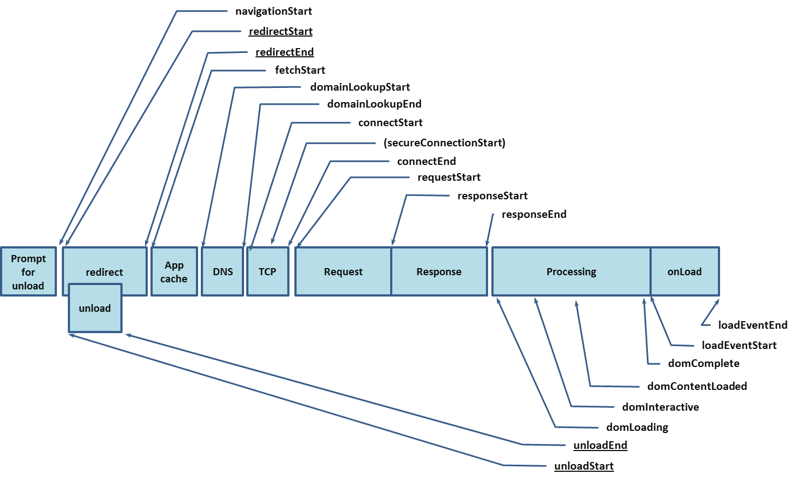

# 页面优化 - 基础篇



这里我们所谈论的页面优化，其实就是要让页面更快地显示、响应、用户体验更好。

## 加载阶段

核心的优化原则是：优化关键资源的加载速度，减少关键资源个数，降低关键资源大小，降低关键资源的 RTT 次数。

### 理论1：优化关键资源的加载速度
方法一：DNS预解析

实践：

`<link rel="dns-prefetch" href="https://fonts.googleapis.com/">`

[MDN参考](https://developer.mozilla.org/zh-CN/docs/Web/Performance/dns-prefetch)

方法二：资源预加载

实践：

```
<head>
  <meta charset="utf-8">
  <title>JS and CSS preload example</title>

  <link rel="preload" href="style.css" as="style">
  <link rel="preload" href="main.js" as="script">

  <link rel="stylesheet" href="style.css">
</head>

<body>
  <h1>bouncing balls</h1>
  <canvas></canvas>

  <script src="main.js" defer></script>
</body>
```

[MDN参考](https://developer.mozilla.org/en-US/docs/Web/HTML/Link_types/preload)

方法三：利用浏览器缓存机制

HTTP1.0 实践：

```
expires: Tue, 16 Aug 2022 11:45:06 GMT
```

HTTP1.1 实践

```
cache-control: max-age=30000
```

注意：由于index.html提供了需要加载资源的URL，所以index.html最好不要设置缓存或者设置较短的缓存时间。

https://www.taobao.com/ `cache-control: max-age=0, s-maxage=142`

https://www.jd.com/ `Cache-Control: max-age=30`


方法四：gzip压缩

实践：

```
content-encoding: gzip
```

方法五：打破浏览器建立TCP链接数量限制

实践：不同类型静态资源放在不同的服务器，使用不同的域名。

### 理论2：减少关键资源个数

方法一：合并CSS、JS

并不是把应用中的所有的都合并成一个js文件，应该把业务逻辑和库文件分开。项目迭代更新的时候只需要更新业务逻辑代码即可。让库文件走缓存。另外游戏渲染库比较大，如果web应用运行在app上，app如果能把这些库文件打包到app里面 app监测网络请求如果监测到是特定的渲染库，直接走app本地库文件效果更好，几乎就是秒加载。

并不是把所有的都合并成一个CSS，框架CSS和单个页面样式分开打包（不同页面的CSS异步加载，首次进入只加载首屏CSS）。

方法二：合并图片

* 多张图片合并成雪碧图（又叫精灵图），工具有TexturePacker，在CSS中用背景+定位的形式渲染图片，减少资源请求量。
* 合并多个图标放在一个svg中

方法三：异步加载资源

非首屏内容涉及到的资源异步加载，利用webpack提供的import()方法异步加载资源。

方法四：SVG内嵌

svg矢量图，代码内嵌，相对较小。

方法五：图片转Base64数据

将图片内签到html中，减少http请求，适用于较小的图片。比如只有1kb这类图片资源 我们可以直接把图片资源转成base64数据，然后打包到文件中这个图片资源请求就没有了。

方法六：合并音频

“点击” “升级” 这种短的音效多个音频合并成一个音频，需要播放的时候播放这个一个音频中的某一个段就好了，减少资源加载数量。

### 理论3：降低关键资源大小

**方法一:** 压缩HTML、CSS、JS

利用Gulp、Webpack工具压缩资源

**方法二:** 压缩图片

* 压缩图片到一个合适的质量，没必须所有的图片都用2倍高清图片可以和设计沟通把部分图片质量稍微调底一些。这种方式效果比较可观。图片压缩网站：https://tinypng.com/。
* 使用Chrome浏览器支持的.webp格式

### 理论4：降低关键资源的 RTT 次数

可以通过减少关键资源的个数和减少关键资源的大小搭配来实现。除此之外，还可以使用 CDN 来减少每次 RTT 时长。

## 交互阶段

### 减少 JavaScript 脚本执行时间

* 一种是将一次执行的函数分解为多个任务，使得每次的执行时间不要过久。
* 另一种是采用 Web Workers。

总之，在交互阶段，对 JavaScript 脚本总的原则就是不要一次霸占太久主线程。

### 避免强制同步布局

所谓强制同步布局，是指 JavaScript 强制将计算样式和布局操作提前到当前的任务中。

### 避免布局抖动

### 合理利用 CSS 合成动画

### 避免频繁的垃圾回收

在交互阶段，核心的优化原则是：尽量减少一帧的生成时间。可以通过减少单次 JavaScript 的执行时间、避免强制同步布局、避免布局抖动、尽量采用 CSS 的合成动画、避免频繁的垃圾回收等方式来减少一帧生成的时长。

##### 参考：

https://mp.weixin.qq.com/s/_I9UVfDJh0bA28aw9PUs2Q