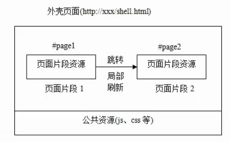

# 面向垂直划分系统的前端集成

## 一、什么是垂直划分系统

### 定义

垂直划分（Vertical Partitioning）是一种系统架构模式，将一个大型应用按照业务领域或功能模块进行垂直切分，每个子系统独立负责特定的业务功能，拥有完整的前后端技术栈。

**垂直划分（按业务领域）**

```
┌─────────────────────────────────────────┐
│          企业级应用平台                    │
├─────────────┬─────────────┬─────────────┤
│  用户管理系统  │  订单管理系统  │  库存管理系统  │
│  (完整栈)    │  (完整栈)    │  (完整栈)    │
│  前端+后端   │  前端+后端   │  前端+后端   │
│  +数据库    │  +数据库    │  +数据库    │
└─────────────┴─────────────┴─────────────┘
```

## 二、垂直划分系统的特点

#### 1. 业务独立性

每个子系统负责独立的业务领域：

```
电商平台示例：
├── 用户中心系统
│   ├── 用户注册/登录
│   ├── 个人信息管理
│   └── 权限管理
│
├── 商品管理系统
│   ├── 商品发布
│   ├── 商品分类
│   └── 库存管理
│
├── 订单管理系统
│   ├── 下单流程
│   ├── 订单跟踪
│   └── 退款处理
│
└── 支付系统
    ├── 支付接口
    ├── 账单管理
    └── 财务对账
```

#### 2. 技术栈独立

每个子系统可以选择最适合的技术栈：

| 子系统  | 前端技术                 | 后端技术              | 数据库        |
|------|----------------------|-------------------|------------|
| 用户中心 | Vue 3 + Element Plus | Spring Boot       | MySQL      |
| 商品管理 | React + Ant Design   | Node.js + Express | MongoDB    |
| 订单管理 | Angular + Material   | Django            | PostgreSQL |

#### 3. 团队独立

每个子系统由独立团队负责：

```
组织架构：
├── 用户中心团队（5人）
│   ├── 前端开发 × 2
│   ├── 后端开发 × 2
│   └── 测试 × 1
│
├── 商品管理团队（6人）
│   ├── 前端开发 × 2
│   ├── 后端开发 × 3
│   └── 测试 × 1
│
└── 订单管理团队（8人）
    ├── 前端开发 × 3
    ├── 后端开发 × 3
    └── 测试 × 2
```

这种架构模式特别适合大型企业应用，能够有效降低系统复杂度，提高开发效率和系统可维护性。

## 三、前端集成方案

### 方案一：多域名独立部署

每个子系统使用独立域名部署

**架构示例**

```
前端应用：
├── https://www.example.com        → 电商平台主站（营销页/首页）
├── https://user.example.com       → 用户中心
├── https://product.example.com    → 商品管理
└── https://order.example.com      → 订单管理
```

**多域名服务器配置**

```nginx
# 用户中心系统
server {
    listen 80;
    server_name user.example.com;
    root /var/www/user-system;
}

# 商品管理系统
server {
    listen 80;
    server_name product.example.com;
    root /var/www/product-system;
}
# ... 其他系统
```

**优点**：

- ✅ 系统完全独立，互不影响
- ✅ 部署简单，每个系统独立发布
- ✅ 域名清晰，便于管理和访问控制
- ✅ 技术栈完全自由，可使用不同框架

**缺点**：

- ❌ 需要配置 CORS，每个服务都要处理
- ❌ Cookie 跨域共享受限
- ❌ SSL 证书管理成本高（多个域名）
- ❌ 跨系统调用 API 较复杂

**适用场景**：

- 子系统业务完全独立
- 团队完全独立，各自维护
- 对系统隔离性要求高
- 不需要频繁的跨系统交互

**案例**

* 百度：https://www.baidu.com

### 方案二：统一域名独立部署

统一域名，通过路径区分子系统

**示例**

* https://www.example.com **电商平台**
* https://www.example.com/user 用户中心
* https://www.example.com/product 商品管理

**统一域名服务器配置**

```nginx
# 电商平台多页面应用 nginx 配置示例
server {
    listen 80;
    server_name www.example.com;
    
    # 根目录（首页/营销页面）
    root /var/www/example;
    index index.html;
    
    location / {
        index  index.html index.htm;
        try_files $uri $uri/ /index.html;
    }
    
    # 用户中心系统 - 指向独立目录
    location /user {
        alias /var/www/example-user;
        index index.html;
        try_files $uri $uri/ /user/index.html;
    }
    
    # 商品管理系统 - 指向独立目录
    location /product {
        alias /var/www/example-product;
        index index.html;
        try_files $uri $uri/ /product/index.html;
    }
    
    # ... 其他系统
}
```

**目录结构示例**

```
/var/www/
├── example/                # 主站根目录（首页/营销页）
│   ├── index.html
│   ├── css/
│   └── js/
├── example-user/           # 用户中心独立目录
│   └── user/
│       ├── index.html
│       ├── css/
│       └── js/
└── example-product/        # 商品管理独立目录
    └── product/
        ├── index.html
        ├── css/
        └── js/
```

**案例**

* 阿里云：https://www.aliyun.com

**优点**：

- ✅ 统一域名，无跨域问题
- ✅ 集中式路由管理
- ✅ 便于监控和日志

### MPA 模式总结

无论是**多域名独立部署**还是**统一域名路径分发**，两种方案都采用了 **MPA（多页面应用）** 架构模式，通过页面级别的划分实现了垂直系统的前端集成。

#### 优势

1. **模块化架构**
    - 每个子系统独立的 Git 仓库
    - 独立的代码分支和版本管理
    - 独立的开发环境和依赖管理

2. **团队独立协作**
    - 每个模块有独立的开发团队
    - 团队间互不干扰，并行开发效率高
    - 责任边界清晰

3. **独立部署发布**
    - 模块发布互不影响
    - 可单独回滚某个模块
    - 降低发布风险

4. **技术栈灵活**
    - 不同模块可使用不同技术栈（Vue、React、Angular）
    - 独立的构建工具和配置
    - 可根据业务特点选择最优方案

#### 缺点

虽然 MPA 在模块化和团队协作方面有明显优势，但在用户体验层面存在无法回避的问题：

1. **页面切换体验差**
    - 页面间跳转需要完整刷新，出现白屏
    - 用户体验不连贯，交互流畅度较差
    - 无法实现页面间的平滑过渡动画

2. **资源重复加载**
    - 每次页面跳转都需要重新加载 HTML、CSS、JS
    - 公共资源（如 React、Vue、UI 组件库）无法在页面间共享
    - 增加服务器负载和带宽消耗
    - 在弱网环境下体验尤其糟糕

3. **状态管理困难**
    - 页面间状态无法直接共享
    - 需要通过 URL 参数、Cookie、LocalStorage 等方式传递状态
    - 复杂的跨页面交互实现成本高
    - 用户操作上下文容易丢失

4. **现代交互需求难以满足**
    - 无法实现乐观 UI 更新（Optimistic UI）
    - 无法实现骨架屏等现代加载体验
    - 难以实现即时反馈和流畅的用户交互
    - 与原生 APP 的体验差距明显

### 从 MPA 到 SPA 的演进

随着用户对 Web 应用体验要求的提高，MPA 的这些缺陷变得越来越难以接受。为了解决这些问题，前端架构逐步向 **SPA（单页应用）** 演进：

**动因**：

- **用户体验诉求**：现代 Web 应用需要类似原生 APP 的流畅体验
- **业务复杂度增加**：需要更复杂的交互逻辑和状态管理

**技术演进方向**:

- 将 UI 更新逻辑从服务端转移到客户端
- 通过前端路由实现页面切换，避免整页刷新
- 使用组件化架构，实现视图的动态更新

这种演进代表了前端应用从 **"以服务器为中心"** 向 **"以浏览器为中心"** 的转变，追求更好的用户体验和交互性能。

### 方案三：单页应用（SPA）

> 单页应用程序（SPA）是指在单个 HTML 页面中运行的 Web 应用程序，通过动态重写当前页面来响应用户交互，而不是从服务器加载全新的页面。SPA
> 依赖于 React、Angular、Vue 等前端框架来管理路由、状态和视图更新。



**SPA 的核心特点**:

- ✅ 页面切换无白屏，体验流畅
- ✅ 公共资源只加载一次，性能更好
- ✅ 状态管理更简单，跨页面交互更容易
- ✅ 可实现复杂的现代交互体验

**示例**

* https://www.example.com **电商管理后台**（SPA 应用）
* https://www.example.com/products 商品管理（前端路由）
* https://www.example.com/orders 订单管理（前端路由）

**SPA 服务器配置**

```nginx
# SPA 应用 nginx 配置
server {
    listen 80;
    server_name www.example.com;
    
    root /var/www/spa-app;
    index index.html;
    
    # 关键配置：所有路由都返回 index.html，由前端路由接管
    location / {
        try_files $uri $uri/ /index.html;
    }
}
```

**目录结构**

```
/var/www/spa-app/
├── index.html              # 唯一的 HTML 入口
├── favicon.ico
├── static/
│   ├── css/
│   │   └── main.css
│   └── js/
│       ├── main.js         # 打包后的应用代码
│       └── vendor.js       # 第三方库
└── assets/
    └── images/
```

**案例**

#### SPA 的新挑战：从单体到巨石应用

SPA 成功解决了 MPA 的用户体验问题，成为现代 Web 应用的主流架构。然而，随着应用规模的增长，SPA 又面临新的挑战。

**典型演变过程**：

```
企业级 SPA 应用的成长轨迹：

初期（1-2年）          中期（3-5年）           后期（5年+）
├── 10+ 页面          ├── 50+ 页面           ├── 100+ 页面
├── 2-3 人团队        ├── 10+ 人团队         ├── 30+ 人团队
├── 代码库 < 50MB     ├── 代码库 > 200MB     ├── 代码库 > 500MB
└── 构建 < 1分钟      ├── 构建 > 5分钟       ├── 构建 > 15分钟
                      └── 首屏 > 5秒         └── 首屏 > 10秒
```

**SPA 巨石应用的问题**：

1. **代码库膨胀**
    - 单一代码仓库越来越庞大
    - 构建时间越来越长
    - 首屏 Bundle 体积过大

2. **团队协作困难**
    - 多个团队在同一代码库中开发
    - 代码冲突频繁，合并困难
    - 发布互相阻塞

3. **技术债务累积**
    - 技术栈升级困难（牵一发动全身）
    - 老代码难以重构
    - 新技术难以引入

4. **部署风险高**
    - 任何改动都需要整体发布
    - 一个模块的 bug 影响整个应用
    - 回滚成本高

```javascript
// 单一的巨大应用
const App = () => {
  return (
    <Router>
      {/* 30+ 页面 */}
      <Route path="/knowledge/*" component={KnowledgeModule}/>
      {/* 20+ 页面 */}
      <Route path="/ai/*" component={AIModule}/>
      {/* 25+ 页面 */}
      <Route path="/data/*" component={DataModule}/>
      {/* 35+ 页面 */}
      <Route path="/settings/*" component={SettingsModule}/>
    </Router>
  );
};

// 问题：
// 1. 所有模块的代码都在一个仓库，代码冲突频繁
// 2. 任何一个模块的修改都需要整体构建和发布
// 3. 首屏需要加载所有模块的基础代码
// 4. 技术栈无法独立演进
```

**解决方案：微前端架构**

为了在保持 SPA 流畅体验的同时，解决巨石应用的问题，**微前端（Micro-Frontend）** 架构应运而生。

# 微前端架构

## 什么是微前端？

微前端 这个名词，第一次被提出还是在2016年底，那是在 ThoughtWorks Technology Radar。
这个概念将微服务这个被广泛应用于服务端的技术范式扩展到前端领域。

**现代的前端应用**的发展趋势正在变得越来越富功能化，富交互化，也就是传说中的SPA(单页面应用)；
这样越来越复杂的单体前端应用，背后的后端应用则是数量庞大的微服务集群。
被一个团队维护的前端项目，随着时间推进，会变得越来越庞大，越来越难以维护。
所以我们给这种应用起名为巨石单体应用。

微前端核心思想是认为：**现代化的前端单体应用（SPA应用）**
通常由多个相对独立的功能模块组成，每个模块由独立的团队负责。这些团队专注于特定的业务领域，成员涵盖前端、后端、UI、数据库等端到端能力，能够独立完成开发、测试、部署全流程，实现真正的自治和快速交付。

微前端架构旨在解决：**现代化的前端单体应用（SPA应用）**
在一个相对长的时间跨度下，由于参与的人员、团队的增多、变迁，从一个普通应用演变成一个巨石应用(Frontend Monolith)
后，随之而来的应用不可维护的问题。这类问题在企业级 Web 应用中尤其常见.

微前端是一种多个团队通过独立发布功能的方式来共同构建 **现代化 web 应用** 的技术手段及方法策略.

## 场景分析

* 时间跨度长
* 业务复杂
* 跨团队开发
* 跨技术栈
* 独立部署

核心问题是：如何让大型项目在长期迭代中保持健康、可扩展、可维护？

基于以上我们实际的业务背景，在开发大型现代的企业级应用的时候会选择微前端架构设计。

## 微前端的核心挑战

微前端架构的本质是在同一个浏览器上下文中运行多个独立应用，这带来了以下核心技术挑战：

### 1. 子应用加载与生命周期管理

- **动态加载**：根据路由按需加载子应用资源（HTML、CSS、JS）
- **生命周期控制**： `bootstrap`（初始化）、`mount`（挂载）、`unmount`（卸载）

### 2. 运行时隔离

- **样式隔离**
- **JavaScript 隔离**

### 3. 应用间通信

- **Props 传递**：主应用通过 props 向子应用传递配置和数据
- **事件总线**：发布-订阅模式实现松耦合通信
- **浏览器 API**：CustomEvent

### 4. 路由管理

- **路由协调**：主应用路由与子应用路由的同步
- **浏览器历史**：前进/后退按钮的正确处理

### 5. 依赖共享与性能优化

- **公共依赖共享**：避免重复加载 React/Vue 等框架
- **Bundle 优化**：代码分割、Tree Shaking、按需加载
- **资源缓存**：利用浏览器缓存和 CDN 加速

## 主流微前端实现方案

### 1. **iframe 方案：** 天然隔离的粗粒度边界

iframe 提供最强的隔离性：DOM、CSS、JS 与安全上下文天生隔离，跨团队冲突最少。它的代价也明显：历史上 iframe
与主应用通信的成本高、可访问性与路由对齐复杂、SEO 受限。适合重安全、低耦合、弱交互的嵌入式场景，如第三方控制台插件。若使用此路，请务必配合
postMessage 协议、sandbox 与 CSP。

### 2. **客户端运行时集成：** single-spa 家族

single-spa 提供容器化运行时，在同一页面内加载多个子应用，支持按路由激活、手动挂载的 parcel 机制、以及与 import maps
的集成。它的优势是易于渗透到既有SPA，对多框架并存与渐进迁移尤为友好；你可以先把一个页面区域抽出为子应用，验证通信与发布链路，再逐步扩大覆盖面。(
single-spa.js.org)

### 3. **Web Components 方案：** 以规范实现轻隔离

使用 Custom Elements 与 Shadow DOM 把子应用封装为浏览器原生组件，容器负责放置自定义标签与提供跨组件通信总线。得益于标准化能力，CSS
不易互相污染，组件也能跨框架复用；缺点是生态配套需要自建，例如路由接入、跨组件共享状态等。

## 微前端实践

### 1. 通过 iframe 运行时集成

在浏览器中组合应用程序的最简单方法之一是iframe。从本质上讲，iframe使的独立的子页面构建变得很容易。它们还在样式化和全局变量之间提供了良好的隔离，不会相互干扰。只要我们谨慎地划分应用程序和组建团队，iframe就很适合。

但是也有一些不好的地方，比如全局loading，跨应用之间通信，子应用路由管理，历史记录等等问题。

下面是一个简单的例子：

```
<html>
  <head>
    <title>Feed me!</title>
  </head>
  <body>
    <h1>Welcome to Feed me!</h1>

    <iframe id="micro-frontend-container"></iframe>

    <script type="text/javascript">
      const microFrontendsByRoute = {
        '/': 'https://browse.example.com/index.html',
        '/order-food': 'https://order.example.com/index.html',
        '/user-profile': 'https://profile.example.com/index.html',
      };

      const iframe = document.getElementById('micro-frontend-container');
      iframe.src = microFrontendsByRoute[window.location.pathname];
    </script>
  </body>
</html>
```

**案例**

* 云问

**为什么不是 iframe**

看这里 [Why Not Iframe](https://www.yuque.com/kuitos/gky7yw/gesexv)

### 2. 通过 JavaScript 运行时集成

假设每个微前端应用都使用`<script>`包含在页面上，加载时公开一个全局函数作为它的入口点。主应用程序然后决定应该安装哪个微前端，并调用相关的函数来告诉微前端何时何地渲染自己。

那这种形式就更升级一点，但是这种形式就牵扯出一些问题：比如样式污染和全局变量污染，等等问题。但是这些都可以解决。

下面是一个简单的例子：

```
<html>
  <head>
    <title>Feed me!</title>
  </head>
  <body>
    <h1>Welcome to Feed me!</h1>

    <!-- 这些脚本不会立即渲染任何东西 -->
    <!-- 相反，它们将入口点函数附加到窗口上 -->
    <script src="https://browse.example.com/bundle.js"></script>
    <script src="https://order.example.com/bundle.js"></script>
    <script src="https://profile.example.com/bundle.js"></script>

    <div id="micro-frontend-root"></div>

    <script type="text/javascript">
      // 这些全局函数通过上面的脚本附加到window上
      const microFrontendsByRoute = {
        '/': window.renderBrowseRestaurants,
        '/order-food': window.renderOrderFood,
        '/user-profile': window.renderUserProfile,
      };
      const renderFunction = microFrontendsByRoute[window.location.pathname];

      // 确定了入口函数后，我们现在称它为，
      // 给它应该呈现自身的元素ID
      renderFunction('micro-frontend-root');
    </script>
  </body>
</html>
```

上面这块儿不应该是上来就把所有的`script`都加载进来，本来浏览器的优势就在说可以实现增量下载。所以真正实现的时候应该是做到增量下载。

#### 微前端 - qiankun 框架示例

##### 1. 主应用配置

安装依赖：

```shell
$ npm i qiankun -S
```

在主应用中注册微应用

```ts
import { registerMicroApps, start, setDefaultMountApp } from 'qiankun';

registerMicroApps([
  {
    name: 'ec-app',                          // 子应用名称（唯一）
    entry: '//localhost:8080/ec',               // 子应用入口（开发环境）
    container: '#micro-app-container',       // 子应用挂载的 DOM 节点
    activeRule: '/ec',                       // 路由匹配规则
    props: { token: getToken() },            // 传递给子应用的数据
  },
  {
    name: 'im-app',
    entry: '//localhost:8080/im',
    container: '#micro-app-container',
    activeRule: '/im',
    props: { token: getToken() },
  },
]);

// 启动 qiankun
start();
```

当浏览器 URL 发生变化时，qiankun 会自动匹配 `activeRule`，将对应的子应用加载并挂载到指定的 `container` 中，同时依次调用子应用暴露的生命周期钩子。

##### 2. 子应用改造

子应用需要导出三个生命周期函数，供框架调用：

```ts
// qiankun 生命周期配置
export const qiankun = {
   // 应用加载之前
   async bootstrap(props: any) {
      console.log('app1 bootstrap', props);
   },
   // 应用 render 之前触发
   async mount(props: any) {
      console.log('app1 mount', props);
      // 可以在这里接收主应用传递的 props
   },
   // 应用卸载之后触发
   async unmount(props: any) {
      console.log('app1 unmount', props);
   },
};
```

##### 3. 子应用打包配置

子应用需要调整打包配置，使其支持被 qiankun 动态加载：

安装插件`@umijs/plugins`插件

`npm install @umijs/plugins --save-dev`

```ts
import {defineConfig} from "umi";

export default defineConfig({
   base: '/app1',
   history: {
      type: 'hash'
   },
   routes: [
      {path: '/about', component: '@/pages/about'},
      {path: "/concat", component: "@/pages/concat"},
   ],
   publicPath: process.env.NODE_ENV === 'production' ? 'http://localhost:8082/app1/' : '',
   qiankun: {
      slave: {}
   },
   plugins: ['@umijs/plugins/dist/qiankun']
});

```

## 五、总结

基于团队实际业务场景（EC、IM与人工客服集成），我们选择 **qiankun 微前端方案**，主要优势如下：

1. **业务匹配**：EC 和 IM 属于不同业务域，团队独立，适合微前端的垂直拆分模式
2. **技术成熟**：qiankun 在蚂蚁金服内部大规模落地，社区活跃，文档完善
3. **渐进迁移**：可在不重写现有系统的前提下，逐步将子系统接入主应用
4. **体验一致**：用户在统一的主应用内切换子系统，无页面刷新，体验流畅