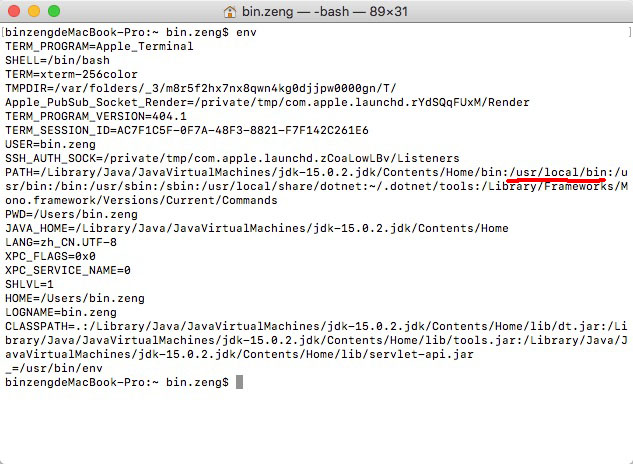

使用Node开发一款命令行工具是一件比较有意思的事情。

## 1.命令行工具与环境变量 PATH

使用 which 追根 pwd 、env 命令，发现它们实际执行的路径在某一个 bin 目录

```
binzengdeMacBook-Pro:~ bin.zeng$ which pwd
/bin/pwd

binzengdeMacBook-Pro:~ bin.zeng$ which env
/usr/bin/env
```

而这些 bin 目录在环境变量 PATH 中，豁然开朗。简而言之: 「在环境变量的 PATH 中路径的命令可在其它任意地方执行」。



「开发命令行的原理也是如此，将你开发的命令行工具脚本置于环境变量 PATH 下的路径之中」，而本篇文章的目标就是:

> 使用 Javascript 这门前端开发者熟悉的语言，借助 Node 环境，开发一个命令行工具。
 
## 2.原理 

```
binzengdeMacBook-Pro:~ bin.zeng$ ls -lah $(which webpack)
lrwxr-xr-x  1 bin.zeng  admin    42B  4 28 14:05 /usr/local/bin/webpack -> ../lib/node_modules/webpack/bin/webpack.js
```

从中可以看出关于 Node 全局命令行的原理:

* npm 全局下载某个 package 到路径 /usr/local/lib/node_modules 下 (yarn 同理，对应路径 ~/.config/yarn/global/node_modules)

* 根据该库的 package.json 中 bin 字段的指示，把对应的命令行路径通过符号索引挂载到 PATH 路径

* 对应的二进制脚本添加 x 权限 (可执行文件权限)

简而言之，Node 环境下的命令行工具，借助的原理无非是「环境变量 Path」与一个「符号链接」

## 3.开发

在 「package.json 中的 bin 字段」，用以指定最终的命令行工具的名字

```
{
   "bin": {
       "webpack": "bin/webpack.js"
  }
}

```

对于可直接执行的文件，需要指明执行环境，首行添加一行说明:

webpack.js

```
#!/usr/bin/env node

// code 往下写
```

在命令行工具中，可通过 progress.argv 可获取用户输入。请看以下示例：

$ webpack 1 2 3

```
// Output: [
//   '/usr/local/bin/node',
//   '/Users/shanyue/webpack.js',
//   '1',
//   '2',
//   '3',
// ]
process.argv
```

根据解析 process.argv 可以定制格式来获取各式各样的参数作为命令行的输入。

当然解析参数也要参照 POSIX 兼容的基本规律: 格式、可选、必选、简写、说明、帮助等等。命令行工具命名协议 文章中已说的足够详细。

因为 POSIX 兼容繁杂的规则，以此衍生出了关于解析命令参数的多个库，站在巨人的肩膀上，在实际工作中就直接开用吧！

以下是一个 Demo: 使用 commander 解析不同的输入指令

```
const { program } = require('commander')

// 解析不同的指令输入
program
  .option('-d, --debug', 'output extra debugging')
  .option('-s, --small', 'small pizza size')
  .option('-p, --pizza-type <type>', 'flavour of pizza')

program.parse(process.argv)

const options = program.opts()
console.log(options)
```

### 参考

[https://mp.weixin.qq.com/s/TAj-dvEU8FeM6ifq34zanA](https://mp.weixin.qq.com/s/TAj-dvEU8FeM6ifq34zanA)