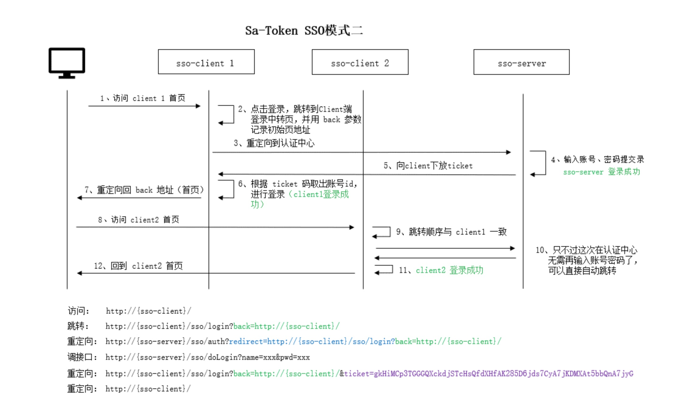

# 【登录】技术设计

## 1. 前序

后台管理系统开发两大基础核心功能，第一登录，第二权限管理。有了这两个基础功能之后才能进行不同的业务页面。

## 2. 登录功能需求分析

用户登录流程及核心技术点

1. 进入登录页
2. 输入账号密码
    * 验证账号密码格式
3. 调用验证码组件
4. 请求登录接口拿到 token
    * token 存储
5. 业务接口请求携带 token
    * 401 失效自动跳登录

### 登陆

登录包括以下几个基本功能：

1. 支持账号密码登录
    * 账号密码校验
    * 用户行为校验
        1. 验证码校验
        2. 短信校验
        3. 滑块校验
            1. https://www.bookstack.cn/read/anji-plus-captcha/f26c8bfb057c4a15.md
            2. captcha https://github.com/anji-plus/captcha/
    * 账号与密码加密
    * 记住密码
    * sessionId与token存储
2. 支持第三方登录
3. 支持跨系统间访问无需二次登录（单点登陆）

## 3、登陆安全处理

### Token存储

[前端登录token到底应该存在哪？一篇说透！](https://mp.weixin.qq.com/s/yJBqprwmZ2WOQGgei_74dw)

Token应该存储在cookie中，还是storage中？

* 将 Token 存储在 webStorage (localStorage, sessionStorage) 中可以通过同域的js访问，这样导致很容易受到 XSS
  攻击，特别是项目中引入很多第三方 js 库的情况下，如果js脚本被盗用，攻击者就可以轻易访问你的网站。

> 跨站脚本攻击（XSS）：是一种注入代码攻击，通过在网站里注入script代码，当访问者浏览网站的时候通过注入的script代码窃取用户信息，盗用用户身份等

* 将Token 存储在 cookie 中，可以指定 httponly来防止js被读取，也可以指定 secure 来保证Token 只在 HTTPS 下传输，缺点是不符合RestFul
  最佳实践，容易受到 CSRF 攻击。

> 跨站请求伪造（CSRF）：跨站点请求伪造，攻击者盗用已经认证过的用户信息，以用户信息的名义进行操作（转账，购买商品等），由于身份已经认证过了，所以网站会认为此操作是用户本人操作。CSRF
> 并不能拿到用户信息，但它可以盗用用户的凭证进行操作。

### Token泄露防止

为了防止token泄露，可以使用双Token机制。

access_token 临时token，过期时间较短  
refresh_token 刷新token，过期时间较长

## 4、功能实现

### 账号/密码登录

**账号密码校验**

当用户在浏览器页面中输入账号密码，首先就要对用户的账号密码进行规则校验。在前端进行规则校验主要是为了**提升用户体验**、*
*减轻服务器负担**。

1. 提升用户体验
    * 即时反馈：前端校验能够在用户输入信息时即时给出反馈，如必填项检查、格式错误提示等，避免用户提交后才发现错误，减少等待时间。
    * 减少操作步骤：用户可以在输入过程中即时纠正错误，避免了提交后再重新填写表单的繁琐步骤。
2. 减轻服务器负担
    * 过滤明显错误：前端校验可以过滤掉明显的输入错误，减少不必要的网络传输和服务器请求，从而减轻服务器压力。
    * 分流正常请求：对于格式正确的数据，前端校验通过后，后端可以集中精力处理逻辑更为复杂的验证，如数据库查询等。
    * 优化性能：减少无效请求，提高服务器的处理能力和响应速度，尤其在高流量情况下，这种分流尤为重要。

**表单提交**

前端做：合法性（前端做必填项检查、格式错误等等合法性校验）
后端做：正确性（后端服务端对业务逻辑及数据正确性进行校验，不能把逻辑暴露给前端）

> 考虑到如果有业务逻辑调整只需要服务端一端修改校验逻辑即可，前端不需要做业务逻辑正确性校验调整。

### 推荐结论（分工原则）

* 后端：必须全覆盖“约束/安全/一致性”校验
  * 必填/类型/取值范围/枚举（如 state 只能 1/2、region 只能 cd/wh）
  * 业务规则（如同名唯一、状态流转、关联资源是否存在、权限/数据归属）
  * 防篡改（前端的 disabled 字段、只读字段，后端仍要拒绝非法修改）
  * 并发一致性（幂等、重复提交、版本号/更新时间冲突等）
  * 原因：前端校验可被绕过（抓包/脚本/旧版本客户端），后端是最后防线。

* 前端：不需要全覆盖，但建议覆盖“高频、可本地判定”的校验
  * 必填、长度限制、格式（手机号/邮箱/日期范围）、枚举下拉选择
  * 联动校验（A 选项决定 B 必填/可见）
  * 即时提示，减少提交后才发现错误
  * 原因：提升体验、降低后端压力，但不能替代后端。

实际落地建议（你们这类管理台）
* 最低标准
  * 后端：100% 覆盖所有字段约束 + 业务规则 + 权限校验
  * 前端：至少覆盖必填/基本格式/枚举，并把后端返回的校验错误正确展示出来
* 避免“重复劳动”的做法
  * 规则来源尽量单一（优先后端）：前端只做“必要子集”
  * 后端返回结构化校验错误（字段 + 错误信息）；前端用表单能力（如 ProForm/antd Form）映射到字段上展示
  * 你们项目里 services/index.ts 已经把 validation[0].field + err_msg 拼到 message，如果后端能返回多条 validation，前端可以进一步升级成逐字段提示（体验更好）。

什么时候前端也要“尽量完整”
* 表单很长/提交成本高（比如上传、复杂配置），用户不希望提交后才发现大量错误
* 后端校验成本高（例如调用外部依赖、复杂计算），前端先挡一层明显错误更划算

## 5、单点登录

[单点登录（Single Sign-On，简称SSO）](https://sa-token.cc/doc.html#/sso/readme)

#### 背景（分析）

举个场景，假设我们的系统被切割为N个部分：商城、论坛、直播、社交…… 如果用户每访问一个模块都要登录一次，那么用户将会疯掉，
为了优化用户体验，我们急需一套机制将这N个系统的认证授权互通共享，让用户在一个系统登录之后，便可以畅通无阻的访问其它所有系统。
**单点登录**就是为了解决这个问题而生！

#### 任务（目标）

简而言之，单点登录要做到： **在多个互相信任的系统中，用户只需登录一次，就可以访问所有系统。**

> 理论上用户只需要有一个公司账号就可以了，登录了这个账号就可以访问这个公司的所有产品。但是用户又比较值钱，所以大多数互联网公司都有自己的用户账号，比如：百度账号、淘宝账号、腾讯账号等等。

#### 行动（实现方式）

##### 前端同域

适用于同一个主域名下的多个子域名。通过在主域名设置共享的 Cookie，实现跨子域名的单点登录。

例如：baidu.com yun.baidu.com map.baidu.com

**实现步骤：**

1. 用户在主域名（如 http://example.com）登录后，服务器在该域名下设置一个 Cookie。
2. 子域名（如 http://app1.example.com 和 http://app2.example.com）可以读取这个 Cookie，从而确认用户身份。

##### 前端不同域

比如：taobao.com tmall.com

**实现步骤：**

### 参考

* [Sa-Token](https://sa-token.cc/doc.html)
* https://mp.weixin.qq.com/s/TyG7ZSutPHjTz-M1yT0sUg