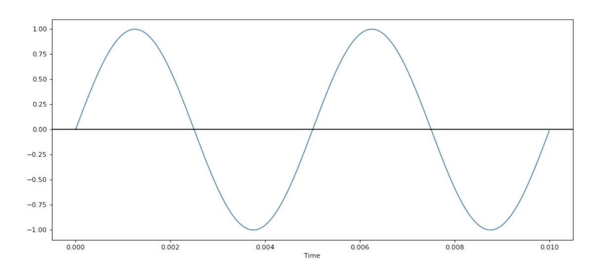
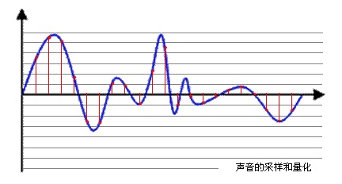
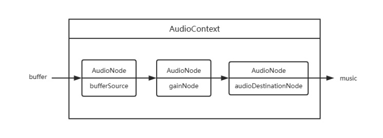
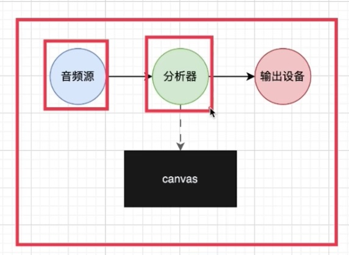

# 语音合成

## 音频基础知识了解：波、采样、采样率、采样位深度、声道、PCM

### 波

中学物理有介绍过，声音是由物体振动产生的，这个振动经由介质传导到我们的耳朵中引起耳膜振动从而让我们听见声音。

我们可以用波形来描述振动，其中横轴是时间，纵轴是振动的位移，也就是离开原点的距离。

振动的两个关键属性是频率和振幅，频率是指一秒钟振动多少次，对应于音高，频率越高声音越尖锐刺耳。

振幅则表示最大的位移值，对应于音量，振幅越大声音越响。



图片来源：https://cjting.me/2021/08/07/fourier-transform-and-audio-visualization/ 

波形 = 时间+位移

### 采样

因为声音是一个随时间变化的连续函数，任意一段间隔内都有无穷多个值，而无穷多的数据是没办法存储在计算机中的。

想要存储，我们就需要将它离散化变成离散序列，具体的方法就是采样，使用固定的间隔对函数进行求值。

通过采样，我们将一个无尽序列变成了一个有限序列，其中每一个值叫做样本，这样就可以方便地在计算机中存储了。

采样的关键参数有两个，分别是采样频率和采样深度。

### 采样频率（采样率）

采样率(sampleRate), 采样率就是每秒从连续信号中提取并组成离散信号的采样个数，它用赫兹（Hz）来表示，说的简单一点就是每秒在每个声道上采样的个数。



图片来源：https://blog.csdn.net/qq_41824928/article/details/108124382 

蓝色代表模拟音频信号，红色的点代表采样得到的量化数值。采样频率越高，样本越多，红色的间隔就越密集，记录这一段音频信号所用的数据量就越大，同时音频质量也就越高，也更接近原始的声音。

根据奈奎斯特理论，采样频率只要不低于音频信号最高频率的两倍，就可以无损失地还原原始的声音。通常人耳能听到频率范围大约在20Hz～20kHz之间的声音，为了保证声音不失真，采样频率应在40kHz以上。常用的音频采样频率有：8kHz、11.025kHz、22.05kHz、16kHz、37.8kHz、44.1kHz、48kHz、96kHz、192kHz等。（8k=8000，44.1k=44100)

通常人耳能听到频率范围大约在20Hz～20kHz之间的声音，根据香农采样定理(也叫奈奎斯特采样定理)，理论上来说采样率大于40kHz的音频格式都可以称之为无损格式，为了保证声音不失真，采样频率应在40kHz以上。常用的音频采样频率有：8kHz、11.025kHz、22.05kHz、16kHz、37.8kHz、44.1kHz、48kHz、96kHz、192kHz等。

### 采样位深度（采样大小值）

位深度，也叫位宽，量化精度，上图中，每一个红色的采样点，都需要用一个数值来表示大小，这个数值的数据类型大小可以是：4bit、8bit、16bit、32bit等等，位数越多，表示得就越精细，声音质量自然就越好，当然，数据量也会成倍增大。常见的位宽有：8bit 或者 16bit。

假设我们用 16bit 采样深度和 44100 的采样频率，那么一段一秒钟的声音就变成了一个 44100 长度的 int16 数组。

假如采样频率是 44100，一共有 10639873 个样本，使用 int16 进行存储，计算可知这首歌的时间是 10639873/44100 = 241.266 秒。

得到采样值数组以后，接下来如何存储这个数组就是编码的范畴了。我们可以直接存，也可以采用某种算法压缩以后再存。各种各样的办法，对应着各种各样的音频格式，比如 MP3, AAC, WAV 等。

### 声道

由于音频的采集和播放是可以叠加的，因此，可以同时从多个音频源采集声音，并分别输出到不同的扬声器，故声道数一般表示声音录制时的音源数量或回放时相应的扬声器数量。单声道（Mono）和双声道（Stereo）比较常见，顾名思义，前者的声道数为1，后者为2。

### PCM

PCM 是指脉冲编码调制（Pulse Code Modulation）

把声音从模拟信号转化为数字信号的技术，即对声音进行采样、量化的过程，经过PCM处理后的数据，是最原始的音频数据，即未对音频数据进行任何的编码和压缩处理。

在计算机应用中，能够达到最高保真水平的就是PCM编码，被广泛用于素材保存及音乐欣赏，CD、DVD以及我们常见的 WAV文件中均有应用。因此，PCM约定俗成了无损编码，因为PCM代表了数字音频中最佳的保真水准，并不意味着PCM就能够确保信号绝对保真，PCM也只能做到最大程度的无限接近。

* 单个音频采样用得较多位深度的是16位，当然也可以使用8位，24位，甚至32位。
* 声道就是同时采集音频的通道数，用的较多的是2声道，也有单声道，5.1声道,7.1声道等。
* 采样频率就是1秒钟采样的个数，一般用44.1kHz，也可以是8kHz,11.025kHz,48kHz,96kHz等。
* 一帧应该是指持续采样时间，这个是很灵活的可以使用20ms，也可是200ms，一般来说时间越短延时就越少。

这样一帧的PCM数据大小就很容易计算出来：PCMBufferSize = 采样率*采样时间*采样位深/8*通道数

要算一个PCM音频流的码率是一件很轻松的事情，采样率值×采样大小值×声道数 bps。一个采样率为44.1KHz，采样大小为16bit，双声道的PCM编码的WAV文件，它的数据速率则为 44.1K×16×2 =1411.2 Kbps。

### 傅里叶变换

https://cjting.me/2021/08/07/fourier-transform-and-audio-visualization/

## 音频上下文 AudioContext 详解

```
const audioContext = new AudioContext();
console.log(audioContext);

// audioWorklet: AudioWorklet {}
// baseLatency: 0.005333333333333333
// currentTime: 1.5946666666666667
// destination: AudioDestinationNode {maxChannelCount: 2, context: AudioContext, numberOfInputs: 1, numberOfOutputs: 0, channelCount: 2, …}
// listener: AudioListener {positionX: AudioParam, positionY: AudioParam, positionZ: AudioParam, forwardX: AudioParam, forwardY: AudioParam, …}
// onstatechange: null
// sampleRate: 48000
// state: "running"
```

* baseLatency: 返回 AudioContext 将音频从 AudioDestinationNode 传递到音频子系统的处理延迟的秒数
* sampleRate: 采样率
* currentTime: 只读，从 0 开始，只增不减，以秒为单位
* state: 表示当前的状态
* suspended: 调用了audioContext.suspend()
* running: 正常运行
* closed: 调用了audioContext.close()
* onstatechange: 状态改变事件监听
* audioWorklet: AudioWorklet 和 AudioWorkletNode 有关（下面解释 TODO:）
* destination: 返回 AudioDestinationNode 对象，表示 context 的最终节点，一般是音频渲染设备
* listener: 返回 AudioListener 对象，可以用来实现 3D 音频空间化

### source、AudioNode与destination



图片来源：https://juejin.cn/post/6844904049972609037 

Web Audio是提供了很多Audio Node

* 音频源Audio Node
* 处理音效的Audio Node
* 输出音频的Audio Node
* 数据分析类Audio Node
* JS操纵音频 Audio Node

### Source

* audioContext.createBufferSource() 该节点代表音源，创建后需要往其buffer属性上挂载需要播放的数据。
    - loop: 是否为循环播放
    - loopStart/loopEnd: 如果设置了循环播放，那么就会在此区间内循环播放
    - playbackRate: 播放倍速，可以通过source.playbackRate.value = 2的方式来修改值，同时上还有minValue和maxValue来表示调整区间
    - play: play的参数 ([when][, offest][, duration])
        - when是何时被播放，如果when小于audioContext.currentTime或者是0，声音会被立即播放
        - duration播放的持续时间，如果没有设置就会播放到最后
    - stop: 停止播放
    - onended: 播放结束事件
* audioContext.createMediaElementSource  
    - 接收一个audio或者video元素
* audioContext.createMediaStreamSource 
    - 接收一个MediaStream对象
* audioContext.createConstantSource

### AudioNode

* audioContext.createGain()
    - 该节点代表音量控制，可以通过设置gainNode.gain.value的值来设置音量，值的范围是 [0, 1]
* AudioContext.createAnalyser()
    - 可以用来获取音频时间和频率数据（时域和频域），以及实现数据可视化，它不对音频有任何修改作用，仅仅是分析。
    - 分析器节点的功能通过（快速傅里叶变换[FFT]）将现实中的时域图变成频率图

### AudioDestinationNode

* audioContext.createMediaStreamDestination() 
    - 该节点代表声音输出，destinationNode在创建audioContext时会自动挂载到audioContext.destination上，所以一般不需要创建。

## 音频播放与可视化

文本转语音播放并可视化，实现流程：

ajax => 原始数据(ArrayBuffer) => 解码后数据(AudioBuffer) => AudioBufferSourceNode(把解码后的数据挂载到音源上) => 通过audioContext.destination交由硬件播放
https://juejin.cn/post/6962380242497306638 

首先创建上下文，拿到音频源，音频源与分析器连接，分析器在与扬声器连接进行输出，这样就形成了一个音频源到扬声器的输出通路

```
<!doctype html>
<html lang="en">
	<head>
		<meta charset="UTF-8" />
		<title>Title</title>
	</head>
	<body>
		<button onclick="stop()">停止</button>
		<button onclick="play()">播放</button>
		<canvas></canvas>
		<script src="./axios.min.js"></script>
		<script>
			let data = {
				text: `我花了 666 块住进了一个房号是 666 的房间。我觉得有 2-4 的把握，这场比分是 2-4。人要是行，干一行行一行，行行都行，要是不行，干一行不行一行，行行不行。`
			}
			// let data = { text: `你好` }

			const audioContext = new (window.AudioContext || webkitAudioContext)()

			function play() {
				axios({
					url: 'https://best-chatai.tz12306.com/newapi/person/tts/get',
					method: 'post',
					responseType: 'arraybuffer',
					data
				}).then(
					(response) => {
						console.log({ response })
						var arraybuffer = response.data

						audioContext.decodeAudioData(arraybuffer, (audioBuffer) => {
              var source = audioContext.createBufferSource()
							source.buffer = audioBuffer
							source.onended = () => {
								console.log('ended')
							}

							var gain = audioContext.createGain()
							gain.gain.value = 0.6

							var analyser = audioContext.createAnalyser()
							analyser.fftSize = 128

							source.connect(gain)
							gain.connect(analyser)
							analyser.connect(audioContext.destination)

							source.start(0)

							const cvs = document.querySelector('canvas')
							const ctx = cvs.getContext('2d')

							function render() {
								const bufferLength = analyser.frequencyBinCount
								const dataArray = new Uint8Array(bufferLength)
								analyser.getByteFrequencyData(dataArray)

								const { width, height } = cvs
								ctx.clearRect(0, 0, width, height)
								const len = dataArray.length / 1.5
								const barWidth = width / len
								ctx.fillStyle = '#78c5F7'
								for (let i = 0; i < len; i++) {
									const data = dataArray[i]
									const barHeight = (data / 255) * height
									const x = i * barWidth
									const y = height - barHeight
									ctx.fillRect(x, y, barWidth - 2, barHeight)
								}

								requestAnimationFrame(render)
							}

							render()
						})
					},
					(err) => {
						console.log({ err })
					}
				)
			}

			function stop() {
				audioContext.suspend()
			}
		</script>
	</body>
</html>
```
**音频可视化**

##### 创建AnalyserNode对象

  

* AudioContext 的 createAnalyser（）方法能创建一个 AnalyserNode，可以用来获取音频时间和频率数据，以及实现数据可视化。

`const analyser = ctx.createAnalyser();`

##### 设置 fftSize 属性

* AnalyserNode 接口的 fftsize 属性的值是一个无符号长整型的值，表示（信号）样本的窗口大小。当执行快速傅里叶变换（Fast FourierTransfor （FFT））时，这些（信号）样本被用来获取频域数据。
* fftSize 属性的值必须是从32到32768范围内的2的非零幂；其默认值为2048。

`analyser. fftSize = 512;`

* 定义一个8位无符号整型数组，他的长度为波形的一半，因为波形的前后一半和后一半是相同的，所以获取一半即可此处用的是analyser中的方法，便于理解也可以使用analyser.fftSize/2结果是一样的

```
const bufferLength = analyserNode.frequencyBinCount
const dataArray = new Uint8Array(bufferLength)
```

##### 获取数据绘制图形

然后使用requestAnimationFrame循环操作，通过getByteFrequencyData方法获取播放时分析器分析出的数据存入dataArray中，绘图柱状图即可。

```
function render() {
	analyserNode.getByteFrequencyData(dataArray)

	requestAnimateFrameId = requestAnimationFrame(render)
}

render()
```

### 参考

[AJAX 的进阶使用（Blob、ArrayBuffer、FormData、Document、JSON、Text）](https://segmentfault.com/a/1190000018605820)

[前端音频合成 连接一](https://www.noxxxx.com/%E5%89%8D%E7%AB%AF%E9%9F%B3%E9%A2%91%E5%90%88%E6%88%90.html)

[前端音频合成 连接二](https://cloud.tencent.com/developer/article/2023232)

我想问一下阿里语音AI语音合成功能，如果后端是流式返回二进制音频段，前端可以一边接收一边播放音频吗
https://developer.aliyun.com/ask/577562 

原生音频API将赋予前端新的能力，你能想到的音频处理都能实现【渡一教育】
https://www.bilibili.com/video/BV1JH4y1275k/?spm_id_from=333.880.my_history.page.click&vd_source=7fcc9fcab35e85781576cd997ae41a88 

音频波形 制作参考。
https://github.com/HaloMartin/MCVoiceWave/tree/f6dc28975fbe0f7fc6cc4dbc2e61b0aa5574e9bc?tab=readme-ov-file 

音频可视化：采样、频率和傅里叶变换
https://cjting.me/2021/08/07/fourier-transform-and-audio-visualization/ 

https://blog.csdn.net/qq_41824928/article/details/108124382
音频相关基础知识（采样率、位深度、通道数、PCM、AAC）

P5.js 实现音频可视化
https://www.youtube.com/watch?v=24JFvG50zkc 
https://www.youtube.com/watch?v=jEwAMgcCgOA&t=65s 

**其他**

深度解读 TTS 技术的原理及挑战
https://www.shenzhenware.com/articles/13355 

p5.js 是个 JavaScript 创意编程程式库，其专注在让编程更易于使用及更加广泛的包容艺术家、设计师、教育家、初学者以及任何其他人！p5.js 是个免费及开源的软件因为我们相信所有人都应该能自由使用软件及用于学习软件的工具。
https://p5js.org/zh-Hans/ 

