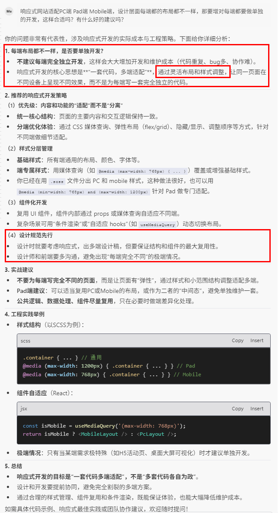

# 响应式网站开发

响应式网站指一套代码开发一个网站，同时适配多端（PC端、Pad端、Mobile端）等不同尺寸的屏幕上显示良好。

> 响应式开发的核心思想是 **"一套代码，多端适配"** 通过灵活布局和样式调整，让同一页面在不同设备上呈现不同效果，
> 而不是为每端写一套完全独立的代码。

## PC端和移动端采用了相同的布局结构，但是样式不一样，则通过灵活的布局和样式调整适配不同端

**响应式网站参考**

* [暴雪官网](https://www.blizzard.com/zh-tw/)
* [微软官网](https://www.microsoft.com/en-sg/)
* [苹果官网](https://www.apple.com.cn/)

### 1、CSS媒体查询

通过CSS3的媒体查询，根据不同的屏幕尺寸区间设置不同的样式效果，和不同尺寸的图片，来保证页面图片显示不失真，布局元素错乱。

### 2、栅格布局

栅格布局是一种网格化的页面布局方式，它由行和列组成。

### 3、弹性布局(flex/grid)

Flexbox是一种基于弹性盒子模型的布局技术。

* 使用 Flexbox 布局可以让元素自动适应不同屏幕尺寸
* 元素可以自动换行、伸缩，减少媒体查询的使用
* 特别适合一维布局（行或列）

### 4、隐藏/显示

### 5、调整元素顺序

### 6、CSS变量（自定义属性）配合媒体查询


```
:root {
  --main-font-size: 16px;
}

@media (max-width: 768px) {
  :root {
    --main-font-size: 14px;
  }
}

.text {
  font-size: var(--main-font-size);
}
```

### 7、移动优先设计（Mobile First）

```scss
// 网站的响应式设计：移动优先设计（Mobil e First）
// 移动端默认样式
.container {
  width: 100%;
}

// 平板（屏幕宽度不小于768px时）
@media (min-width: 768px) {
  .container {
    width: 750px;
  }
}

// 桌面（屏幕宽度不小于1024时）
@media (min-width: 1024px) {
  .container {
    width: 960px;
  }
}
```



## PC端和移动端采用了完全不同的【布局结构】和【交互】处理方式，实时响应式布局切换方案

**方式一**

1. 实现动态设备检测

创建一个全局状态管理机制，在窗口大小变化时更新设备类型：

```tsx
// DeviceContext.tsx
import React, {createContext, useState, useEffect, useContext} from 'react';
import {debounce} from '@/packages/util/src';

const DeviceContext = createContext({
  isPc: true,
  isMobile: false
});

export const DeviceProvider = ({children}) => {
  // 初始设备检测
  const [device, setDevice] = useState({
    isPc: window.innerWidth >= 768,
    isMobile: window.innerWidth < 768
  });

  useEffect(() => {
    const handleResize = debounce(() => {
      const width = window.innerWidth;
      const isPc = width >= 768;

      // 只有在设备类型发生变化时才更新
      if (isPc !== device.isPc) {
        setDevice({
          isPc: isPc,
          isMobile: !isPc
        });

        // 更新全局变量以保持兼容性
        window.isPc = isPc;
        window.isMobile = !isPc;
      }
    }, 250);

    window.addEventListener('resize', handleResize);
    return () => window.removeEventListener('resize', handleResize);
  }, [device]);

  return (
    <DeviceContext.Provider value={device}>
      {children}
    </DeviceContext.Provider>
  );
};

export const useDevice = () => useContext(DeviceContext);
```

2. 在应用入口处使用 Provider

```tsx
// App.tsx
import {DeviceProvider} from './DeviceContext';

function App() {
  return (
    <DeviceProvider>
      {/* 应用内容 */}
    </DeviceProvider>
  );
}
```

3. 修改现有组件以使用新的设备检测

```tsx
// 示例组件
import {useDevice} from './DeviceContext';

function ResponsiveComponent() {
  const {isPc, isMobile} = useDevice();

  // 根据当前设备类型渲染不同内容
  return isPc ? <PCComponent/> : <MobileComponent/>;
}
```

**方式二**

一种强制刷新方案，在检测到从PC端切到移动端的情况下强制刷新页面重新渲染内容。

```tsx
useEffect(() => {
  const initialIsMobile = window.innerWidth < 768;

  function handleResize() {
    const currentIsMobile = window.innerWidth < 768;
    if (initialIsMobile !== currentIsMobile) {
      window.location.reload();
    }
  }

  const debouncedHandleResize = debounce(handleResize, 500);
  window.addEventListener('resize', debouncedHandleResize);

  return () => {
    window.removeEventListener('resize', debouncedHandleResize);
  };
}, []);
```

**技术性挑战**
对于两套完全不同的UI和交互逻辑，确实存在一些挑战：

1. 页面结构差异大：PC和移动端组件结构完全不同，切换需要重新渲染整个组件树
2. 状态保持问题：切换视图时可能会丢失当前状态
3. 性能考量：频繁切换可能导致性能问题