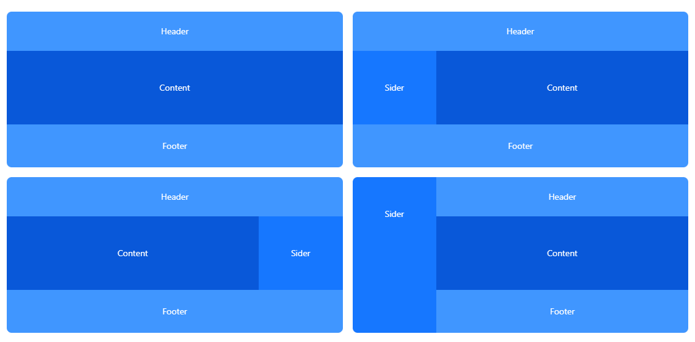

# 管理后台 - 布局开发

经典的页面布局



我们实现如下经典的管理后台布局


## 组件设计

* 布局组件：`<Layout>` `<Container>` `<Header>` `<Main>` `<Footer>` `<Sider>`
* 导航组件：`<Menu>` 菜单 `<Breadcrumb>` 面包屑 `<Tags>` 标签页

## 组件概述

* `<Layout>`：管理后台布局组件。
* `<Container>`：外层容器。
* `<Header>`：顶栏容器。
* `<Main>`：主要区域容器。
* `<Footer>`：底栏容器。
* `<Sider>`：侧边栏容器。

## 组件实现

## 示例

```shell
<Layout>
  <Outlet/>
</Layout>
```