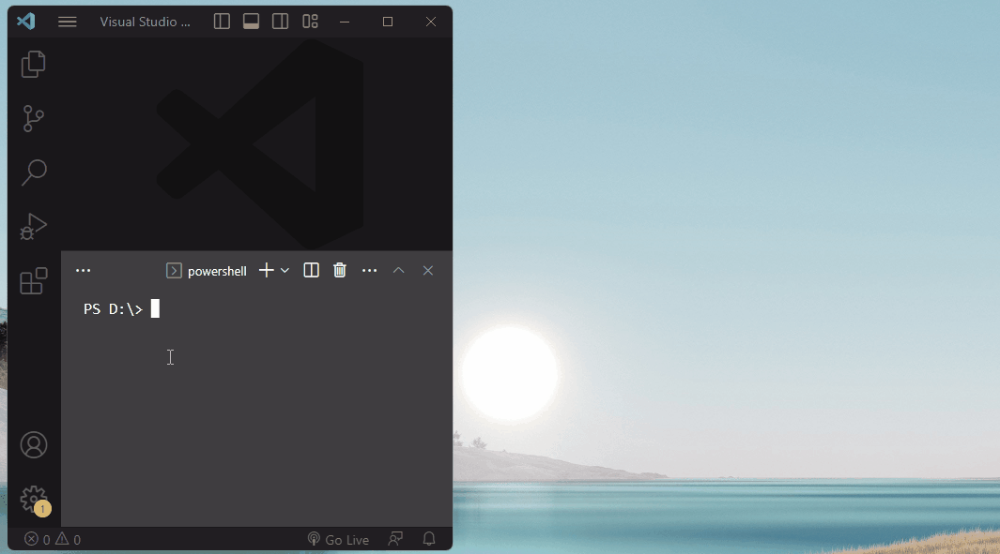
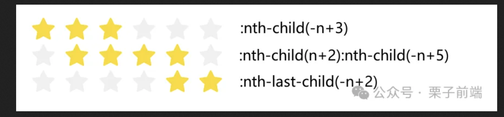

# 前端代码片段

[N 个值得一看的前端代码片段](https://mp.weixin.qq.com/s/778hr32KnLFEw7oBNt38sg)

## 1. 快速打开官网

当你想查看第三方库的主页和代码仓库时，你可以使用一下命令快速打开：

```
// 打开主页
npm home PACKAGE_NAME
npm home react

// 打开代码仓库
npm repo PACKAGE_NAME
npm repo react
```



## 2. 格式化时分秒

在展示音视频时长之类的场景时，需要把时长秒数格式为 HH:mm:ss 的格式。

```
const formatSeconds = (s) =>
  [parseInt(s / 60 / 60), parseInt((s / 60) % 60), parseInt(s % 60)]
    .join(':')
    .replace(/\b(\d)\b/g, '0$1')
```

如果你想显示“刚刚”、“5分钟前”之类的内容，可以尝试 timeago.js 库。

## 8. 文件下载

使用 `a` 标签的 `download` 属性，同源才能触发下载，IE 不支持，移动端兼容性也不太好。

```
<a href="/path/to/file" download>Download</a>
```

```
// 或者 js 临时生成 a
function download(url) {
  const link = document.createElement('a')
  link.download = 'file name'
  link.href = 'url'

  document.body.appendChild(link)
  link.click()
  document.body.removeChild(link)
}
```

静态资源服务器设置响应头也能触发浏览器下载。

```
Content-Disposition: attachment; filename="filename.jpg"
```

除了在线文件下载，你还可以创建一个 text 或 json 文件，并下载，主要用到了 `Blob` 对象和 `createObjectURL` 方法。

```
const data = JSON.stringify({ 'message': 'Hello Word' });

const blob = new Blob([data], { type: 'application/json' });

// 创建一个 URL
const url = window.URL.createObjectURL(blob);

// 用上面的 download 方法下载这个 url
...

// 释放创建的 URL
window.URL.revokeObjectURL(url); 
```


## 10. 多行省略号

单行或多行截断显示省略号，很常用的 CSS 片段。

```
.truncate {
  overflow: hidden;
  text-overflow: ellipsis;
  white-space: nowrap;
}

.truncate {
  display: -webkit-box;
  -webkit-box-orient: vertical;
  -webkit-line-clamp: 2;
  overflow: hidden;
}
```

## 11. 选中最后几个元素

```
// 前三个
li:nth-child(-n + 3) {
  text-decoration: underline;
}

// 选中 2-5 的列表项
li:nth-child(n + 2):nth-child(-n + 5) {
  color: #2563eb;
}

// 倒数两个
li:nth-last-child(-n + 2) {
  text-decoration-line: line-through;
}
```



## 12. 滚动条样式

自定义滚动条样式也是很常见的需求，除了通过样式，也可以通过第三方库（如 better-scroll 等）来实现自定义滚动条样式。

```
/*定义滚动条高宽及背景 高宽分别对应横竖滚动条的尺寸*/
::-webkit-scrollbar {
  width: 8px;
  height: 8px;
}

/*定义滚动条轨道 内阴影+圆角*/
::-webkit-scrollbar-track {
  border-radius: 10px;
  background-color: #fafafa;
}

/*定义滑块 内阴影+圆角*/
::-webkit-scrollbar-thumb {
  border-radius: 10px;
  background: rgb(191, 191, 191);
}

/*较新的 API*/
body {
  scrollbar-width: thin;
  scrollbar-color: #718096 #edf2f7;
}
```

## 14. 限制并发

当有大量请求需要发起时，往往需求限制并发数量保证其他请求能优先返回。

```
async function asyncPool(poolLimit, iterable, iteratorFn) {
  // 用于保存所有异步请求
  const ret = [];
  // 用户保存正在进行的请求
  const executing = new Set();
  for (const item of iterable) {
    // 构造出请求 Promise
    const p = Promise.resolve().then(() => iteratorFn(item, iterable));
    ret.push(p);
    executing.add(p);
    // 请求执行结束后从正在进行的数组中移除
    const clean = () => executing.delete(p);
    p.then(clean).catch(clean);
    // 如果正在执行的请求数大于并发数，就使用 Promise.race 等待一个最快执行完的请求
    if (executing.size >= poolLimit) {
      await Promise.race(executing);
    }
  }
  // 返回所有结果
  return Promise.all(ret);
}

// 使用方法
const timeout = i => new Promise(resolve => setTimeout(() => resolve(i), i));
asyncPool(2, [1000, 5000, 3000, 2000], timeout).then(results => {
  console.log(results)
})
```

## 16. 打开 Modal 时禁止 body 滚动

打开弹窗的时候，会发现背后的内容还是可以滚动，我们需要在弹窗出现时禁用滚动，在弹窗消失时恢复。

```
// 打开 Modal 时，禁止 body 滚动
document.body.style.overflow = 'hidden';

// 恢复滚动
document.body.style.removeProperty('overflow');
```

## 17. 读取mp3文件的信息

```
// 监听文件输入字段的变化
document.getElementById('mp3-file-input').addEventListener('change', function(event) {
    // 获取选中的文件
    var file = event.target.files[0];
 
    // 创建一个Audio元素
    var audio = new Audio();
 
    // 当音频可以播放时，获取元数据
    audio.onloadedmetadata = function() {
        // 输出音频的元数据
        console.log('音频标题:', audio.title);
        console.log('音频艺术家:', audio.artist);
        console.log('音频专辑:', audio.album);
        console.log('音频时长(秒):', audio.duration.toFixed(2));
    };
 
    // 创建一个FileReader来读取文件
    var reader = new FileReader();
 
    // 当文件读取完毕
    reader.onload = function(e) {
        // 为Audio元素设置加载的数据URL
        audio.src = e.target.result;
    };
 
    // 以DataURL的形式读取文件
    reader.readAsDataURL(file);
});
```

## 18. CSS使页面不滚动

```
.noscroll,.noscroll body{
  overflow: hidden !important;
  height: 100% !important;
}
```


## 19. 【奖励】增加、删除
```

<div v-for="(reward,index) in info.rewards" :key="index" class="condition-group">
	<el-input v-model="reward.product_id"
	          placeholder="请输入奖励ID"
	          :disabled="server_opening"
	          style="width:160px;margin-right: 8px;"/>
	<el-input v-model="reward.amount" placeholder="请输入数值"
	          :disabled="server_opening"
	          style="width:160px;margin-right: 8px;"/>
	<el-button v-if="info.rewards.length>1 && !server_opening"
	           class="button-custom"
	           icon="el-icon-minus2"
	           @click="onClickReward('delete',index)"/>
	<el-button v-if="index===info.rewards.length-1 && !server_opening"
	           icon="el-icon-plus2"
	           class="button-custom"
	           @click="onClickReward('add',index)"/>
</div>

onClickReward(type, index) {
	if (type === 'add') {
		this.info.rewards.push({
			"product_id": null,
			"amount": null,
		})
	} else if (type === 'delete') {
		this.info.rewards.splice(index, 1)
	}
},
```