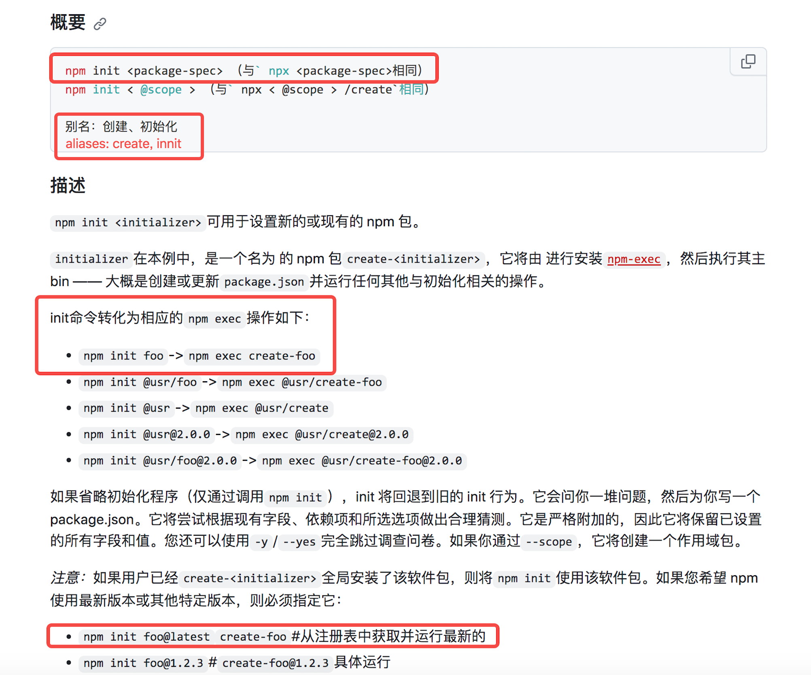
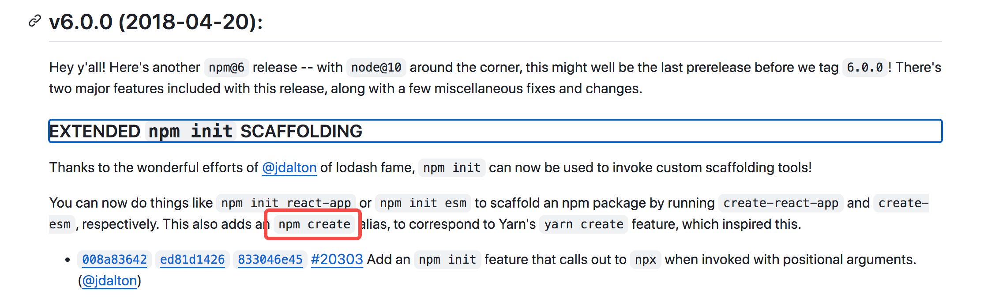

# 深入理解 npm init vue@latest 与 npm create vue@latest

npm 官方文档 [点击这里](https://docs.npmjs.com)

我系统的 node 版本是v16.13.1，npm 版本是 8.6.0。

## npm init

npm init 用来初始化我们本地项目的 package.json。还可以使用 npm init -y 来实现跳过手动配置，一键初始化本地项目。

[npm init v6 文档](https://docs.npmjs.com/cli/v6/commands/npm-init)

[npm init v8 文档](https://docs.npmjs.com/cli/v8/commands/npm-init)

**总结：**

* 根据官网介绍 npm create 是 npm init 的别名
* npm init 包名（类似于 npx create-包名）
* npm init @包名（类似于 npx @包名-create）
* npm init foo -> npm exec create-foo，当执行 npm init foo时，实际是将init命令转化为了相应的npm exec操作，也就是相当于执行：npm exec create-foo

注意：npm create 是 npm v6 之后才有的，详情见下图（ [CHANGELOG 点击这里](https://github.com/npm/cli/blob/release/v6/CHANGELOG.md#v600-2018-04-20)）。

## 执行 npm init vue@latest

* 当执行 npm init vue@latest，可以理解成 npx create-vue，这一指令将会安装并执行 create-vue。(正如官方所说[点击这里查看](https://cn.vuejs.org/guide/quick-start.html))
* @latest是从注册表中获取并运行最新的版本

## npx

npx 官方文档[点击这里](https://docs.npmjs.com/cli/v8/commands/npx)

npx作用：从本地或远程 npm 包运行命令。

npx会先验证本地是否安装了该软件包，安装了则直接使用该软件包。如果未安装将读取远程库中的create-vue，并缓存到全局的npm-cache中。

获取 npm-cache 的路径

`npm get config cache`

## 执行 npx create-vue

create-vue 包的地址：[点击这里](https://www.npmjs.com/package/create-vue )

* 首先npx拉取create-vue包
* 然后执行 create-vue 中的 package.json 中的 bin 指向的文件，也就是 outfile.cjs 文件
* .cjs 文件后缀指的是这个文件用的是CommonJS模块化规范

## 总结

1. npm create 是 npm init 的别名;
2. npm init 除了我们熟知的初始化 package.json，还可以利用远程库来初始化项目；
3. npm init vue 可以理解为： 执行npx create-vue > package.json > bin > create-vue > outfile.cjs
