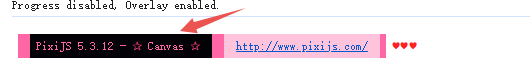

# PIXI 笔记

## PIXI 5.x 以后的版本开启Canvas渲染模式的方式

issue 链接 [点击这里](https://github.com/pixijs/pixijs/issues/5417)

官方回答 [点击这里](https://github.com/pixijs/pixijs/issues/5389#issuecomment-457889307)

**官方回答翻译**

简短的回答是，我们并没有删除它，而是删除了一些关于v5的内容：

我们决定让context2d渲染成为Pixi世界的二等公民。在v4中，WebGL和Canvas是相当平等的，因为许多开发人员需要传统浏览器的支持。在未来，Canvas可能会被弃用或变成一个外部插件，因为浏览器的支持已经改进，而对Canvas的支持阻碍了我们的发展。对于Pixi来说，未来更多的是WebGL 1 vs 2，而不是画布vs WebGL。

也就是说，对于v5并没有太多改变。我们创建了两个pixi“包”：一个有画布，一个没有。带有canvas的称为“pixi.js-legacy”，而webgl仅为“pixi.js”。

**意思是说：**

需要引入 "pixi.js-legacy" 库才行, 然后在new Application的时候传入 forceCanvas：true参数才行。 [pixi.js-legacy NPM包链接](https://www.npmjs.com/package/pixi.js-legacy)

```javascript
<script src="https://cdn.jsdelivr.net/npm/pixi.js-legacy@7.x/dist/pixi-legacy.min.js"></script>
```

```javascript
const app = new Application({
    forceCanvas: true, // 开启canvas渲染模式
});

document.body.appendChild(app.view);
```

如下图输出显示 Canvas 渲染即代表 且切换成 Canvas 渲染了。


