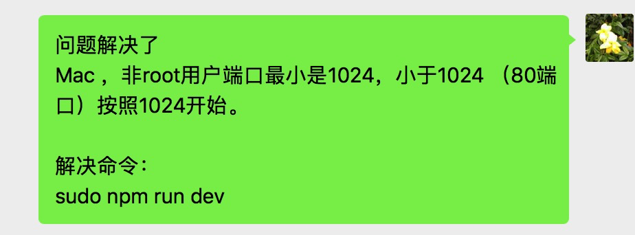

# Vue 笔记

## 未匹配到路由，则重定向到404页面

```
routes.unshift({
	path: '*',
	redirect: `/404`,
})
```

## Vue项目每次进入项目都跳转到根目录代码：

```
new Vue({
  el: '#app',
  router,
  components: {App},
  template: '<App/>',
  beforeCreate () {
    if (this.$route.path !== '/') {
      this.$router.push({path: '/'})
    }
  }
})
```

## Vue computed 可以返回函数

```
computed: {
  isEnable() {
    return function (keyName) {
      return this.contentForm[keyName] === '1'
    }
  },
},
```

使用

```
<el-table
  v-if="isEnable('enableInteraction')"
  class="page-table"
>
```

## Vuex getters 可以返回函数

```
getters: {
	getMenuByPath: state => path => {
	  let menu = state.menuList.find(menu => menu.path === path)
	  return menu;
	}
},
```

使用

```
let menu = store.getters.getMenuByPath(to.path)
```

## 关闭 vue cli 中的 eslint 检查工具

```
// vue.config.js
module.exports = {
  lintOnSave:false //关闭eslint检查
  devServer: {
    overlay: {
      warnings: false, //不显示警告
      errors: false	//不显示错误
    }
  },
}
```

## Vue 深度选择器 :v-deep

```
.area {

  .col-jjje ::v-deep .el-input-group__append {
    padding: 0 10px !important;
  }

  ::v-deep .citySelect-box {
    width: 100% !important;
    padding-right: 10px;
  }
}
```

## Vue 80端口无法使用，直接运行到1024问题

参考：[在mac os中，非root用户是无法使用小于1024的常用端口的。如果开发中需要用到80端口, 就要设置端口转发。](https://blog.csdn.net/samuelandkevin/article/details/80279773)



## 解决 vue2 数组内交换位置后无法重新渲染的问题

背景：如下代码，list 是一个响应式数组，调用swap(1,2) 交互数组中的元素，通过vue devtools查看data已经变了，但是 vue 不会触发重新渲染！

```
new Vue({
	el: "#app",
	data() {
		return {
			list: [0, 1, 3, 4],
		}
	},
	methods: {
		swap(index1, index2) {
			let temp = this.list[index1];

			this.list[index1] = this.list[index2];
			this.list[index2] = temp;

			// console.log(this.list);

			// 方法一
			// this.$set(this.list, index1, this.list[index2])
			// this.$set(this.list, index2, temp)

			// 方法二
			this.$forceUpdate();
		},
	}
})
```

原因：vue2 只对数组的push pop shift unshift splice ... 等等这些方法做了代理，当做了这些之外的操作是监听不到的。

解决：

方法一：用this.$set();

方法二：用this.$forceUpdate(); 强制触发重新渲染。

## vue 查看全局已经注册的指令
```
import Vue from 'vue'

console.log(Vue.options.directives);

// 遍历并打印所有指令
for (const directiveName in Vue.options.directives) {
  console.log(`指令名称: ${directiveName}`);
}
```