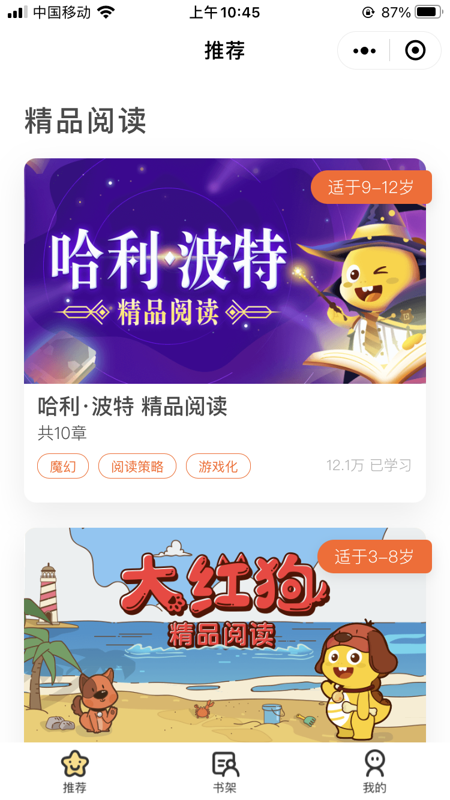

# 哈利·波特与大红狗 精品阅读游戏

<h1>《哈利·波特与大红狗 精品阅读》</h1>

产品：张宝龙、毕鹤琼、张元㞵

设计：大顺、车娜

研发：田渊、维彬、华哥、廖小敏、张海岩

测试：元香、元园

教研：金老师

### 英语阅读游戏化作品

VIPKID专为5-15岁孩子设计了自主英语学习课程，「哈利·波特与大红狗
精品阅读」是为了激励学生阅读与拉新用户而开发的游戏化的产品，其包括多个章节内容展现，通过课前预习、课中阅读、课后答题的交互形式来与用户互动。

精品阅读应用：

小程序嵌套Web页面模式，小程序提供精品阅读课程商城、书架、个人中心功能，Web支持游戏化阅读功能。

### 项目开发：

Web前端项目是一个SPA应用，由多个模块组成。项目功能多，代码规模庞大，这些模块都需要独立开发和部署，并且需要有自己的生命周期和版本控制，基于项目的这些特点，前端采用微前端思路架构项目。
主应用负责整个应用的框架搭建、路由分发和子应用的注册和协调管理，子应用为组件化模式独立开发的前端功能模块。
视图层应用渐进式框架Vue渲染，结合VueRouter动态注册路由和Webpack异步加载模块的能力实现对子应用的加载和挂载。

游戏模块项目基于MVC模式开发，使用的是PureMVC框架，底层WebGL渲染使用PIXI 2D渲染引擎，开发代码使用TypeScript语言，代码规范检查 Tslint。项目中加入了骨骼动画、序列帧动画、粒子动画，传统补间动画使用
TweenMax库制作。技术上还使用Axios来处理网络请求，Sentry收集线上异常错误信息帮助排查线上问题。

<!--  -->

<!--  -->

<!--  -->

<!--  -->

<!--  -->