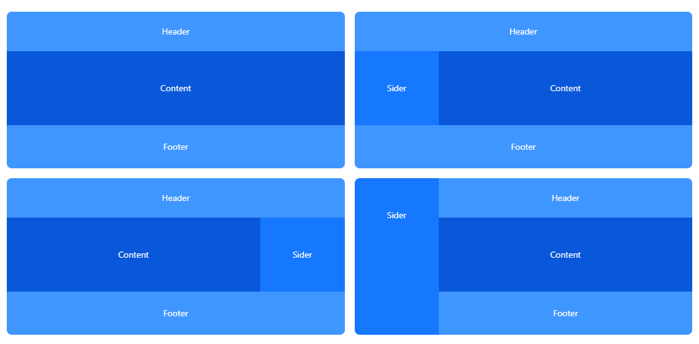

# 管理后台 - 布局开发

经典的页面布局

我们实现如下经典的管理后台布局

## 组件开发

* 布局
    * `<Container>`
    * `<Header>`
    * `<Content>`
    * `<Footer>`
    * `<Sider>`
* 导航
    * `<Menu>` 菜单
    * `<Breadcrumb>` 面包屑
    * `<Tags>` 标签页

最终只需要在页面中引入 `<Layout>` 组件即可