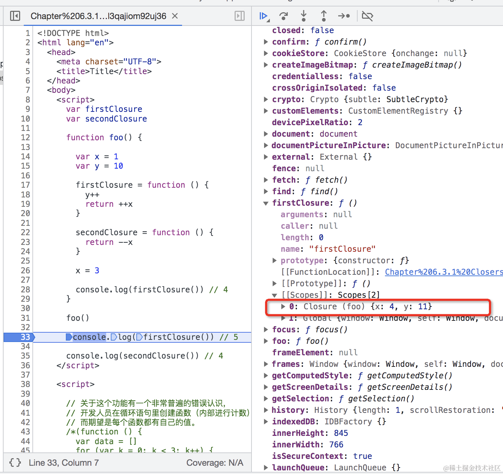
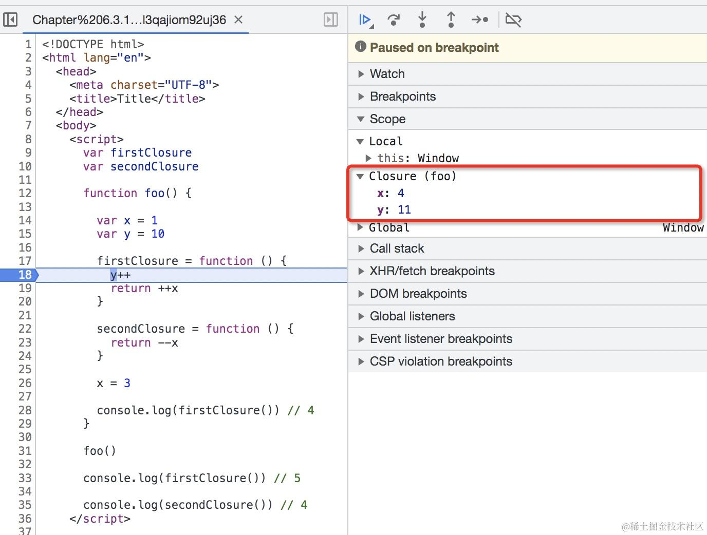

# 深入理解 JavaScript 闭包

## 1. 前言

面试的时候常常会有面试官会问：谈谈你对闭包的理解？

首先回答问题要有清晰的思路和逻辑顺序，如：

1. 描述问题产生的背景。
2. 如何解决的问题。
3. 带来了什么结果。

比如回答对闭包的理解可以按：

1. 为什么会有闭包？（问题是什么）
2. 闭包是如何设计的？（怎么解决的）
3. 闭包的应用场景。（带来了什么结果）

我觉得按这样的思路回答问题，比按[MDN](<https://developer.mozilla.org/zh-CN/docs/Web/JavaScript/Closures>)
上的解释说一遍回答“闭包（closure）是一个函数以及其捆绑的周边环境状态（lexical environment，词法环境）的引用的组合”要好。

## 2. 为什么会有闭包？

在[面向堆栈的编程语言](http://en.wikipedia.org/wiki/Stack-oriented_programming_language)
中，函数的局部变量都是保存在栈上的，每当函数激活的时候，这些变量和函数参数都会压入到该堆栈上。

当函数返回的时候，这些参数又会从栈中移除。这种模型对将函数作为函数式值使用的时候有很大的限制（比方说，作为返回值从父函数中返回）。绝大部分情况下，问题会出现在当函数有自由变量的时候。

在ECMAScript中，函数是可以封装在父函数中的，并**可以使用父函数上下文的变量**。这个特性会引发Funarg问题。

### Funarg 问题

自由变量是指**在函数中使用**的，但既**不是函数参数**也**不是函数的局部变量**的变量

示例1：

```
  function foo() {
    var x = 10

    return function bar() {
      console.log(x)
    }
  }

  var returnedFunction = foo()

  console.log(returnedFunction.prototype)

  var x = 20

  returnedFunction()
```

上述例子中，对于bar函数来说，x就属于自由变量。

示例2：

```
  var x = 10;

  function foo() {
    console.log(x)
  }

  (function (funArg) {
    var x = 20

    funArg()
  })(foo)
```

两类funarg问题 ：

1. 取决于是否将**函数以返回值返回**（第一类问题，示例1）
1. 以及是否将**函数当函数参数使用**（第二类问题，示例2）。

思考一下:

1. 当内层函数返回了或者通过别的暴露出去了，那么外层函数销毁，内层函数却没有销毁，这时候怎么处理作用域，父作用域销不销毁？
2. 在执行returnedFunction函数与funArg函数的时候如何找到x变量？

为了解决上述问题，JavaScript 就引入了闭包的机制。

## 3. 闭包是如何设计的？

**再次强调下：ECMAScript
只使用[静态（词法）作用域](https://en.wikipedia.org/wiki/Scope_(computer_science)#Lexical_scoping) 。**  (
而诸如Perl这样的语言，既可以使用静态作用域也可以使用动态作用域进行变量声明）。

```
function foo(){

}

// 执行上下文
fooContext = {
    VO:{...}, // 变量对象
    this:thisValue, // this值是执行上下文一属性
    Scope // 函数作用域链
}
```

函数在创建阶段会给foo函数创建[[Scopes]]属性

函数执行上下文作用域链：
fooContext.Scope = fooContext.AO + foo.[[Scopes]]

技术上说，创建该函数的父级上下文的数据是保存在该函数的内部属性 [[Scopes]]中的。

但是 JS 引擎怎么知道它要用到哪些外部引用呢，需要做 AST 扫描，很多 JS 引擎会做 Lazy Parsing，这时候去 parse
函数，正好也能知道它用到了哪些外部引用，然后把这些外部用打包成 Closure 闭包，加到 [[scopes]] 中。

如下图：firstClosure函数在创建完成之后，函数内部引用的自由变量就已经打包成Closure闭包，挂到函数的[[Scopes]]上了。



调用 firstClosure 函数的时候，JS 引擎 会取出 [[Scopes]] 中的打包的 Closure + Global 链，设置成新的作用域链，
这就是函数用到的所有外部环境了，有了外部环境，自然就可以运行了。



## 4. 闭包的应用场景

- 命名空间污染：模块要用多个变量，我们希望变量不影响全局，全局也不影响我们的变量。
- 模拟私有属性
- 有状态的函数

## 5. 闭包的缺点

- 如果一个变量被闭包对象 Closure 引用，无法被释放回收。
- 如果一个很大的对象被闭包对象 Closure 引用，本来函数调用结束就能销毁，但是现在引用却被通过闭包保存到了堆里，而且还一直用不到，那这块堆内存就一直没法使用，严重到一定程度就算是内存泄漏了。
- 闭包函数又在多个地方被引用，导致数据引用复杂，容易发生内存泄漏问题。

至此通过清晰的回答，面试官会对你肯定刮目相看。

参考：

[闭包是什么？从为什么会有闭包讲起！](https://juejin.cn/post/7084549768067678245?share_token=81B8021F-F924-477C-AC49-47071C69927E)