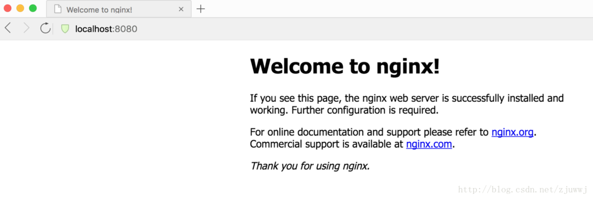

# Nginx

## 1、Nginx 基础

1.安装

sudo brew install nginx

2.查看nginx版本

nginx -v

2.2 查看nginx的安装位置

which nginx

2.3 查看nginx配置文件的路径

nginx -t

3.启动nginx

sudo nginx

4.查看nginx是否启动成功

在浏览器中访问 `http://localhost:8080` ，如果出现如下界面，则说明启动成功.

5.关闭nginx

sudo nginx -s stop

6.重新加载nginx

sudo nginx -s reload

常用的指令有：

nginx -s reload 重新加载配置

nginx -s reopen 重启

nginx -s stop 停止

nginx -s quit 退出

nginx -V 查看版本，以及配置文件地址  nginx-v 查看版本

nginx -c filename 指定配置文件

nginx -h 帮助

## 2、Nginx 配置

Nginx的安装目录下的nginx.conf文件，该文件负责Nginx的基础功能配置。

Nginx的主配置文件(conf/nginx.conf)按以下结构组织：

配置块|	功能描述|
|---|---|
全局块|	与Nginx运行相关的全局设置|
events块|	与网络连接有关的设置|
http块|	代理、缓存、日志、虚拟主机等的配置|
server块|	虚拟主机的参数设置（一个http块可包含多个server块）|
location块|	定义请求路由及页面处理方式|

[配置参考](https://mp.weixin.qq.com/s/irgQW4DTAyX3SPF-F5ccdQ)

### 参考

https://mp.weixin.qq.com/s/irgQW4DTAyX3SPF-F5ccdQ
