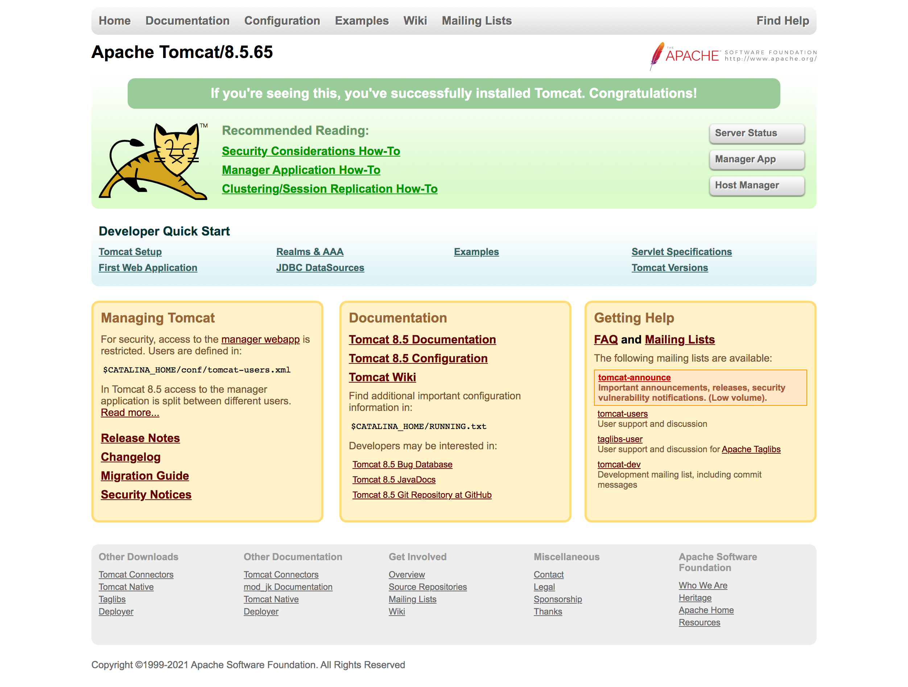
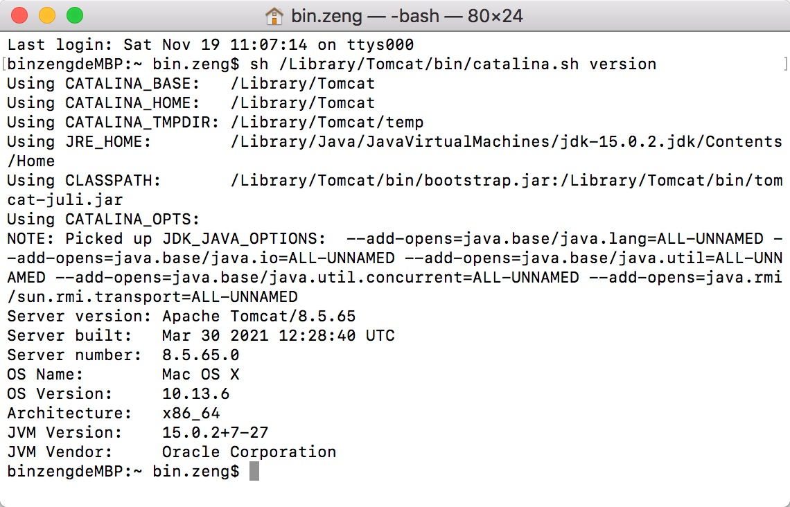

# Tomcat 基础

## 一、安装Tomcat

[Tomcat官方下载地址](https://tomcat.apache.org/)

## 二、用终端（Terminal）直接打开Tomcat了

1、进入Tomcat的bin目录下：终端输入`cd /Library/Tomcat/bin` ，输完回车  
2、授权bin目录下的所有操作：终端输入`sudo chmod 755 *.sh`，输完回车  
3、这时要输入密码，输完回车  
4、这时候就可以开启Tomcat了，终端输入`sudo sh ./startup.sh`，输完回车  

## 三、到浏览器输入网址 localhost:8080  ，若出现了下面的画面就证明成功了



## 四、关闭Tomcat，用终端输入sh ./shutdown.sh，回车即可关闭

[MAC下安装配置Tomcat（小白向）](https://www.jianshu.com/p/69496fb3495e)

MAC安装Tomcat如何配置账号密码？？？

找到tomcat主目录下的子目录conf里面的tomcat-users.xml文件，在此文件里修改。

## 五、查看Tomcat版本号

输入命令：`sh /Library/Tomcat/bin/catalina.sh version`

