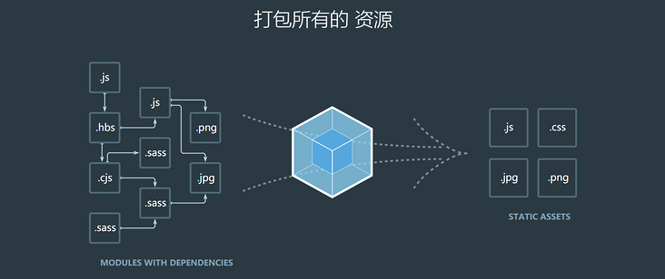

# 构建工具

还是先来说说早期前端项目开发一些痛点和问题。例如：

* 在开发过程中用到SCSS，如果每次修改SCSS文件都去执行`sass style.scss:style.css编译导出css文件，则很麻烦而且效率低下。
* 在开发完成项目后需要对多个JavaScript文件进行代码合并、并压缩，人工合并耗时耗力。

构建工具的主要功能就是实现自动化处理，例如对代码进行检查、预编译等。

## Grunt

Grunt.js是基于Node.js的自动化任务运行器，于2013年02月18日发布了v0.4.0的版本。

## Gulp

Gulp 是基于任务和流(Task.Stream) 的构建工具。

Gulp 就是将开发流程中让人痛苦或耗时的任务自动化，从而减少你所浪费的时间、创造更大价值。

Gulp 的优势：

1. 简单：代码优于配置、node 最佳实践、精简的 API 集，gulp 让工作前所未有的简单。
2. 高效：基于 node 强大的流(stream)能力，gulp 在构建过程中并不把文件立即写入磁盘，从而提高了构建速度。
3. 生态：遵循严格的准则，确保我们的插件结构简单、运行结果可控。

https://segmentfault.com/a/1190000002491282

#### Grunt/Gulp的核心是Task

我们可以配置一系列的task，并且定义task要处理的事务（例如ES6、ts转化，图片压缩，scss转成css）。之后让grunt/gulp来依次执行这些task，而且让整个流程自动化。所以grunt/gulp也被称为**前端自动化任务管理工具**。

什么时候用grunt/gulp呢？

如果你的工程模块依赖非常简单，甚至是没有用到模块化的概念。只需要进行简单的合并、压缩，就使用grunt/gulp即可。但是如果整个项目使用了模块化管理，而且相互依赖非常强，我们就可以使用更加强大的webpack了。

## Webpack

Webpack 是一个现代的 JavaScript 应用的静态**模块打包**工具。

涉及到两个概念：模块 和 打包

### 模块

通过模块化开发完成项目后，还需要处理模块间的各种依赖，并且将其进行整合打包。而webpack其中一个核心就是让我们可能进行模块化开发，并且会帮助我们处理模块间的依赖关系。而且不仅仅是JavaScript文件，我们的CSS、图片、json文件等等在webpack中都可以被当做模块来使用。这就是webpack中模块化的概念。

### 打包

就是将webpack中的各种资源模块进行打包合并成一个或多个包(Bundle)。并且在打包的过程中，还可以对资源进行处理，比如压缩图片，将scss转成css，将ES6语法转成ES5语法，将TypeScript转成JavaScript等等操作。

特点：

1. 一切皆模块：不管是html，css，js，json 等等。各模块通过loader和plugins处理，然后打包到一起。
2. 按需加载：打包过程中 Webpack 通过 Code Splitting 功能将文件分为多个 chunks，还可以将重复的部分单独提取出来作为 commonChunk，从而实现按需加载。

grunt/gulp和webpack有什么不同呢？

* grunt/gulp更加强调的是前端流程的自动化，模块化不是它的核心。
* webpack更加强调模块化开发管理，而文件压缩合并、预处理等功能，是他附带的功能。

## Vite ???

## xxx-cli

构建适合自己公司的脚手架工具 xxx-cli

自动创建项目基础文件（创建项目的基础结构、提供项目的规范和约定），简化并统一开发人员的日常构建与开发相关的工作。

* 相同的组织结构
* 相同的开发范式
* 相同的模块依赖
* 相同的工具配置
* Gulp 
* ESlint 
* 相同的基础代码
