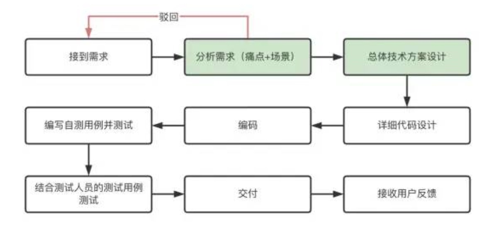

# 开发流程规范

开发流程在一定程度上应该是由研发者自己来掌控。对开发者来说核心还是：高质高效的完成用户需求。

不是拿到需求后就开始急匆匆的写代码，以此来体现他们的高效，但往往却因为需求理解不到位和前期代码欠缺设计导致bug率高和返工。

如何找到合适自己的开发流程是需要一定的经验，需要反复总结和思考，最终达到高质高效完成的目的。

在接收到需求后应第一时间去了解  `这个需求的背景是什么？`  `这么做到底有没有解决用户的痛点？` `或者说用户更深层次的需求是什么？` 如果团队的产品经验不是很丰富，那么在这个阶段往往会砍掉很多不合理的需求（这一点真的很重要）。

对于较复杂的功能往往还需要进行技术方案调研和技术方案设计，并输出详细的设计文档。涉及到细节上，则需要将数据流走向、组件设计等通过脑图的形式呈现出来。
