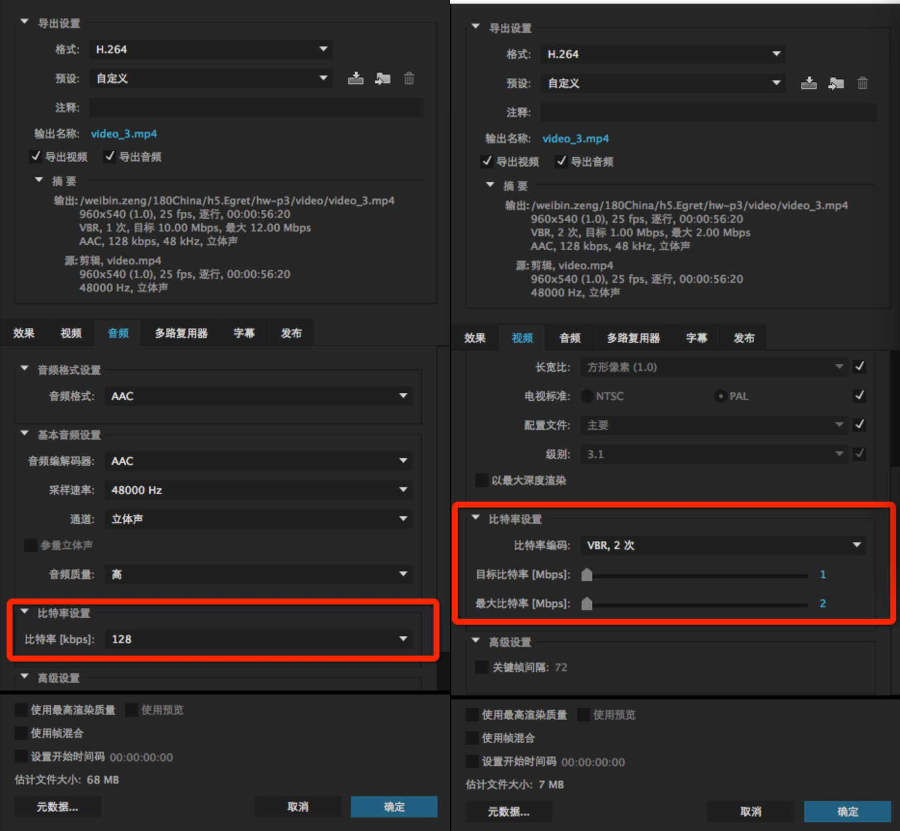

# 关于浏览器媒体播放的问题

如果H5里面有多一个音频，视频和音频的采样率要调整成一样。
不管是音频还是视频里面有音频，只要有多个音乐都会出现破音、音乐无法静音、音乐无法播放。

微信Android浏览器(测试机器HUAWEI mata7) 视频和背景音频同时播放，当视频开始播放 背景音频的音量会莫名其妙降低。解决办法：具体原因未找到。应尽快避免音频和视频分离，制作时候让音频和视频合在一起。多个音频播放尽量是简短的音乐播放。

### 微信浏览器播放视频总结：
ios可以不全屏拉起全屏播放

如果要跳转到固定的某一帧播放，不能准确的设置currentTime跳转到某一帧播放。

Android自动拉起全屏播放。会闪屏一下，然后浏览器全屏。    http://h5.180network.com.cn/2017/jd_jiajujie/ 

并且在android上面视频会被自动拉伸   http://m.zhuanzhuan.58.com/Mzhuanzhuan/zhuanzhuan/zhuanzhuan/index.html?userId=o3Aj5jjA5ICN1pvaJrS7kieZgqjw

如果域名在微信白名单下 视频可以不全屏播放 https://wqs.jd.com/promote/201711/trump/5/index.html?pro_id=5&android=1

有多个视频时，添加多个 video 标签来分别播放。

### 微信浏览器播放音频总结：
音乐的音量只能做0-1处理，不能加大会异常。

在5s上遇到过破声的问题，因为调用了系统的播放器导致的。将 new Audio 的方式改成 audio 标签解决了。

在ios9.几版本中 播放音频文件无法控制音量，静音。解决办法：用户需要升级到最新的ios系统。

如果使用一个audio标签动态改变标签的src属性，可能监听不到音频播放完成，设置了loop无法循环播放等问题。解决办法：使用多个audio标签，不要使用动态改变src解决。

在浏览器媒体文件无法自动播放媒体文件。解决办法：必须要触摸一下屏幕才能播放。

微信浏览器注册事件:
document.addEventListener("WeixinJSBridgeReady",function() {
　　//获取网络状态
    window["WeixinJSBridge"].invoke('getNetworkType',{},function(e) {
 　　//音频播放
        document.getElementById("sound").play();
        document.getElementById("sound").pause();
   });
},false);
正常单条音频设置 采样率32 比特率441000

### 视频/音频 压缩输出设置：

