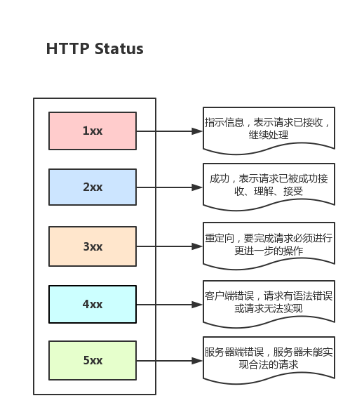
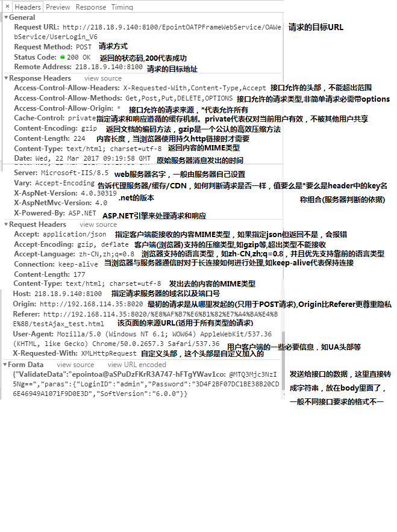

# 从输入URL到页面加载的过程？如何由一道题完善自己的前端知识体系！

## 大纲
* 对知识体系进行一次预评级

* 为什么说知识体系如此重要？

* 梳理主干流程

* 从浏览器接收url到开启网络请求线程
	* 多进程的浏览器
	
	* 多线程的浏览器内核
	
	* 解析URL
	
	* 网络请求都是单独的线程
	
	* 更多

* 开启网络线程到发出一个完整的http请求

	* DNS查询得到IP

	* tcp/ip请求

	* 五层因特网协议栈

* 从服务器接收到请求到对应后台接收到请求

	* 负载均衡

	* 后台的处理

* 后台和前台的http交互

	* http报文结构

	* cookie以及优化

	* gzip压缩

	* 长连接与短连接

	* http 2.0

	* https

* 单独拎出来的缓存问题，http的缓存

	* 强缓存与弱缓存

	* 缓存头部简述

	* 头部的区别

* 解析页面流程

	* 流程简述

	* HTML解析，构建DOM

	* 生成CSS规则

	* 构建渲染树

	* 渲染

	* 简单层与复合层

	* Chrome中的调试

	* 资源外链的下载

	* loaded和domcontentloaded

	* CSS的可视化格式模型

	* 包含块（Containing Block）

	* 控制框（Controlling Box）

	* BFC（Block Formatting Context）

	* IFC（Inline Formatting Context）

	* 其它

* JS引擎解析过程

	* JS的解释阶段

	* JS的预处理阶段

	* JS的执行阶段

	* 回收机制

* 其它

* 总结	

## 梳理主干流程
1. 从浏览器接收url到开启网络请求线程（这一部分可以展开浏览器的机制以及进程与线程之间的关系）

2. 开启网络线程到发出一个完整的http请求（这一部分涉及到dns查询，tcp/ip请求，五层因特网协议栈等知识）

3. 从服务器接收到请求到对应后台接收到请求（这一部分可能涉及到负载均衡，安全拦截以及后台内部的处理等等）

4. 后台和前台的http交互（这一部分包括http头部、响应码、报文结构、cookie等知识，可以提下静态资源的cookie优化，以及编码解码，如gzip压缩等）

5. 单独拎出来的缓存问题，http的缓存（这部分包括http缓存头部，etag，catch-control等）

6. 浏览器接收到http数据包后的解析流程（解析html-词法分析然后解析成dom树、解析css生成css规则树、合并成render树，然后layout、painting渲染、复合图层的合成、GPU绘制、外链资源的处理、loaded和domcontentloaded等）

7. CSS的可视化格式模型（元素的渲染规则，如包含块，控制框，BFC，IFC等概念）

8. JS引擎解析过程（JS的解释阶段，预处理阶段，执行阶段生成执行上下文，VO，作用域链、回收机制等等）

9. 其它（可以拓展不同的知识模块，如跨域，web安全，hybrid模式等等内容）

## 1.从浏览器接收url到开启网络请求线程

### 多进程的浏览器

浏览器是多进程的，有一个主控进程，以及每一个tab页面都会新开一个进程（某些情况下多个tab会合并进程）

进程可能包括主控进程，插件进程，GPU，tab页（浏览器内核）等等

* Browser进程：浏览器的主进程（负责协调、主控），只有一个

* 第三方插件进程：每种类型的插件对应一个进程，仅当使用该插件时才创建

* GPU进程：最多一个，用于3D绘制

* 浏览器渲染进程（内核）：默认每个Tab页面一个进程，互不影响，控制页面渲染，脚本执行，事件处理等（有时候会优化，如多个空白tab会合并成一个进程）

### 多线程的浏览器内核

每一个tab页面可以看作是浏览器内核进程，然后这个进程是多线程的，它有几大类子线程

* GUI线程

* JS引擎线程

* 事件触发线程

* 定时器线程

* 网络请求线程

可以看到，里面的JS引擎是内核进程中的一个线程，这也是为什么常说JS引擎是单线程的

### 解析URL

输入URL后，会进行解析（URL的本质就是统一资源定位符）

URL一般包括几大部分：

* protocol，协议头，譬如有http，ftp等

* host，主机域名或IP地址

* port，端口号

* path，目录路径

* query，即查询参数

* fragment，即#后的hash值，一般用来定位到某个位置

### 网络请求都是单独的线程

每次网络请求时都需要开辟单独的线程进行，譬如如果URL解析到http协议，就会新建一个网络线程去处理资源下载

因此浏览器会根据解析出得协议，开辟一个网络线程，前往请求资源（这里，暂时理解为是浏览器内核开辟的，如有错误，后续修复）

## 2.开启网络线程到发出一个完整的http请求
这一部分主要内容包括：dns查询，tcp/ip请求构建，五层因特网协议栈等等

仍然是先梳理主干，有些详细的过程不展开（因为展开的话内容过多）

### DNS查询得到IP
如果输入的是域名，需要进行dns解析成IP，大致流程：

如果浏览器有缓存，直接使用浏览器缓存，否则使用本机缓存，再没有的话就是用host

如果本地没有，就向dns域名服务器查询（当然，中间可能还会经过路由，也有缓存等），查询到对应的IP

注意，域名查询时有可能是经过了CDN调度器的（如果有cdn存储功能的话）

而且，需要知道dns解析是很耗时的，因此如果解析域名过多，会让首屏加载变得过慢，可以考虑dns-prefetch优化

这一块可以深入展开，具体请去网上搜索，这里就不占篇幅了（网上可以看到很详细的解答）

### tcp/ip请求

http的本质就是tcp/ip请求

需要了解3次握手规则建立连接以及断开连接时的四次挥手

tcp将http长报文划分为短报文，通过三次握手与服务端建立连接，进行可靠传输

#### get和post的区别

get和post虽然本质都是tcp/ip，但两者除了在http层面外，在tcp/ip层面也有区别。

get会产生一个tcp数据包，post两个

具体就是：

get请求时，浏览器会把headers和data一起发送出去，服务器响应200（返回数据），

post请求时，浏览器先发送headers，服务器响应100 continue， 浏览器再发送data，服务器响应200（返回数据）。

再说一点，这里的区别是specification（规范）层面，而不是implementation（对规范的实现）

### 五层/七层因特网协议栈

OSI七层框架：<label style='color:red'>`物理层`、`数据链路层`、`网络层`、`传输层`、`会话层`、`表示层`、`应用层`</label>

## 3.从服务器接收到请求到对应后台接收到请求

## 4.后台和前台的http交互

其中，Method的话一般分为两批次：

> HTTP1.0定义了三种请求方法： GET, POST 和 HEAD方法。
以及几种Additional Request Methods：PUT、DELETE、LINK、UNLINK

> HTTP1.1定义了八种请求方法：GET、POST、HEAD、OPTIONS, PUT, DELETE, TRACE 和 CONNECT 方法。

这里面最常用到的就是状态码，很多时候都是通过状态码来判断，如（列举几个最常见的）：

>200——表明该请求被成功地完成，所请求的资源发送回客户端  
304——自从上次请求后，请求的网页未修改过，请客户端使用本地缓存  
400——客户端请求有错（譬如可以是安全模块拦截）
401——请求未经授权  
403——禁止访问（譬如可以是未登录时禁止）  
404——资源未找到  
500——服务器内部错误  
503——服务不可用  
...

再列举下大致不同范围状态的意义
>1xx——指示信息，表示请求已接收，继续处理  
2xx——成功，表示请求已被成功接收、理解、接受  
3xx——重定向，要完成请求必须进行更进一步的操作  
4xx——客户端错误，请求有语法错误或请求无法实现  
5xx——服务器端错误，服务器未能实现合法的请求  

### 请求/响应头部

譬如，请求头部的Accept要和响应头部的Content-Type匹配，否则会报错

譬如，跨域请求时，请求头部的Origin要匹配响应头部的Access-Control-Allow-Origin，否则会报跨域错误

譬如，在使用缓存时，请求头部的If-Modified-Since、If-None-Match分别和响应头部的Last-Modified、ETag对应

还有很多的分析方法，这里不一一赘述

### 请求/响应实体

http请求时，除了头部，还有消息实体，一般来说

请求实体中会将一些需要的参数都放入进入（用于post请求）。

譬如实体中可以放参数的序列化形式（a=1&b=2这种），或者直接放表单对象（Form Data对象，上传时可以夹杂参数以及文件），等等

而一般响应实体中，就是放服务端需要传给客户端的内容

一般现在的接口请求时，实体中就是对于的信息的json格式，而像页面请求这种，里面就是直接放了一个html字符串，然后浏览器自己解析并渲染。

如下图是对某请求的http报文结构的简要分析

### cookie以及优化

cookie是浏览器的一种本地存储方式，一般用来帮助客户端和服务端通信的，常用来进行身份校验，结合服务端的session使用。

关于cookie的交互，可以看下图总结

### gzip压缩

首先，明确gzip是一种压缩格式，需要浏览器支持才有效（不过一般现在浏览器都支持）， 而且gzip压缩效率很好（高达70%左右）

然后gzip一般是由apache、tomcat等web服务器开启

当然服务器除了gzip外，也还会有其它压缩格式（如deflate，没有gzip高效，且不流行）

所以一般只需要在服务器上开启了gzip压缩，然后之后的请求就都是基于gzip压缩格式的， 非常方便。

### 长连接与短连接

首先看tcp/ip层面的定义：

	* 长连接：一个tcp/ip连接上可以连续发送多个数据包，在tcp连接保持期间，如果没有数据包发送，需要双方发检测包以维持此连接，一般需要自己做在线维持（类似于心跳包）
	
	* 短连接：通信双方有数据交互时，就建立一个tcp连接，数据发送完成后，则断开此tcp连接

然后在http层面：

	* http1.0中，默认使用的是短连接，也就是说，浏览器没进行一次http操作，就建立一次连接，任务结束就中断连接，譬如每一个静态资源请求时都是一个单独的连接
	
	* http1.1起，默认使用长连接，使用长连接会有这一行Connection: keep-alive，在长连接的情况下，当一个网页打开完成后，客户端和服务端之间用于传输http的tcp连接不会关闭，如果客户端再次访问这个服务器的页面，会继续使用这一条已经建立的连接

注意： keep-alive不会永远保持，它有一个持续时间，一般在服务器中配置（如apache），另外长连接需要客户端和服务器都支持时才有效

### http 2.0

然后简述下http2.0的一些特性：

	* 多路复用（即一个tcp/ip连接可以请求多个资源）
	
	* 首部压缩（http头部压缩，减少体积）
	
	* 二进制分帧（在应用层跟传送层之间增加了一个二进制分帧层，改进传输性能，实现低延迟和高吞吐量）
	
	* 服务器端推送（服务端可以对客户端的一个请求发出多个响应，可以主动通知客户端）
	
	* 请求优先级（如果流被赋予了优先级，它就会基于这个优先级来处理，由服务器决定需要多少资源来处理该请求。）

### https

## 单独拎出来的缓存问题，http的缓存

### 强缓存与弱缓存

### 缓存头部简述

### 头部的区别

## 解析页面流程

前面有提到http交互，那么接下来就是浏览器获取到html，然后解析，渲染

这部分很多都参考了网上资源，特别是图片，参考了来源中的文章

### 流程简述

浏览器内核拿到内容后，渲染步骤大致可以分为以下几步：

	1. 解析HTML，构建DOM树
	
	2. 解析CSS，生成CSS规则树
	
	3. 合并DOM树和CSS规则，生成render树
	
	4. 布局render树（Layout/reflow），负责各元素尺寸、位置的计算
	
	5. 绘制render树（paint），绘制页面像素信息
	
	6. 浏览器会将各层的信息发送给GPU，GPU会将各层合成（composite），显示在屏幕上

如下图：

	* HTML解析，构建DOM

	* 生成CSS规则

	* 构建渲染树

	* 渲染

	* 简单层与复合层

	* Chrome中的调试

	* 资源外链的下载

	* loaded和domcontentloaded

	* CSS的可视化格式模型

	* 包含块（Containing Block）

	* 控制框（Controlling Box）

	* BFC（Block Formatting Context）

	* IFC（Inline Formatting Context）

	* 其它

* JS引擎解析过程

	* JS的解释阶段

	* JS的预处理阶段

	* JS的执行阶段

	* 回收机制

* 其它

* 总结	