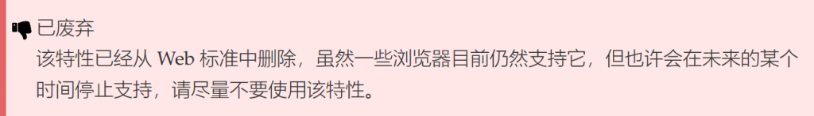

# 字符编码

在 JavaScript 中，一共有三个方法可以对字符串进行 URI 编码，分别为 escape()、encodeURI() 与 encodeURIComponent()，它们的区别如下。

### escape() 方法

### encodeURI() 方法
类型	包含  
保留字符	; , / ? : @ & = + $  
非转义的字符	字母 数字 - _ . ! ~ * ' ( )  
数字符号	#  

因此，encodeURI 自身无法产生能适用于 HTTP GET 或 POST 请求的 URI，例如对于 XMLHTTPRequests， 因为 “&”, “+”, 和 “=” 不会被编码，然而在 GET 和 POST 请求中它们是特殊字符。

### encodeURIComponent() 方法
encodeURIComponent() 是对统一资源标识符（URI）的组成部分进行编码的方法。它使用一到四个转义序列来表示字符串中的每个字符的 UTF-8 编码。正因为这个方法是对 URI 的组成部分编码的，所以其中不应该含有任何 URI 特殊字符，它会转义除了字母、数字、(、)、.、!、~、*、'、-和_之外的所有字符，原因如 MDN 上所写：

>为了避免服务器收到不可预知的请求，对任何用户输入的作为 URI 部分的内容你都需要用 encodeURIComponent 进行转义。比如，一个用户可能会输入”Thyme &time=again“ 作为 comment 变量的一部分。如果不使用 encodeURIComponent 对此内容进行转义，服务器得到的将是 comment=Thyme%20&time=again。请注意，”&” 符号和”=” 符号产生了一个新的键值对，所以服务器得到两个键值对（一个键值对是 comment=Thyme，另一个则是 time=again），而不是一个键值对。

>—— encodeURIComponent() | MDN