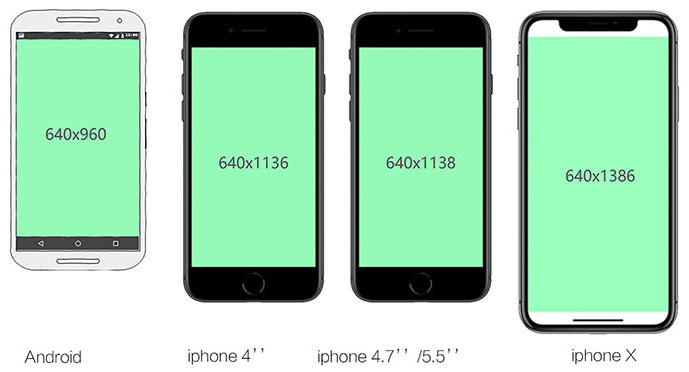

# 开发规范

## 移动端视频

总结：
1. 全屏单页面活动页：输出640 * 1386  格式.mp4
2. 微信端：输出640*1258  格式.mp4
(ios微信可以不全屏播放所以是1386-128(状态栏+导航栏高度)=1258，android
没有1386的屏幕所以不管)

## 音频

总结：
1. 大小压缩至80kb以下
2. 文件格式 .mp3
3. 开头和结尾音轨建议做淡入淡出处理

## 移动端设计图

> 有一种说法：认为肉眼可识别的最高密度为300ppi。而iPhone X的458ppi在手机屏幕历史可能仅次于HTC one的468ppi(2013年)， 所以完全可以认为X 是今天市面上最清晰的手机^_^ 无论我这个凡人的肉眼能不能看得出区别来，都不能影响它的傲娇。

总结：
1. 当手机的屏幕密度是326ppi，倍图是2的时候就足以满足人肉眼识别的能力。所以在h5上面3倍图就不用考虑了。
2. 单屏显示的界面 如H5活动页面适配方案会等比例缩放图片所以设计图制作成640 x 1386px的就够了。安全区域是640 x 960px，（如果是微信还要除去状态栏和导航栏的高度128px，也就是640*1258px)。
3. 对于大多数采用瀑布流的页面来说，仅仅是屏幕高度上的变化，可以无视。然而制作webapp字体大小无法等比例缩小，所以使用rem的适配方案，设计图出宽度750的，小手机更改html的font-size，页面字体等比例缩小，图片宽度使用百分比)。

## .psd文件提供